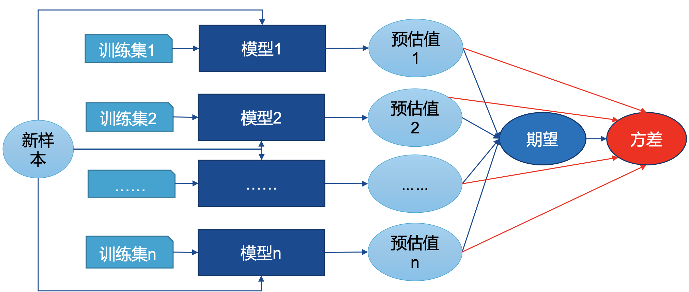
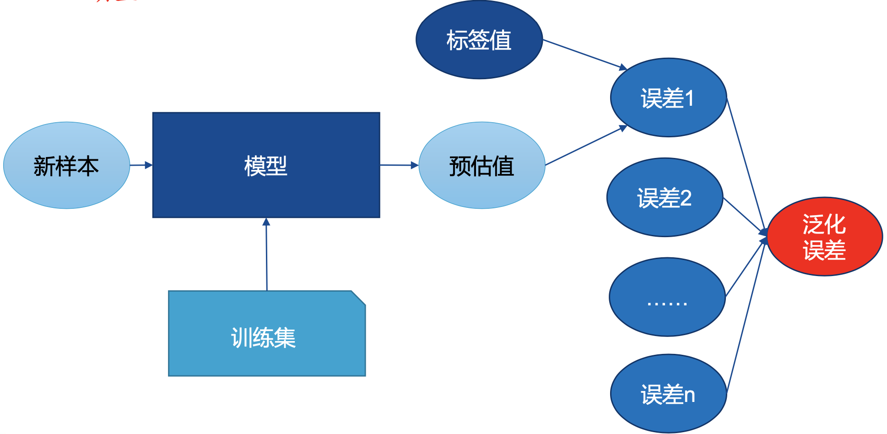
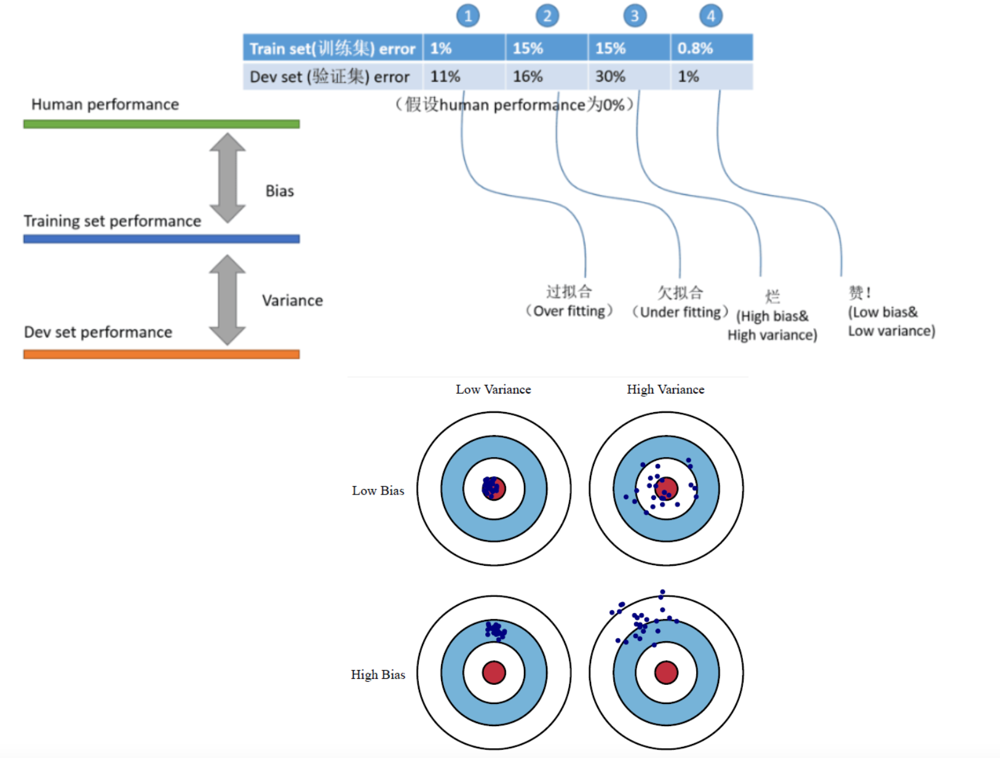
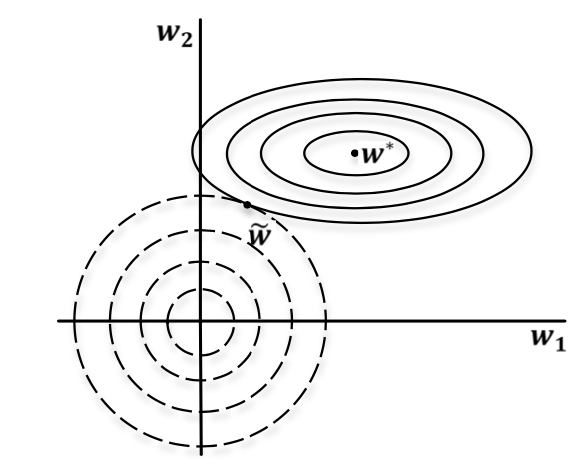

1. 正则化方法概述
2. 参数范数正则化

# 正则化方法概述

### 数据集

训练集(Trainingset)：用于模型拟合的数据样本；

验证集(Validation set)：是模型训练过程中单独留出的样本集，它可以用于调整模型的超参数和用于对模型的能力进行初步评估，例如SVM中参数c和核函数的选择，或者选择网络结构；

测试集(Testset)：用来评估模最终模型的泛化能力，但不能作为调参、选择特征等算法相关的选择的依据。

### 过拟合

过拟合是指模型能很好地拟合训练样本，而无法很好地拟合测试样本的现象，从而导致泛化性能下降；为防止“过拟合”，可以选择减少参数、降低模型复杂度、正则化等。

### 欠拟合

欠拟合是指模型还没有很好地训练出数据的一般规律，模型拟合程度不高

的现象；为防止“欠拟合”，可以选择调整参数、增加迭代深度、换用更加

复杂的模型等。

### 误差分析

**偏差(bias)**：反映了模型在样本上的期望输出与真实标记之间的差距，即模型本身的精准度，反映的是模型本身的拟合能力。

**方差(variance)**：反映了模型在不同训练数据集下学得的函数的输出与期望输出之间的误差，即模型的稳定性，反应的是模型的波动情况。

**泛化误差(Generalization Error)**：度量训练所得模型在总体数据上得到的预估值和标签值偏离程度的期望。

**举例说明**

**深度学习一般步骤**

下面我们引出正则化的概念，首先我们要明白什么是一个好的模型，基本要求就是在训练数据上表现好，但往往我们也希望它能在其他数据上也有很好的表现，也就是泛化性。

- 广义正则化：通过某种手段使学习算法在训练误差变化不大的情况下，使得泛化误差显著降低的方法
- 狭义正则化：不减少网络参数，只进行参数范围调整的方法

# 参数范数正则化

### 范数基本知识

机器学习中，很多时候都需要衡量一个向量的大小，此时便需要用到范数的知识。

范数是将向量映射到非负值的函数，它满足三条性质：

- 非负性   $f(x) \geq 0(f(x)=0 \Leftrightarrow x=0)$
- 齐次性   $\forall \alpha \in R, f(\alpha x)=|\alpha| f(x)$
- 三角不等式   $f(x+y) \leq f(x)+f(y)$

$L_p$ 范数是使用最为广泛的一种范数，定义为 $\|\boldsymbol{x}\|_{\boldsymbol{p}}=(\sum_i |x_i|^p)^{1/p}$，当 $p = 2$ 时该范数等价于向量和原点的欧几里得距离。有时候也需要衡量矩阵的大小，在深度学习中，最常见的做法便是使用Frobenius范数(F范数)，即 $\|\boldsymbol{x}\|_{\boldsymbol{F}} = \sqrt{\sum_{i, j} A_{i j}^{2}}$.

### 参数范数正则化

通过简单地在损失函数 $J()$ 后添加一个参数范数正则化项 $\Omega(\theta)$，来限制模型的学习能力，正则化后的损失函数可表示为 $\tilde{J}$：
$$
\tilde{J}(\boldsymbol{\theta} ; \mathbf{X}, \mathbf{y})=\mathrm{J}(\boldsymbol{\theta} ; \mathbf{X}, \mathbf{y})+\alpha \Omega(\boldsymbol{\theta})
$$
其中，$ \alpha $是正则项系数，它是一个超参，用来权衡惩罚项 $Ω$ 对损失函数的贡献。若 $α$ 为0，表示无正则化；$α$ 越大，正则化惩罚越大。

我们希望正则化后的训练误差（第一项）最小，又希望模型尽量简单（第二项）。

当最小化正则化后的损失函数时候，同时降低原有损失函数 $J()$和正则化项 $\Omega(\theta)$ 的值，一定程度减少了过拟合的程度。通俗来说，正则化就是让参数，如权重w多几个等于0，或 者接近于0，说明该节点影响很小，如果是神经网络相当于 在神经网络中删掉了一些节点，这样模型就变简单了。

- $L_0$ 范数：$\|\boldsymbol{W}\|_{\boldsymbol{0}}$，指向量中非0的元素的个数，越小说明0元素越多
- $L_1$ 范数：$\|\boldsymbol{W}\|_{\boldsymbol{1}}$，指向量中各个元素绝对值之和
- $L_2$ 范数：$\|\boldsymbol{W}\|_{\boldsymbol{2}}$，即各元素的平方和再开方

### $L_2$ 正则化 

L2正则化主要用于线性回归，又称为岭回归(Ridge Regression) 或权重衰减(Weight decay)，添加的正则化项形式如下：
$$
\Omega(\mathbf{w})=\frac{1}{2}\|\mathbf{w}\|_{2}^{2}
$$
损失函数：
$$
\tilde{J}(\boldsymbol{\theta} ; \mathbf{X}, \mathbf{y})=\mathrm{J}(\boldsymbol{\theta} ; \mathbf{X}, \mathbf{y})+ \frac{\alpha}{2}\|\mathbf{w}\|_{2}^{2}
$$
**L2参数正则化分析(单步)**

对于某一模型，假设要对其所有的参数进行参数正则化，则正则化后的整体损失函数 $\tilde{J}$ 为 $\tilde{J}(\boldsymbol{\theta} ; \mathbf{X}, \mathbf{y})=\mathrm{J}(\boldsymbol{\theta} ; \mathbf{X}, \mathbf{y})+ \frac{\alpha}{2}\|\mathbf{w}\|_{2}^{2}$.
计算梯度得 $\nabla_{\mathbf{w}} \tilde{J}(\boldsymbol{w} ; \boldsymbol{X}, \boldsymbol{y})=\nabla_{\mathbf{w}} J(\boldsymbol{w} ; \boldsymbol{X}, \boldsymbol{y})+\alpha w$.

使用单步梯度下降更新权重：
$$
\begin{aligned} \mathbf{w} & \leftarrow \mathbf{w}-\lambda\left(\nabla_{\mathbf{w}} J(\boldsymbol{w} ; \boldsymbol{X}, \boldsymbol{y})+\alpha \boldsymbol{w}\right) \\ &=(1-\lambda \alpha) \mathbf{w}-\lambda \nabla_{\mathbf{w}} J(\boldsymbol{w} ; \boldsymbol{X}, \boldsymbol{y}) \end{aligned}
$$
在进行每步梯度更新前，先对参数 w 进行了缩放。因此，这也是权重衰减名称的来源。

**L2参数正则化分析(整个训练过程)**

我们先记未正则化的损失函数 $𝐽$得到的最小损失权重向量为 $\mathbf{w}^{*}=\operatorname{argmin}_{\boldsymbol{w}} J(\boldsymbol{w})$. 在 $w^*$ 附近对损失函数做二次近似，近似的 $\tilde{J}(w)$ 如下：
$$
\hat{J}(\mathbf{w})=J\left(\mathbf{w}^{*}\right)+\left(\mathbf{w}-\mathbf{w}^{*}\right)^{T} \nabla J\left(\mathbf{w}^{*}\right)+\frac{1}{2}\left(\mathbf{w}-\mathbf{w}^{*}\right)^{T} \boldsymbol{H}\left(\mathbf{w}-\mathbf{w}^{*}\right)
$$
$𝐻$ 是 $𝐽$ 在 $𝐰$ 处计算的*Hessian*矩阵。当 $\hat{J}(w)$ 取得最小值时，其梯度应为0，即 $\nabla_{\mathbf{w}} \hat{J}(\boldsymbol{w})=\boldsymbol{H}\left(\boldsymbol{w}-\boldsymbol{w}^{*}\right)=0$.

引入L2正则化项的梯度，设变量 $\tilde{w}$ 使得 $\tilde{J}(w)$ 最小
$$
\nabla_{\mathbf{w}} \hat{J}(\boldsymbol{w})=      \alpha 
\tilde{w}+

\boldsymbol{H}\left(\tilde{\boldsymbol{w}}-\boldsymbol{w}^{*}\right)=0
$$
求得
$$
\tilde{w} = (H + \alpha I)^{-1}Hw^*
$$
因为 𝑯 是对称矩阵，可分解为 $𝐻=𝑄Λ𝑄^T$，所以
$$
\tilde{\mathbf{w}}=Q(\Lambda+\alpha I)^{-1} \Lambda Q^{T} \mathbf{w}^{*}
$$

$$
(\Lambda+\alpha I)^{-1} \Lambda=\left[\begin{array}{cccc}\frac{\lambda_{1}}{\lambda_{1}+\alpha} & 0 & \cdots & 0 \\ 0 & \frac{\lambda_{2}}{\lambda_{2}+\alpha} & \cdots & 0 \\ \vdots & \vdots & \ddots & \vdots \\ 0 & 0 & \cdots & \frac{\lambda_{n}}{\lambda_{n}+\alpha}\end{array}\right]
$$

举例：$\begin{array}{r}\frac{w_{1}^{2}}{a^{2}}+\frac{w_{2}^{2}}{b^{2}}=1 , \lambda_{1}=\frac{2}{a^{2}}, \lambda_{2}=\frac{2}{b^{2}}\end{array}$

可见，权重衰减是沿着𝑯的特征向量的标准正交基所定义的轴缩放 $𝒘^∗$。当原损失函数在特征值大的方向进行下降时， 正则化项对其影响较小；在特征值小的方向进行下降时，正则化项会对其进行限制。也就是说，保证了原损失函数沿着损失下降最大的方向下降。

**稀疏问题**：

1. 特征选择： $x_i$ 的大部分元素(也就是特征)都是和最终的输出$ y_i$ 没有关系；但在预测新的样本时，这些没用的信息反而会被考虑，从而干扰了对正确 $y_i$ 的预测。稀疏规则化算子的引入就是为了完成特征自动选择，它会学习地去掉 这些没有作用的特征，也就是把这些特征对应的权重置为0。
2. 可解释性：患病回归模型 $y=w_1x_1+w_2x_2+\cdots+w_{1000}x_{1000}+b$， 通过学习，如果最后学习到的 $w^*$ 就只有很少的非零元素， 例如只有5个非零的 $w_i$，也就是说，患不患这种病只和这5个因素有关，那医生就好分析多了。

### $L_1$ 正则化 

L1正则化又称为Lasso回归(Lasso Regression)，在损失函数中添加待正则化参数w的L1-范数(即w所有参数绝对 值之和)作为正则化项：$\Omega(w) = \|w\|_1$.

损失函数：
$$
\tilde{J}(\boldsymbol{\theta} ; \mathbf{X}, \mathbf{y})=\mathrm{J}(\boldsymbol{\theta} ; \mathbf{X}, \mathbf{y})+ \alpha \|w\|_1
$$
计算梯度：
$$
\nabla_{\mathbf{w}} \tilde{J}(\boldsymbol{w} ; \boldsymbol{X}, \boldsymbol{y})=\nabla_{\mathbf{w}} J(\boldsymbol{w} ; \boldsymbol{X}, \boldsymbol{y})+\alpha \cdot \operatorname{sign}(\boldsymbol{w})
$$

其中，sign(w)只是简单的取w各个元素的正负号。L1正则化与L2不 大一样，不一定能得到$J(w;X,y)$二次近似的直接算术解。

**L1参数正则化分析**

$w^*$ 是未正则化的损失函数𝐽得到的最小损失权重向量，即
$$
\mathbf{w}^{*}=\operatorname{argmin}_{w} J(\boldsymbol{w})
$$
在 $w^*$ 处对正则化后的损失函数进行二次泰勒展开
$$
\hat{J}(\mathbf{w})=J\left(\mathbf{w}^{*}\right)+\frac{1}{2}\left(\mathbf{w}-\mathbf{w}^{*}\right)^{T} \boldsymbol{H}\left(\mathbf{w}-\mathbf{w}^{*}\right)
$$
$𝐻$是$𝐽$在  $w^*$  处计算的*Hessian*矩阵。当$\hat{J}(\boldsymbol{w})$ 取得最小值时，其梯度应 为0
$$
\nabla_{\mathbf{w}} \hat{J}(\boldsymbol{w})=   

\boldsymbol{H}\left(\boldsymbol{w}-\boldsymbol{w}^{*}\right)=0
$$
L1正则项在完全一般化的Hessian矩阵无法得到清晰的代数表达式， 进一步假设Hessian为对角矩阵，即 $𝐇 = diag([H_{1,1}, ⋯ , H_{𝑛,n}]) $，且 $H_{𝑖,𝑖} > 0$ 。(如果线性回归问题中的数据已被预处理，去除输入特征 之间的相关性，那么这一假设成立)。

可将目标函数二次近似分解为关于参数的总和
$$
\tilde{J}(\boldsymbol{w})=J\left(\boldsymbol{w}^{*}\right)+\sum_{i}\left[\frac{1}{2} H_{i, i}\left(w_{i}-w_{i}^{*}\right)^{2}+\alpha\left|w_{i}\right|\right]
$$
最小化这个近似损失函数可得
$$
\widetilde{w_{i}}=\operatorname{sign}\left(w_{i}^{*}\right) \max \left\{\left|w_{i}^{*}\right|-\frac{\alpha}{H_{i, i}}, 0\right\}
$$
得到的参数 $\tilde{w}$ 的各个元素可能为0。因此，与L2正则化相比，得到的参数更加稀疏。

### $L_1$和$L_2$的对比

- L2范数更有助于计算病态的问题

- L1相对于L2能够产生更加稀疏的模型

- 从概率角度进行分析，很多范数约束相当于对参数添加先 验分布，其中L2范数相当于参数服从高斯先验分布；L1范 数相当于拉普拉斯分布

$$
\begin{array}{l}\underset{\boldsymbol{w}}{\operatorname{argmax}} p(\boldsymbol{w} \mid X)=\underset{\boldsymbol{w}}{\operatorname{argmax}} \frac{p(X \mid \boldsymbol{w}) p(\boldsymbol{w})}{p(X)}=\underset{\boldsymbol{w}}{\operatorname{argmax}} p(X \mid \boldsymbol{w}) p(\boldsymbol{w}) =\underset{\boldsymbol{w}}{\operatorname{argmax}}\left(\prod_{i=1}^{n} p\left(x_{i} \mid \boldsymbol{w}\right)\right) p(\boldsymbol{w}) \\ \operatorname{argmax}_{\boldsymbol{w}} L(\boldsymbol{w})=\prod_{i=1}^{n} \frac{1}{\sigma \sqrt{2 \pi}} \exp \left(\frac{\left(\boldsymbol{y}_{i}-\boldsymbol{w}^{T} \boldsymbol{x}_{i}\right)^{2}}{2 \sigma^{2}}\right) \prod_{j=1}^{d} \frac{1}{\tau \sqrt{2 \pi}} \exp \left(\frac{\left(\boldsymbol{w}_{j}\right)^{2}}{2 \tau^{2}}\right) \\ \operatorname{argmax}_{\boldsymbol{w}} L^{\prime}(\boldsymbol{w})=\ln \prod_{i=1}^{n} \frac{1}{\sigma \sqrt{2 \pi}} \exp \left(-\frac{\left(\boldsymbol{y}_{i}-\boldsymbol{w}^{T} \boldsymbol{x}_{i}\right)^{2}}{2 \sigma^{2}}\right) \prod_{j=1}^{d} \frac{1}{\tau \sqrt{2 \pi}} \exp \left(-\frac{\left(\boldsymbol{w}_{j}\right)^{2}}{2 \tau^{2}}\right) \\ =-\frac{1}{2 \sigma^{2}} \sum_{i=1}^{n}\left(\boldsymbol{y}_{i}-\boldsymbol{w}^{T} \boldsymbol{x}_{i}\right)^{2}-\frac{1}{2 \tau^{2}} \sum_{i=1}^{d}\left(\boldsymbol{w}_{j}\right)^{2}+\ldots\end{array}
$$

# 稀疏表示

数据集可视为矩阵𝑆，其中矩阵的行数表示样本的数量，矩阵的列数则表示对应的特征。在很多应用中，矩阵𝑆中存在 很多零元素，但这些零元素并不是以整列、整行形式存在。

- 如在文档分类领域，我们将每一篇文档作为一个样本，那么数据集可表示为每一行表示为一个文档，每一列为一个字(词)，行列交汇处就是某字(词)在某文档中出现的频率。

如果矩阵𝑆是普通的非稀疏矩阵，稀疏表示目的是为这个普 通稠密表达的样本𝑆找到一个合适的字典，将样本转换为稀 疏表示(Sparse Representation)形式，从而在学习训练的 任务上得到简化，降低模型的复杂度。亦被称作字典学习 (Dictionary Learning)

- 稀疏表示的本质是使用尽可能少的数据表示尽可能多的特征，并且 同时也能带来计算效率的提升。

### 稀疏表示学习

给定数据集为 $\{x_1,x_2,\cdots,x_𝑛\} $字典学习可表示为
$$
\min _{B, \alpha_{i}} \sum_{i=1}^{m}\left\|x_{i}-B \alpha_{i}\right\|_{2}^{2}+\lambda \sum_{i=1}^{m}\left\|\alpha_{i}\right\|_{1}
$$
其中$B \in R^{d \times k},\alpha_i \in R^k$ ，k 为字典的词汇量，$\alpha_i$ 是样本的稀疏表示。第一项保证能够通过字典𝐵由稀疏表示 $𝛼_𝑖$ 重构样本数据 $𝑥_𝑖$ ， 第二项保证 $𝛼_𝑖$ 尽可能稀疏。学习任务则是求解字典𝐵，以及 $x_i$ 的稀疏表示 $\alpha_i$ ，可采用变量交替优化的策略进行学习。
