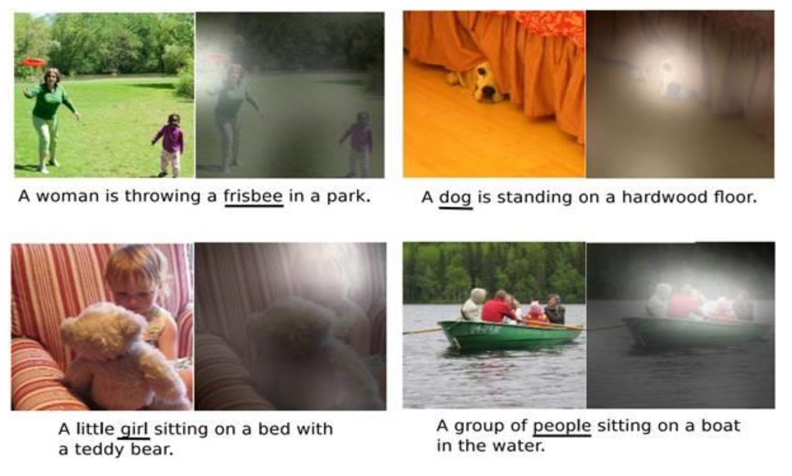
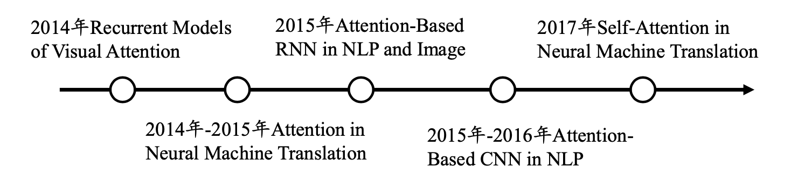
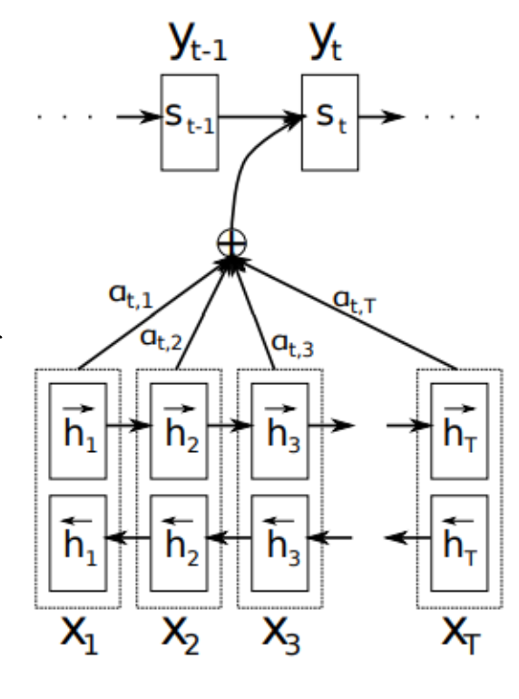
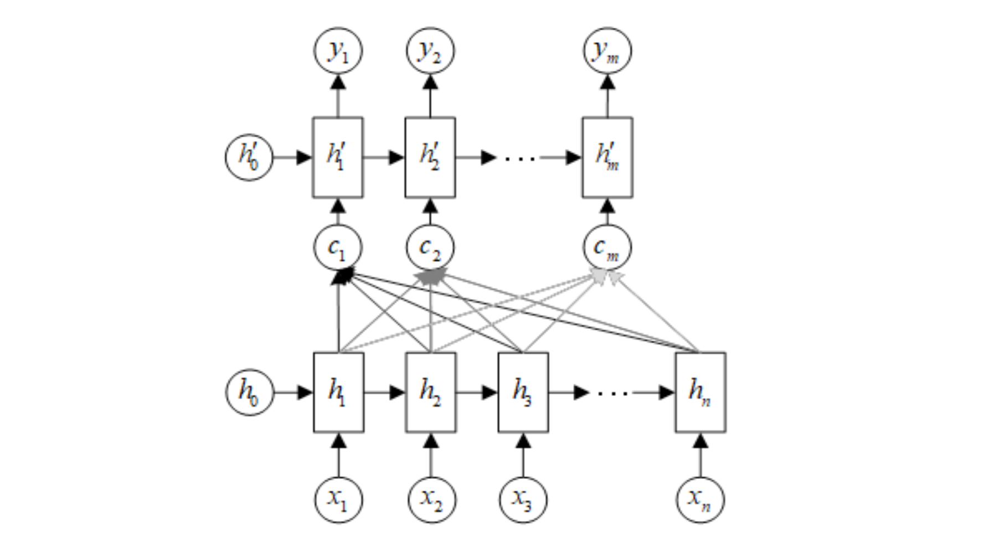
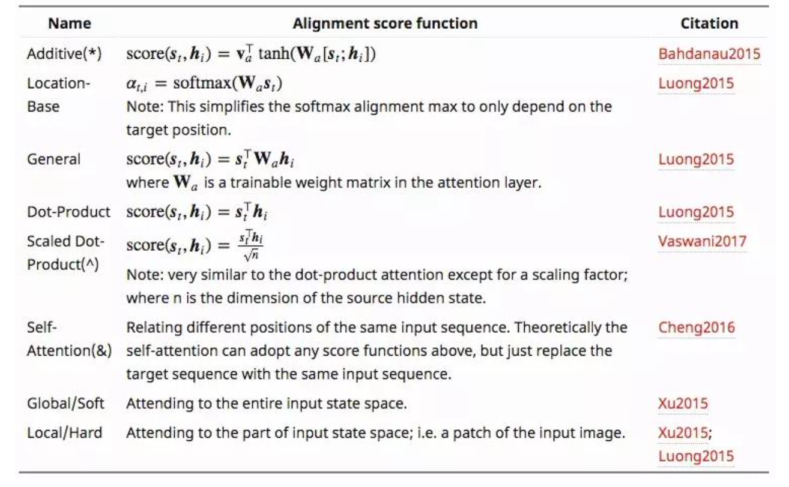
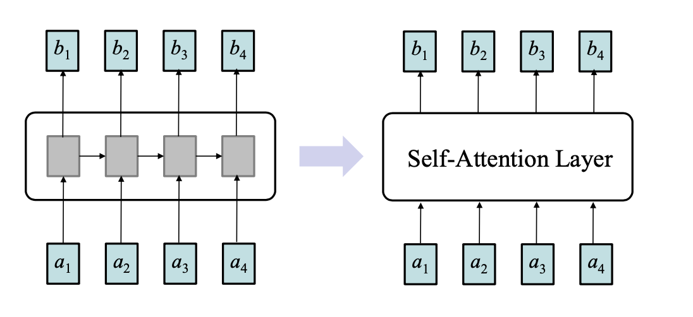
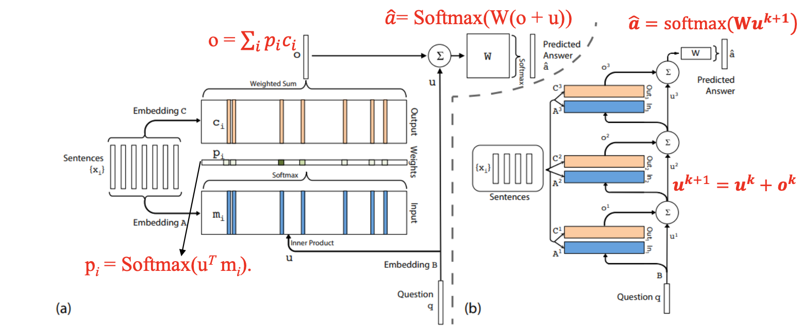

注意力机制

记忆网络

# 注意力机制

### 人类的注意力机制

在深度学习中注意力机制的研究：

参考：
[1] Recurrent Models of Visual Attention. NIPS 2014: 2204- 2212
[2] Neural machine translation by jointly learning to align and translate, ICLR 2015
[3] Show, Attend and Tell: Neural Image Caption Generation with Visual Attention，ICML 2015
[4] Attention is all you need，NIPS 2017

### 注意力机制在在神经机器翻译领域的应用

- 神经机器翻译主要以Encoder-Decoder模型为基础结构

- 在神经机器翻译中，Encoder一般采用RNN或者LSTM实现
  - 从统计角度，翻译相当于寻找译句y，使得给定原句 x 时条件概率最大：$\arg \max _{y} p(\boldsymbol{y} \mid \boldsymbol{x})$
  - 得到上下文向量 c 的方法有很多，可以直接将最后一个隐状态作为上下文变量，也可对最后的隐状态进行一个非线性变换 $\sigma(\cdot)$，或对所有的隐状态进行非线性变换 $\sigma()$

$$
c =h_{T} \\  \,\,\,\  c =\sigma\left(h_{T}\right) \\ c =\sigma\left(h_{1}, h_{2}, \cdots, h_{T}\right)
$$

### 解码器

- 用给定的上下文向量c和之前已经预测的词 $\{y_1,\cdots,y_{t-1}\}$

### 现存问题

-  输入序列不论长短都会被编码成一个固定长度的向量表示，而解码则受限于该固定长度的向量表示
- 这个问题限制了模型的性能，尤其是当输入序列比较长时，模型的性能会变得很差

### 神经网络模型注意力机制

- 在这个新结构中，定义每个输出的条件概率为:  $p\left(y_{i} \mid y_{1}, \cdots, y_{i-1}, \boldsymbol{x}\right)=g\left(y_{i-1}, x_{i}, c_{i}\right)$.
- 其中 $𝑠_𝑖$ 为解码器RNN中的隐层状态: $s_{i}=f\left(s_{i-1}, y_{i-1}, c_{i}\right)$.
- 这里的上下文向量 $𝑐_𝑖$ 取决于注释向量序列 (encoder转化得到)，通过使用注意力系数 $𝛼_{𝑖𝑗}$ 对 $h_𝑗$  加权求得：

$$
c_{i}=\sum_{j=1}^{T} \alpha_{i j} h_{j}
$$

### 注意力机制的计算

注意力系数计算：
$$
\alpha_{i j}=\frac{\exp \left(e_{i j}\right)}{\sum_{k=1}^{T_{x}} \exp \left(e_{i k}\right)} \quad e_{i j}=a\left(s_{i-1}, h_{j}\right)
$$
后一个公式中的 $a(\cdot)$ 表示alignment mode，反映 $i$ 位置的输入和 $j$ 位置输出的匹配程度。

计算注意力系数的相似函数(alignment model)有以下几种：
$$
a\left(s_{i-1}, h_{j}\right) = 
h_{j}^{T} \cdot s_{i-1} \\
a\left(s_{i-1}, h_{j}\right) = 
\frac{h_{j}^{T} \cdot W_{\alpha} \cdot s_{i-1}}{W_{\alpha} \cdot\left[h_{j}^{T}, s_{i-1}^{T}\right]^{T}} \\
a\left(s_{i-1}, h_{j}\right) = 
v_{\alpha} \tanh \left(U_{\alpha} h_{j}+W_{\alpha} s_{i-1}\right)
$$

### 几种主流的注意力机制

### 注意力机制的理解

- Attention函数的本质可以被描述为一个查询(query)到一 系列(键key-值value)对的映射

$$
\text { Attention(Query, Source })=\sum_{i=1}^{L_{x}} \text { similarity }\left(\text { Query }, \mathrm{Key}_{i}\right){\times} \text { Value }_{i}
$$

参考文献：Vaswani A, Shazeer N, Parmar N, et al. Attention is all you need[C]. Advances in Neural Information Processing Systems. 2017: 6000-6010.

注意力系数计算

- 阶段1：根据Query和Key计算两者的相似性或者相关性
- 阶段2：对第一阶段的原始分值进 行归一化处理
- 阶段3：根据权重系数对Value进行加权求和，得到Attention Value

Self-attention layer in “Attention is all you need”

### 注意力机制的应用

- GPT/GPT-2
- BERT

# 记忆网络

### 产生背景

现代计算机的一个巨大优势就是可以对信息进行存储。但 是，大多数机器学习模型缺少这种可以读取、写入的长期 记忆的内存结构。RNN、LSTM这样的神经网络原则上可以实现记忆存储， 但是，它们由隐藏状态和权重编码包含的记忆太小了，不能记忆足够信息。基于此，Facebook AI Research提出了一种用于问答任务的记忆网络，实现了记忆的存储。广义上讲，循环神经网络也是记忆网络的一种

### 代表工作

- **Memory Networks**. ICLR 2015

- **End-To-End Memory Networks**. NIPS 2015: 2440-2448

- **Key-Value Memory Networks for Directly Reading Documents**. EMNLP 2016: 1400-1409

- **Tracking the World State with Recurrent Entity Networks**. ICLR 2017

### 结构

结构示意图： I, G, O, R四个模块

参考：Weston, Jason, Sumit Chopra, and Antoine Bordes. "Memory networks." arXiv preprint arXiv:1410.3916 (2014).

- Input vector：将输入x(字符、单词、句子等不同的粒度)转成内部特征向量的表示 $ I(x)$
- Generalization：根据新的输入更新记忆单元中的memory slot $m_i$，$\boldsymbol{m}_{\boldsymbol{i}}=G\left(\boldsymbol{m}_{\boldsymbol{i}}, \boldsymbol{I}(\boldsymbol{x}), \boldsymbol{m}\right), \forall i$.

- Output feature map：根据记忆单元和新的输入，输出特征 $o = O(x, m)$

- Response：最后，解码输出特征 $o$，并给出对应的响应 $r = R(o)$，R可以是一个RNN网络生成回答的句子，更简单的话可以计算相关分数，比如W是一个单词集合(dictionary)

### 端到端的记忆网络

**单层和三层网络**

参考：Sukhbaatar, Sainbayar, Arthur Szlam, Jason Weston, and Rob Fergus. "End-to-end memory networks." arXiv preprint arXiv:1503.08895(2015).

**训练参数**

- A:inputembeddingmatrix
- C: output embedding matrix
- W: answer prediction matrix
- B: question embedding matrix

**损失函数**：交叉熵

### **Key-Value**记忆网络

面向**QA**的**Key-Value**网络结构

- 高效的知识存储和检索
  - key负责寻址lookup，也就是对memory与Question的相关程度进行评分，
  - value则负责reading，也就是对记忆的值进行加权求和得到输出

### 其它记忆网络

- **2017**年，**Facebook AI Research**提出了一种新的基于记忆网 络的循环实体网络，其使用固定长度的记忆单元来存储世 界上的实体，主要存储该实体相关的属性，且该记忆会随 着输入内容实时更新

- **Google DeepMind**也提出了多种记忆网络，如:**Neural Turing Machines**、**Neural Random Access Machines**以及使 用像栈或(双端)队列结构的连续版本等

- 利用外部存储形式的机器学习方式已经成为机器学习领域中一个热点方向
