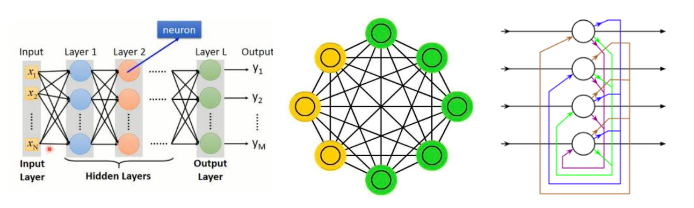
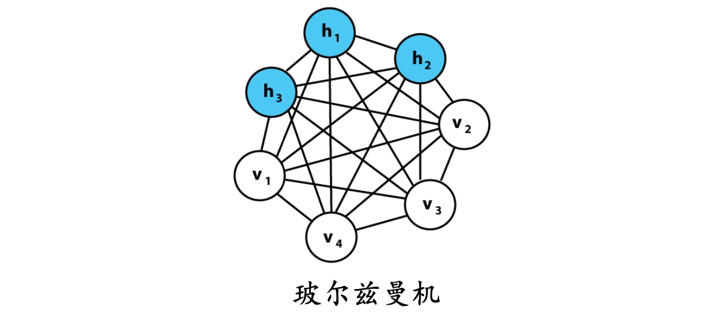
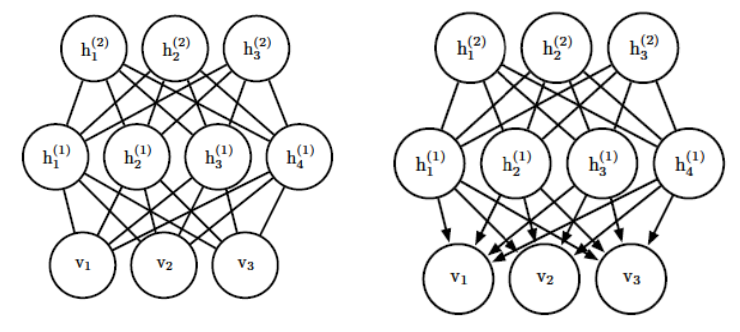
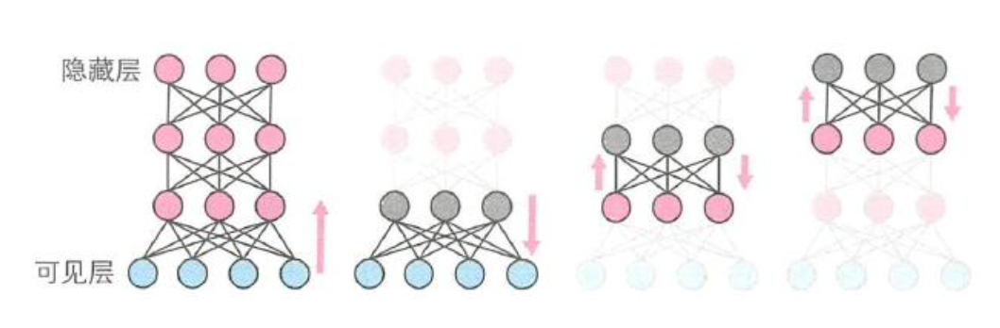
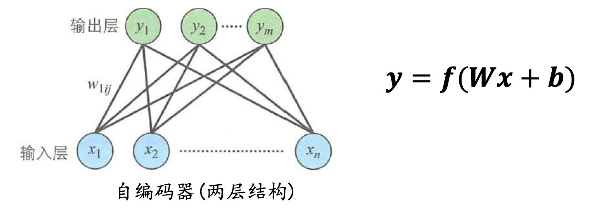
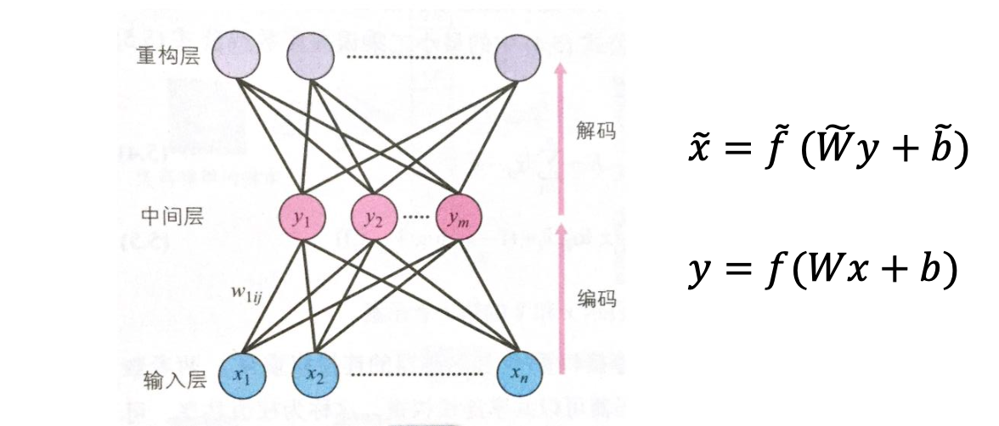

1. 深度生成模型概述
2. Hopfield神经网络
3. 玻尔兹曼机和受限玻尔兹曼机
4. 深度玻尔兹曼机和深度信念网络
5. 自编码器及其变种

# 深度生成模型概述

| 年份 | 事件                                                         | 相关论文                                                     |
| :--: | :----------------------------------------------------------- | ------------------------------------------------------------ |
| 1982 | Hopfield网络提出                                             | J. J . Hopfield . Neural networks and physical systems with emergent collective computational abilities. Proceedings of the National Academy of Sciences, Vol. 79 , No. 8, pp. 2554-2558, 1982 |
| 1983 | 玻尔兹曼机生成模型被提出                                     | Fahlman, S. E., Hinton, G. E., & Sejnowski, T. J. (1983). Massively parallel architectures for Al: NETL, Thistle, and Boltzmann machines. Proceedings of AAAI-83109, 113 |
| 1992 | Neal提出了sigmoid信念网 络                                   | Neal, R. M. (1992). Connectionist learning of belief networks. Artificial intelligence, 56(1), 71- 113 |
| 2006 | Hinton提出深度信念网络                                       | Hinton, G. E., Osindero, S., & Teh, Y. W. (2006). A fast learning algorithm for deep belief nets. Neural computation, 18(7), 1527-1554 |
| 2008 | 采用DBNs来完成回归任务                                       | Hinton, G. E., & Salakhutdinov, R. R. (2008). Using deep belief nets to learn covariance kernels for Gaussian processes. In Advances in neural information processing systems (pp. 1249-1256) |
| 2009 | 将卷积深度信念网络用于可视物体识别                           | Lee, H., Grosse, R., Ranganath, R., & Ng, A. Y. (2009, June). Convolutional deep belief networks for scalable unsupervised learning of hierarchical representations. In Proceedings of the 26th annual international conference on machine learning (pp. 609-616). ACM |
| 2012 | DBNs应用在语音识别领域                                       | Mohamed, A. R., Dahl, G. E., & Hinton, G. (2012). Acoustic modeling using deep belief networks. IEEE Transactions on Audio, Speech, and Language Processing, 20(1), 14-22 |
| 2014 | Goodfellow提出生成对抗网络                                   | Goodfellow, I., Pouget-Abadie, J., Mirza, M., Xu, B., Warde-Farley, D., Ozair, S., ... & Bengio, Y. (2014). Generative adversarial nets. In Advances in neural information processing systems (pp. 2672-2680) |
| 2016 | Deepmind创建了一个深度 生成模型Wavenet，可用来 生成具有自然人声的语音 | Van Den Oord, A., Dieleman, S., Zen, H., Simonyan, K., Vinyals, O., Graves, A., ... & Kavukcuoglu, K. (2016). Wavenet: A generative model for raw audio. arXiv preprint arXiv:1609.03499 |

# Hopfield神经网络

神经网络可以分为，多层神经网络和相互连接型网络。

- 多层神经网络：模式识别
- 相互连接型网络：通过联想记忆去除数据中的噪声

1982年提出的 Hopfield 神经网络是最典型的相互连结型网络。

联想记忆就是当输入模式为某种状态时，输出端要给出与之相应的输出模式。如果输入模式与输出模式一致，称为自联想记忆，否则称为异联想记忆。

...

# 玻尔兹曼机和受限玻尔兹曼机

### 玻尔兹曼机

- 玻尔兹曼机也是相互连接型网络
  - 如果发生串扰或陷入局部最优解，Hopfield神经网络就不能正确的 辨别模式。而玻尔兹曼机(Boltzmann Machine)则可以通过让每个单 元按照一定的概率分布发生状态变化，来避免陷入局部最优解
- 玻尔兹曼机保持了**Hopfield**神经网络的假设: 
  - 权重对称
  - 自身无连接
  - 二值输出

玻尔兹曼机的输出是按照某种概率分布决定的：
$$
\left\{\begin{array}{l}p\left(x_{i}=1 \mid u_{i}\right)=\frac{\exp \left(\frac{x}{k T}\right)}{1+\exp \left(\frac{x}{k T}\right)} \\ p\left(x_{i}=0 \mid u_{i}\right)=\frac{1}{1+\exp \left(\frac{x}{k T}\right)}\end{array}\right.
$$

- $𝑇(>0)$表示温度系数，当 $𝑇$ 趋近于无穷时，无论 $𝑢_𝑖$ 取值如何，$𝑥_𝑖$ 等于1 或 0 的概率都是1/2，这种状态称为稳定状态（k是玻尔兹曼常数）。

附Hopfield网络的输出：
$$
x_{i}(t+1)=\left\{\begin{array}{ll}1, & u_{i}(t)>0 \\ x_{i}(t), & u_{i}(t)=0 \\ 0, & u_{i}(t)<0\end{array}\right.
$$

- 玻尔兹曼机选择模拟退火算法，可以先采用较大的温度系 数及进行粗调，然后逐渐减小温度系数进行微调
  - 温度系数越大，跳出局部最优解的概率越高。但是温度系数增大时， 获得能量函数极小值的概率就会降低
  - 反之，温度系数减小时，虽然获得能量函数极小值的概率增加了， 但是玻尔兹曼机需要经历较长时间才能达到稳定状态

**模拟退火算法**

模拟退火是一种贪心算法，但是它的搜索过程引入了随机因素,以一定的概率来接受一个比当前解要差的解，因此有可能会跳出这个局部的最优解， 达到全局的最优解, 而且这个概率随 着时间推移逐渐降低(逐渐降低才能趋向稳定)

**玻尔兹曼机的训练过程**

1. 训练准备：初始化连接权重 $𝑤_{𝑖𝑗}$ 和偏置 $𝑏_𝑖$

2. 调整参数
    2.1 选取一个单元 $𝑖$, 求 $𝑢_𝑖$
    2.2 根据$𝑢_𝑖$ 的值，计算输出 $𝑥_𝑖$
    2.3 根据输出 $𝑥_𝑖$ 和 $𝑥_𝑗$ 的值，调整连接权重 $𝑤_{𝑖𝑗}$ 和偏置 $𝑏_𝑖$

   重复步骤2，直到满足终止判断条件

通常，使用对数似然函数求解
$$
\ln L(\theta)=\sum_{n=1}^{N} \ln p\left(x_{n} \mid \theta\right)
$$
当对数似然函数的梯度为0时，就可以得到最大似然估计量，即通 过求连接权重 $w_{ij}$ 和偏置 $b_i$ 的相关梯度，可以求出调整值。

**求解困难**：似然函数是基于所有单元组合来计算的，所以单元数过多将导致组 合数异常庞大，无法进行实时计算。为了解决这个问题，人们提出 了一种近似算法，**对比散度算法**（后面有介绍）。

### 受限玻尔兹曼机

- 前面介绍的玻尔兹曼机默认了所有单元都为可见单元，在 实际应用上，玻尔兹曼机还可以由可见单元和隐藏单元共同构成。
  - 隐藏单元与输入数据没有直接联系，但会影响可见单元的概率。假 设可见单元为可见变量 𝑣 ，隐藏单元为隐藏变量 h 。玻尔兹曼机含 有隐藏变量时，概率分布仍然与前面计算的结果相同

...

# 深度玻尔兹曼机和深度信念网络

深度玻尔兹曼机(Deep Boltzmann Machine, DBM) 是由受限玻尔兹曼机堆叠组成。

深度信念网络(Deep Belief Network, DBN)：最上面的两层之间有无方向的对称连接，形成联想记忆。下层从上层接收自上而下的定向连接。最底层单元的状态表示一个数据向量。

参考论文：

[1] Hinton, Geoffrey E., Simon Osindero, and Yee-Whye Teh. "A fast learning algorithm for deep belief nets." Neural computation 18, no. 7 (2006): 1527-1554.
[2] Hinton GE. Deep belief networks. Scholarpedia. 2009 May 31;4(5):5947.

深度玻尔兹曼机采用与多层神经网络不同的训练方法，在训练时采用对比散度算法，逐层来调整连接权重和偏置。

具体做法：

- 首先训练输入层和隐藏层之间的参数，把训练后得到的参数作为下一层的输入
- 再调整该层与下一个隐藏层之间的参数
- 然后逐次迭代，完成多层网络的训练

深度玻尔兹曼机既可以当作生成模型，也可以当作判别模型

- 作为生成模型使用时，网络会按照某种概率分布生成训练数据。概 率分布可根据训练样本导出，但是覆盖全部数据模式的概率分布很难导出，所以通常选择最大似然估计法训练参数，得到最能覆盖训练样本的概率分布

  这种生成模型能够：去除输入数据中含有的噪声，得到新的数据， 对输入数据压缩和特征表达

- 作为判别模型使用时，需要在模型顶层添加一层Softmax实现分类

  进行分类时，需要同时提供训练样本和期望输出，在最顶层级联一 个𝑆𝑜𝑓𝑡𝑚𝑎𝑥层

训练方法：

- 除最顶层外，其他各层都可以使用无监督学习进行训练。
- 把训练得到的参数作为初始值，使用误差反向传播算法对包含最顶 层的神经网络进行训练
- 最顶层的参数使用随机数进行初始化

# 自编码器及其变种

自编码器(Autoencoder):是一种有效的数据维度压缩算法， 主要应用在以下两个方面：

- 构建一种能够重构输入样本并进行特征表达的神经网络
  - 特征表达：是指对于分类会发生变动的不稳定模式，例如手写字体识 别中由于不同人的书写习惯和风格的不同造成字符模式不稳定，或者输入样本中包含噪声等情况，神经网络也能将其转换成可以准确识别的特征。

- 训练多层神经网络时，通过自编码器训练样本得到参数初始值

- 自编码器是一种基于无监督学习的神经网络，目的在于通过不断调整参数， 重构经过维度压缩的输入样本

当样本中包含噪声时，如果神经网络能够消除噪声，则被称为降噪自编码器(**Denoising Autoencoder**)，还有一种称为稀疏自编码器**( Sparse Autoencoder )**的网络， 它在自编码器中引入了正则化项，以去除冗余信息。

### 降噪自编码器

...

### 稀疏自编码器

...
