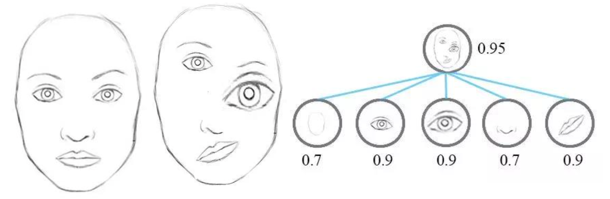
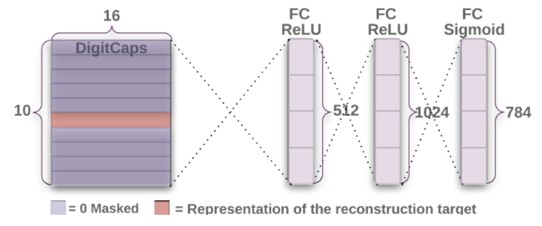
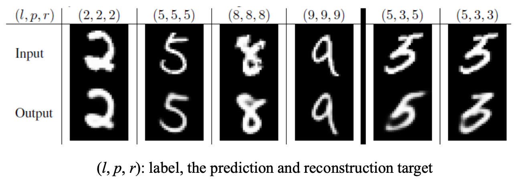

**胶囊网络**

# 背景介绍

**CNN现存的问题**

池化操作提供了局部不变性，错误解决了需要解决的等变性问题，从而丢失了位置等信息：

- 平移等变性：对于一个函数，如果对其输入施加的变换也会同样反应在输出上，那么这个函数就对该变换具有等变性。
  - 例如：输入0,3,2,0,0产生结果0,1,0,0，那么输入模式0,0,3,2,0可能会产生 0,0,1,0的输出
- 平移不变性：对于一个函数，如果对其输入施加的某种操作丝毫不会影响到输出，那么这个函数就对该变换具有不变性。

对于CNN而言，两张图片是类似的，因为它们包含相似的部件。

**胶囊网络的提出**

参考：
[1] Hinton, Geoffrey E., Alex Krizhevsky, and Sida D. Wang. "Transforming auto- encoders." In *International conference on artificial neural networks*, pp. 44-51. Springer, Berlin, Heidelberg, 2011.

[2] Sabour, Sara, Nicholas Frosst, and Geoffrey E. Hinton. "Dynamic routing between capsules." In Advances in neural information processing systems, pp. 3856-3866. 2017.

Geoffrey Hinton：

- The pooling operation used in convolutional neural networks is a big

  mistake and the fact that it works so well is a disaster.

  卷积神经网络中使用的池运算是一个很大的错误，而它工作得如此好的事实是一场灾难。

- If the pools do not overlap, pooling loses valuable information about where things are. We need this information to detect precise relationships between the parts of an object. Its true that if the pools overlap enough, the positions of features will be accurately preserved by “coarse coding” (see my paper on “distributed representations” in 1986 for an explanation of this effect). But I no longer believe that coarse coding is the best way to represent the poses of objects relative to the viewer (by pose I mean position, orientation, and scale)

  如果池不重叠，池将丢失有关事物位置的有价值信息。我们需要这些信息来检测对象各部分之间的精确关系。诚然，如果池足够重叠，特征的位置将通过“粗略编码”得到准确保留。但我不再相信粗编码是表示对象相对于观察者的姿势的最佳方式（我所说的姿势是指位置、方向和比例）

# 胶囊网络模型

- 使用胶囊作为网络基本单元
- 特征向量表示可视实体，对方位等信息进行编码
- 动态路由算法代替池化操作

### 特征向量表示可视实体

### 胶囊

### 动态路由

# CapsNet

### 网络基本结构

**胶囊网络的单层结构**

- 实现从主胶囊(8D)到数字胶囊(16D)的转换，即：低级特征向量向高级特征向量的转换
- 由于使用特征向量长度来表示对应类别存在概率，所以在最后一层进行分时，需要将输出的特征向量取L2范数

- 256个步幅为1的9×9的卷积核，完成图像信息到低级特征的转换
- 具有32个通道的8D胶囊卷积层，每个主胶囊具 有8个步幅为2的9×9的卷积核的卷积单元，实现低级特征到胶囊多维实体(低级特征向量) 的转换

### 边际损失

为了实现同时对多个对象的识别，每类目标对象对应的胶囊应分别使用边际损失函数得到类损失 $L_k$，则总边际损失是所有类损失之和
$$
L_k = T_k \max(0, m^+-\|v_k\|^2)^2 + \lambda(1-T_k)\max(0, \|v_k\|^2-m^-)^2
$$

- 其中，$T_k$是表示 *k* 类目标对象是否存在，当 *k* 类目标对象存在时为1，不存

  在时为0

- 𝑚+是上界，一般取0.9

- 𝑚−是下界，一般取0.1

- $\lambda$ 为不存在的对象类别的损失的下调权重，避免最开始从不存在分类对应的胶囊输出的特征向量中学习，一般取0.5

### 重构正则化

鲁棒性强的模型一定具有很强的重构能力。为了使胶囊对输入图像进行编码并输出对应实例化参数，该网络引入了一个重构损失作为 正则项。重构损失是逻辑单元的输出和像素强度之间的差的平方和：

### 手写数字识别实验结果

- 使用3次路由迭代
-  (*l*, *p*, *r*)代表label的，预测的和重构的
- 最右边是失败的例子

**特征向量的各个维度表示什么**：每行展示了16D的DigitCaps中某个维度在区间[-0.25,0.25]间调整0.05

**重叠手写数字识别**

**test error**

