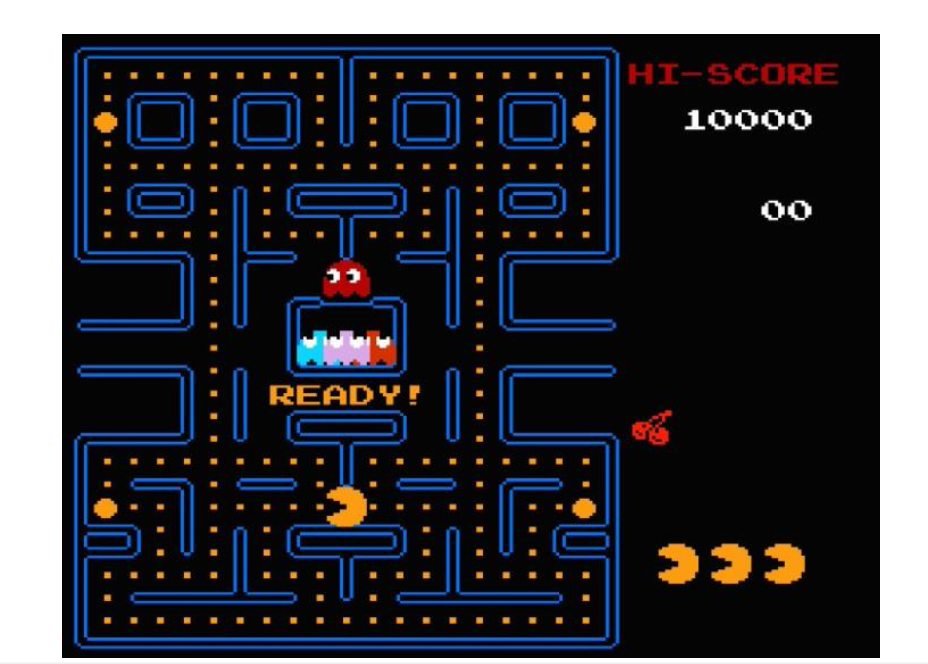
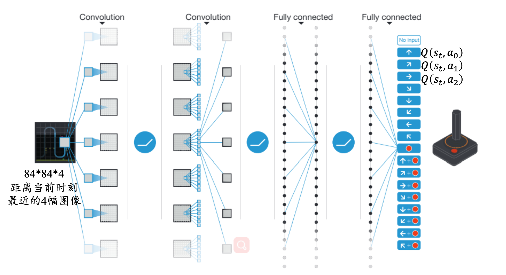

# 强化学习

网络结构：其中的r: reward、s: state 、a: action

马尔科夫决策过程包含五个元素：

# 强化学习算法

...

# 深度强化学习

深度强化学习是深度学习和强化学习的结合

- 深度学习具有较强的感知能力，但是缺乏一定的决策能力
- 强化学习具有决策能力，但对感知问题却束手无策
- 深度强化学习(DeepReinforcementLearning，DRL)将深度学习的 感知能力和强化学习的决策能力相结合，可以直接根据输入的状态进行控制，是一种更接近人类思维方式的人工智能方法
- 深度强化学习目前侧重在强化学习上，解决的仍然是决策问题，只 不过是借助神经网络强大的表征能力去拟合Q表或直接拟合策略以 解决状态-动作空间过大或连续状态-动作空间问题

### 深度强化学习基本过程

- 利用深度学习方法来感知状态，以得到具体的状态特征表示
- 基于预期回报来评价各动作的价值函数
- 通过某种策略做出相应的动作，环境对此动作做出反应，并得到下 一个状态与回报
- 通过不断循环以上过程，最终可以得到实现目标的最优策略

### 深度Q网络(**Deep Q Network**，**DQN**)

- 这是一个较为典型的DRL算法

- DQN融合了神经网络和Q learning的方法。
- DQN把Q learning中的价值函数用深度神经网络近似。除此之外，DQN算法还做了经验回放(Experience Replay)，即将系统探索环境得到的数据储存起来，然后随机采样样本更新深度神经网络的参数。这是一种离线学习法，它能学习当前经历着的，也能学习过去经历过的，甚至是学习别人的经历。随机采样这种做法打乱了经历之间的相关性，也使得神经网络更新更有效率

参考文献：Human-level control through deep reinforcement learning, nature 2015

- 算法可以通过观察**Atari 2600**的游戏画面和得分信息，自主的学会玩游戏
  - 因为输入是RGB，像素也是高维度，因此，对图像进行初步的图像 处理，变成灰度矩形84*84的图像作为输入，有利于卷积。
  - 接下来就是模型的构建问题，毕竟Q(s,a)包含s和a。一种方法就是输 入s和a，输出q值，这样并不方便，每个a都需要forward一遍网络
  - Deepmind的做法是神经网络只输入s，输出则是每个a对应的q。这 种做法的优点就是只要输入s，forward前向传播一遍就可以获取所 有a的q值，毕竟a的数量有限

- 双网络结构

- Main DQN(主网络/当前值网络)：通过其最大Q值选择Action，而这个被选定的Action的Q值则由target DQN生成
- Target DQN(目标网络)：辅助计算目标Q值，这样做的目的是避免让网络训练陷入目标Q值与预测Q值的反馈循环中

# 其它深度强化学习方法

- 对于时间序列信息，深度**Q**网络的处理方法是加入经验回 放机制。但是经验回放的记忆能力有限，每个决策点需要获取整个输入画面进行感知记忆
- 将长短时记忆网络与深度Q网络结合，提出深度递归Q网络(Deep Recurrent Q Network，DRQN)，在部分可观测马尔科夫决策过程中表现出了更好的鲁棒性，同时在缺失若干帧画面的情况下也能获得 很好的实验结果。
- 受此启发的深度注意力递归Q网络(DeepAttentionRecurrentQ network，DARQN)。它能够选择性地重点关注相关信息区域，减少深度神经网络的参数数量和计算开销。

