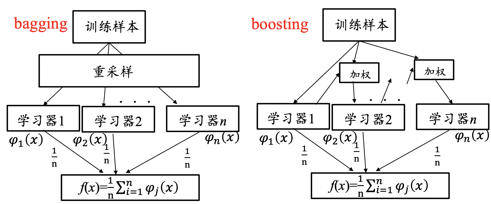
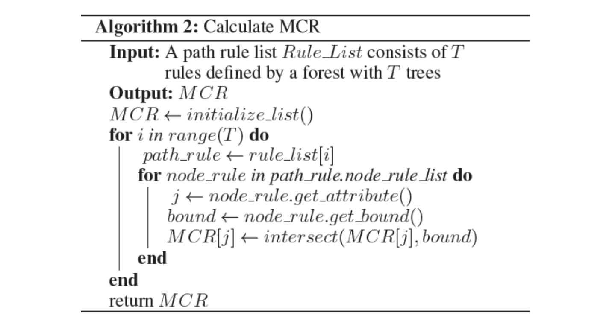

# 决策树

决策树(Decision Tree)是一种基于树结构进行决策的机器学习方法，这恰是人类面临决策时一种很自然的处理机制。

决策树生成过程:

- 寻找最适合分割的特征
- 根据纯度判断方法，寻找最优的分割点，基于这一特征把数据分割 成纯度更高的两部分数据
- 判断是否达到要求，若未达到，重复步骤一继续分割，直到达到要 求停止为止
- 剪枝，防止过拟合

# 随机森林

用随机的方式建立起一棵棵决策树，然后由这些决策树组成一个森 林，其中每棵决策树之间没有关联，当有一个新的样本输入时，就 让每棵树独立的做出判断，按照多数原则决定该样本的分类结果。 这是一种典型的集成学习思想

集成学习(Ensemblelearning)：组合多个弱监督模型以期得到一个更好更全面的强监督模型，集成学 习潜在的思想是即便某一个弱分类器得到了错误的预测，其他的弱分类器也可以将错误纠正回来

# 梯度提升决策树GBDT

GBDT是一种集成使用多个弱分类器(决策树)来提升分类效果的机器学习算法，所有树的结论累加起来作为最终结果。在很多分类和回归的场景中，表现不错且泛化能力较强。

# 深度森林

神经网络可以堆叠为深度神经网络，并且取得了显著的效果。那我们可以考虑，是不是可以将其他的学习模型堆叠起来，以获取更好的表示性能，深度森林模型就是基于这种想法提出来的一种深度结构。

2017年，深度森林由周志华老师提出，基于树模型的方法， 主要使用集成学习思想方法的深度学习框架，也可作为一种在某些任务下替代深度神经网络的方法。

参考：Deep Forest: Towards an Alternative to Deep Neural Networks, 2017

**深度神经网络的问题**

- 需要使用大量的数据进行训练
- 计算资源消耗大
- 可解释性差
- 超参数多，训练依赖于经验

**深度森林的优势**

- 与DNN相比需要的参数更少
- 训练速度快
- 不仅适合大规模数据也适合小规模数据 
- 基于树模型解释性比较好

### 多粒度级联森林

GCForest(muti-Grained Cascade Forest，多粒度级联森林)，它是基于树的集成方法，通过对树组成的森林来集成并前后串联起来达到表征学习的效果。

上图每层包含两个随机森林，随机森林和完全随机森林，处理一个三分类的问题。

- 每个完全随机的森林包含完全随机树，通过随机选择一个 特征在树的每个节点进行分割实现生长，直到叶子节点只包含相同类的实例。
- 类似的，每个随机森林包含的树，通过随机选择 $\sqrt{d}$ 数量的特征作为候选(d是输入特征的数量)，然后选择具有 最佳gini值的特征作为分割
- 每个森林中的树的数值是一个超参数

**GCForest每个森林的类分布向量生成流程**：

- 对于测试样本，每棵树会根据样本所在的子空间中训练样本的类别 占比生成一个类别的概率分布，然后对森林内所有树的各类比例取 平均，输出整个森林对各类的比例
- 每个森林都会生成长度为C的概率向量，如果一层有N个森林，那 么每个森林生成的C个元素会拼接在一起，组成C*N个元素向量， 这就是一层的输出
- 这基础上把源输入特征向量拼接上去组成了下一层的输入

**GCForest的多粒度扫描**：

- 采用滑动窗口的方法，首先生成若干个实例，其次通过实例生成两 个森林，一个完全随机森林，一个随机森林，接着再把生成的两个 森林生成对应的相同维度的“类向量”，最后把这两大类向量连接在一起。
- 一般来说会采用多个不同大小的窗口做扫描

**整体结构**

**相关性能**

### 基于森林的自编码器

**自编码器**(Auto-Encoder)是神经网络的一种，是一种重要的表示学习模型，是深度学习的关键要素之一。自编码器的基本结构是由一个编码器(encoder)和一 个解码器(decoder)组成，其中encoder将输入映射到隐空间，decoder 将隐空间的表示重构为原表示。

**eForest**(Encoder-Forest)：基于森林的自编码器，能够利用决策树的决策路径所定义的等效类 来进行后向重建。利用决策树集成算法进行向前编码和向后解码的操作。

参考：AutoEncoder by Forest, AAAI 2017

**前向编码**

- 在一个有N个已训练决策树的森林中，前向编码过程接受输入数据并将其发送到集成方法中每棵树的根结点
- 一旦数据遍历(traverse)到所有树的叶结点，该过程将返回T维向 量，T中的每个元素 t 是树 t 中的叶结点的整数索引

**后向编码**

- 利用决策树进行决策时需要将决策的路径记录下来，而每个决策路径对应了一个规则(rule)

- 在进行解码重构的过程中，利用森林中N个规则，运用最大相容规 则Maximum Compatible Rule(MCR)，获取N维编码所对应的更精 确的规则，以此规则进行重构

**优势**

- 训练速度较快：如在MNIST和CIFAR10上的训练速度比基于神经网络的模型快数倍以上

- 重构误差低：基于规则，而不是计算

- 容损性：编码规则具有强相关性，因此在部分损坏的情况下也能很 好地工作

- 可复用性：在一个数据集上训练好的模型能够直接应用于同领域另 外一个数据集

**不足**

- 与神经网络相比编码表达力不足

- 编码、解码速度相对神经网络较慢

**深度森林的适用条件**

- 具备逐层处理的任务

- 参数不可微

- 一定的模型复杂度

