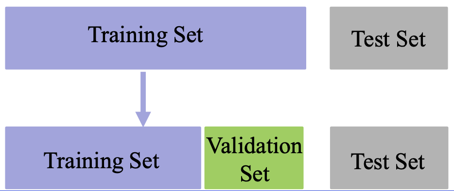

机器学习基础

1. 数据集
2. 误差分析
3. 代表的机器学习方法
   1. 有监督、线性回归、SVM、决策树、RF
   2. 无监督、聚类、降维（PCA）

# 机器学习

### 基本概念

机器学习是指让计算机具有像人一样的学习和思考能力的技术的总称。具体来说是从已知数据中获得规律，并利用规律对未知数据进行预测的技术。

机器学习分类：

- 有监督学习(SupervisedLearning)：有老师(环境)的情况下，学 生(计算机)从老师(环境)那里获得对错指示、最终答案的学习 方法。**跟学师评**
- 无监督学习(UnsupervisedLearning)：没有老师(环境)的情况 下，学生(计算机)自学的过程，一般使用一些既定标准进行评价。 **自学标评**
- 强化学习(Reinforcement Learning)：没有老师(环境)的情况下， 学生(计算机)对问题答案进行自我评价的方法。自学自评

机器学习可以做如下两种分类

- 有监督学习：代表任务“分类”和“回归”
- 无监督学习：代表任务“聚类”和“降维”

### 数据集

数据集：观测样本的集合。具体地，$𝐷={𝑥_1,𝑥_2,⋯,𝑥_𝑛}$ 表示一个包含*n*个样本的数据集，其中 $𝑥_𝑖$ 是一个向量，表示数据集的第𝑖个样本，其维度𝑑称为样本空间的维度。

向量 $𝑥_𝑖$ 的元素称为样本的特征，其取值可以是连续的，也可以是离散的。从数据集中学出模型的过程，便称为“学习”或“训练”。

**数据集分类**

- 训练集(Trainingset)：用于模型拟合的数据样本；
- 验证集(Validation set)：是模型训练过程中单独留出的样本集，它可以用于调整模型的超参数和用于对模型的能力进行初步评估；
  - 例如SVM中参数 $c$ (控制分类错误的惩罚程度)和核函数的选择， 或者选择网络结构

- 测试集(Testset):用来评估模最终模型的泛化能力。但不能作为调 参、选择特征等算法相关的选择的依据。

**常见数据集**

- 图像分类
  - MNIST(手写数字) http://yann.lecun.com/exdb/mnist/
  - CIFAR-10, CIFAR-100, ImageNet
    -  https://www.cs.toronto.edu/~kriz/cifar.html 
    - http://www.image-net.org/
- 电影评论情感分类
  - Large Movie Review Dataset v1.0
    - http://ai.stanford.edu/~amaas/data/sentiment/

- 图像生成诗歌
  - 数据集:https://github.com/researchmm/img2poem

# 误差分析

误差是指算法实际预测输出与样本真实输出之间的差异。

- 模型在训练集上的误差称为“训练误差”
- 模型在总体样本上的误差称为“泛化误差”
- 模型在测试集上的误差称为“测试误差”

由于我们无法知道总体样本会，所以我们只能尽量最小化训练误差， 导致训练误差和泛化误差有可能存在明显差异。

**过拟合**是指模型能很好地拟合训练样本，而无法很好地拟合测试样本的现象，从而导致泛化性能下降。为防止“过拟合”，可以选择减少参数、降低模型复杂度、正则化等

**欠拟合**是指模型还没有很好地训练出数据的一般规律，模型拟合程度不高的现象。为防止“欠拟合”，可以选择调整参数、增加迭代深度、换用更加复杂的模型等。

### 泛化误差分析

假设数据集上需要预测的样本为Y，特征为X，潜在模型为 $Y=f(X)+ε$，其中$ε \sim N(0,σ_ε)$是噪声, 估计的模型为$\hat{f}(X)$.
$$
\begin{array}{l}\operatorname{Err}(\hat{f})=\mathrm{E}\left[(Y-\hat{f}(\mathrm{X}))^{2}\right] \\ \operatorname{Err}(\hat{f})=\mathrm{E}\left[(f(X)+\varepsilon-\hat{f}(\mathrm{X}))^{2}\right] \\ \operatorname{Err}(\hat{f})=\mathrm{E}\left[(f(X)-\hat{f}(\mathrm{X}))^{2}+2 \varepsilon(f(X)-\hat{f}(\mathrm{X}))+\varepsilon^{2}\right] \\ \operatorname{Err}(\hat{f})=\mathrm{E}\left[(E(\hat{f}(\mathrm{X}))-f(X)+\hat{f}(\mathrm{X})-E(\hat{f}(\mathrm{X})))^{2}\right]+\sigma_{\varepsilon}^{2} \\ \operatorname{Err}(\hat{f})=\mathrm{E}[(E(\hat{f}(\mathrm{X}))-f(X))]^{2}+\mathrm{E}\left[(\hat{f}(\mathrm{X})-E(\hat{f}(\mathrm{X})))^{2}\right]+\sigma_{\varepsilon}^{2} \\ \operatorname{Err}(\hat{f})=\operatorname{Bias}^{2}(\hat{f})+\operatorname{Var}(\hat{f})+\sigma_{\varepsilon}^{2}\end{array}
$$
**偏差**(bias)反映了模型在 样本上的期望输出与真实 标记之间的差距，即模型本身的精准度，反映的是模型本身的拟合能力。

**方差**(variance)反映了模 型在不同训练数据集下学 得的函数的输出与期望输出之间的误差，即模型的稳定性，反应的是模型的波动情况。

欠拟合：高偏差低方差

- 寻找更好的特征，提升对数据的刻画能力
- 增加特征数量
- 重新选择更加复杂的模型

过拟合：低偏差高方差

- 增加训练样本数量
- 减少特征维数，高维空间密度小
- 加入正则化项，使得模型更加平滑

### 交叉验证

基本思路：将训练集划分为K份，每次采用其中K-1份作为训练集， 另外一份作为验证集，在训练集上学得函数后，然后在验证集上计 算误差---K折交叉验证

- K折重复多次，每次重复中产生不同的分割
- 留一交叉验证(Leave-One-Out)

# 有监督学习

- 数据集有标记(答案)
- 数据集通常扩展为$(𝑥_𝑖,𝑦_𝑖)$，其中$𝑦_𝑖∈Y$是 $𝑥_𝑖$ 的标记，$Y$ 是所有标记的集合，称为“标记空间”或“输出空间”
- 监督学习的任务是训练出一个模型用于预测 $𝑦$ 的取值，根据 $𝐷=\{(𝑥_1,𝑦_1 ),(𝑥_2,𝑦_2),⋯, (𝑥_𝑛,𝑦_𝑛)\}$，训练出函数𝑓，使得$𝑓(𝑥)≅𝑦$
- 若预测的值是离散值，如年龄，此类学习任务称为“分类”
- 若预测的值是连续值，如房价，此类学习任务称为“回归”

### 线性回归

线性回归是在样本属性和标签中找到一个线性关系的方法，根据训练数据找到一个线性模型，使得模型产生的预测值与样本标 签的差距最小。

若用 $𝑥_𝑖^𝑘$ 表示第𝑘个样本的第𝑖个属性，则线性模型一般形式为：
$$
f(x^k) = w_1x_1^k+w_2x_2^k+\cdots+w_mx_m^k+b = \sum_{i=1}^m w_ix_i^k+b
$$
线性回归学习的对象就是权重向量𝑤和偏置向量𝑏。如果用最小均方 误差来衡量预测值与样本标签的差距，那么线性回归学习的目标可以表示为：
$$
(w^*,b^*) = argmin_{(w,b)}\sum_{k = 1}^n(f(x^k)-y^k)^2 = argmin_{(w,b)}\sum_{k = 1}^n(w^Tx^k+b-y^k)^2
$$

### 逻辑回归

逻辑回归是利用𝑠𝑖𝑔𝑚𝑜𝑖𝑑函数，将线性回归产生的预测值压缩到0和1之间。此时将𝑦视作样本为正例的可能性，即
$$
g(f(x^k))=
\left\{\begin{array}{l}
1, \frac{1}{1+e^{-(w^Tx^k+b)}}\geq 0.5 \\ 0,  otherwise
\end{array}\right.
$$
注意，逻辑回归本质上属于分类算法，sigmoid函数的具体表达形式为：$g(x) = \frac{1}{1+e^{-x}}$.

### 支持向量机

支持向量机是有监督学习中最具有影响力的方法之一，是基于线性判别函数的一种模型。

SVM基本思想：对于线性可分的数据，能将训练样本划分开的超平 面有很多，于是我们寻找“位于两类训练样本正中心的超平面”， 即margin最大化。从直观上看，这种划分对训练样本局部扰动的承 受性最好。事实上，这种划分的性能也表现较好。

下面我们以**线性分类**为例：二类可分数据集 $𝐷 =\{ (𝑥_1 ,𝑦_1) ,(𝑥_2 ,𝑦_2 ),⋯,(𝑥_n ,𝑦_n )\}$ , 其中 $y=1$ 和 $y= -1$ 分别表示两类样本，定义分类的超平面 $f(x)=w^Tx+b$（决策边界 decision boundary) ， “最合适”的分类标准就是使得超平面距离两边数据的间隔最大。

记 $\gamma$ 为样本 x 到超平面的距离，那么有
$$
\begin{align}
x &= x_0 + \gamma \frac{w}{\|w\|}
\\
\gamma &= \frac{w^Tx + b}{\|w\|} = \frac{f(x)}{w}
\end{align}
$$
目标函数：
$$
\arg \max_{w,b} \arg \min_{x_i \in D} \frac{|w^Tx_i+b|}{\sqrt{\sum_{i = 1}^dw_i^2}} \\s.t. \forall x_i \in D,y_i(w^Tx_i+b)\geq 0
$$
通常为方便优化，我们选择加强约束条件：$\forall x_i \in D,|w^Tx_i+b| \geq 1$.

那么，原问题可以近似为：
$$
\arg \min_{w,b}  \frac{1}{2}\sum_{i = 1}^d w_i^2\\s.t. \forall x_i \in D,|w^Tx_i+b| \geq 1
$$
对于线性不可分的数据集，我们可以做下面的操作

- 特征空间存在超曲面(hypersurface)将正类和负类分开
- 核函数(kernelfunction)
  - 使用非线性函数将非线性可分问题从原始的特征空间映射至更高维
  - 决策边界的超平面表示为 $w^T \phi(x)+b = 0$.
  - 定义映射函数的内积为核函数 $K(X_i,x_j) = \phi(x_i)^T \phi(x_j)$.

### 决策树

决策树是一种基于树结构进行决策的机器学习方法，这恰是人类面临决策 时一种很自然的处理机制。

- 在这些树的结构里，叶子节点给出类标而内部节点代表某个属性；
- 例如，银行在面对是否借贷给客户的问题时，通常会进行一系列的决 策。银行会首先判断:客户的信贷声誉是否良好?良好的话，再判断 客户是否有稳定的工作? 不良好的话，可能直接拒绝，也可能判断客 户是否有可抵押物?......这种思考过程便是决策树的生成过程。

决策树的生成过程中，最重要的因素便是根节点的选择，即选择哪种特征作为决策因素：ID3算法使用信息增益作为准则。

### 随机森林

- 集成学习(Ensemblelearning)
  - 组合多个弱监督模型以期得到一个更好更全面的强监督模型，集成学 习潜在的思想是即便某一个弱分类器得到了错误的预测，其他的弱分 类器也可以将错误纠正回来。

- 随机森林用随机的方式建立起一棵棵决策树，然后由这些决策树组成 一个森林，其中每棵决策树之间没有关联，当有一个新的样本输入 时，就让每棵树独立的做出判断，按照多数原则决定该样本的分类 结果。

 **随机森林构建的基本步骤**

- 随机有放回地从训练集中的抽取*m*个训练样本,训练集 $D_t$.
- 从 $D_t$ 对应的特征属性中随机选择部分特征，构建决策树
- 重复上述步骤构建多个决策树

**预测步骤**

- 向建立好的随机森林中输入一个新样本
- 随机森林中的每棵决策树都独立的做出判断
- 将得到票数最多的分类结果作为该样本最终的类别

# 无监督学习

- 数据集没有标记信息(自学)
- 聚类：我们可以使用无监督学习来预测各样本之间的关联度，把关 联度大的样本划为同一类，关联度小的样本划为不同类，这便是 “聚类”
- 降维：我们也可以使用无监督学习处理数据，把维度较高、计算复 杂的数据，转化为维度低、易处理、且蕴含的信息不丢失或较少丢 失的数据，这便是“降维”

### 聚类

聚类的目的是将数据分成多个类别，在同一个类内，对象(实体)之间具 有较高的相似性，在不同类内，对象之间具有较大的差异。

对一批没有类别标签的样本集，按照样本之间的相似程度分类，相似的归为一类，不相似的归为其它类。这种分类称为聚类分析，也 称为无监督分类

常见方法有K-Means聚类、均值漂移聚类、基于密度的聚类等

**K-means**聚类是一个反复迭代的过程，算法分为四个步骤：

1. 选取数据空间中的K个对象作为初始中心，每个对象代表一个聚 类中心；
2. 对于样本中的数据对象，根据它们与这些聚类中心的欧氏距离， 按距离最近的准则将它们分到距离它们最近的聚类中心(最相似) 所对应的类；
3. 更新聚类中心:将每个类别中所有对象所对应的均值作为该类别 的聚类中心，计算目标函数的值；
4. 判断聚类中心和目标函数的值是否发生改变，若不变，则输出结 果，若改变，则返回2)。

### 降维

降维的目的就是将原始样本数据的维度𝑑降低到一个更小的数𝑚，且尽量使得样本蕴含信息量损失最小，或还原数据时产生的误差最小。比如主成分分析法...

降维的优势：

- 数据在低维下更容易处理、更容易使用；
- 相关特征，特别是重要特征更能在数据中明确的显示出来；
- 如果只有二维或者三维的话，能够进行可视化展示；
- 去除数据噪声，降低算法开销等。

