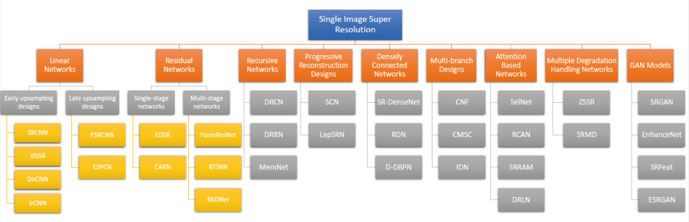
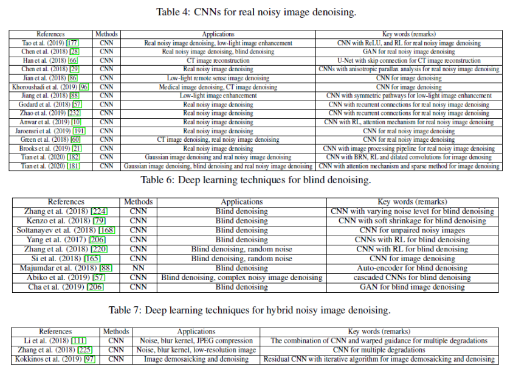
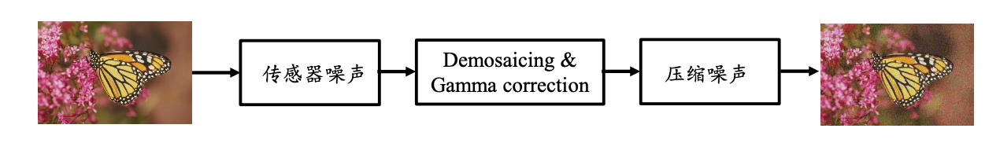

1. 图像/视频处理
2. 图像/视频压缩
3. 传统的计算机视觉处理
4. 图像分类
5. 目标检测
6. 图像分割
7. 图像回归

# 图像/视频处理

### 超分辨率问题

传统的超分辨率问题：
$$
\operatorname{argmin}_{\boldsymbol{X}} \|DH \boldsymbol{X} - \boldsymbol{Y}\|_2^2 + \lambda \|\boldsymbol{X}\|
$$

传统方法主要集中在图像先验，包含基于重构的方法、基于字 典稀疏表示等。

现在很多研究方向都是基于深度学习的超分辨率技术，研究现状主要是集中在CNN。

参考：Anwar, Saeed, Salman Khan, and Nick Barnes. "A deep journey into super-resolution: A survey." arXiv preprint arXiv:1904.07523 (2019).

**SRCNN**

先将低分辨率图像使用双三次插值放大至目标尺寸(如放大至2倍、 3倍、4倍)，此时仍然称放大至目标尺寸后的图像为低分辨率图像 (Low-resolution image)，即图中的输入(input)

- Patch extraction and representation：从低分辨率图像中提取重叠块，将每一个块通过卷积网络表达为高维向量
- Nonlinear Mapping：将每一个块的高维向量经过非线性映射为另外一个高维向量(维度增加)
- Reconstruction：将高维向量累积成高分辨率图像

参考：Dong, Chao, Chen Change Loy, Kaiming He, and Xiaoou Tang. "Learning a deep convolutional network for image super-resolution." In *European conference on computer vision*, pp. 184-199. Springer, Cham, 2014.

**VDSR**

上面介绍的SRCNN存在三个问题：

- 依赖于小图像区域的内容
- 训练收敛太慢
- 网络只对于某一个比例有效

VDSR的改进：

- 增加了感受野，在处理大图像上有优势，由SRCNN的 $13\times13$变为 $41\times41$. 
- 采用残差图像进行训练，收敛速度变快
- 考虑多个尺度，一个卷积网络可以处理多尺度问题

参考：Kim, Jiwon, Jung Kwon Lee, and Kyoung Mu Lee. "Accurate image super-resolution using very deep convolutional networks." In Proceedings of the IEEE conference on computer vision and pattern recognition, pp. 1646-1654. 2016.

### 图像去噪

图像在获取、处理和传输过程中都会引入噪声，去噪问题就是从带噪声的实际图像中恢复出原始图像。
$$
\operatorname{argmin}_{\boldsymbol{X}} \| \boldsymbol{X} - \boldsymbol{Y}\|_2^2 + \lambda \|\boldsymbol{T(X)}\| \quad \boldsymbol{Y} = \boldsymbol{X}+\boldsymbol{n}
$$
去噪方法大概有下面五类，我们主要介绍基于深度学习的图像去噪方法

- 滤波类
- 稀疏表达类
- 外部先验
- 聚类低秩
- 深度学习

基于深度学习的图像去噪的研究现状可以参考下面这篇综述，这篇综述介绍了超过200篇关于深度学习去噪的论文。

参考：Tian, Chunwei, Lunke Fei, Wenxian Zheng, Yong Xu, Wangmeng Zuo, and Chia-Wen Lin. "Deep Learning on Image Denoising: An overview." arXiv preprint arXiv:1912.13171 (2019).

**DnCNN**

DnCNN 是面向高斯噪声的端到端深度卷积去噪网络，它使用residual learning和batch normalization。

目标函数：$\ell(\Theta)=\frac{1}{2 N} \sum_{i=1}^{N}\left\|\mathcal{R}\left(\mathbf{y}_{i} ; \Theta\right)-\left(\mathbf{y}_{i}-\mathbf{x}_{i}\right)\right\|_{F}^{2}$

复原图像：$ x_i = y_i - \mathcal{R}(y_i)$

这里与传统的residuallearning不同，DnCNN并非每隔两层就加一个 shortcut connection，而是将网络的输出直接改成residual image(残差图片)

参考：Zhang, Kai, Wangmeng Zuo, Yunjin Chen, Deyu Meng, and Lei Zhang. "Beyond a gaussian denoiser: Residual learning of deep cnn for image denoising." *IEEE Transactions on Image Processing* 26, no. 7 (2017): 3142-3155.

**CBDNet**

为了解决盲去噪的鲁棒性，增加了噪声估计子网络，这里介绍的CBDNet包括噪声估计子网 $CNN_E$ 和非盲去噪子网 $CNN_D$；更加真实的噪声模型，以及引入非对称损失函数。

独立同分布的高斯噪声模型不能准确反映实际噪声，因为实际的噪声是通常是复杂且信号依赖的，这里提出了多种噪声混合的模型，更加接近真实图像噪声：

- 成像过程中的噪声由泊松分布和高斯分布联合构成：$n(L) = n_s(L) + n_c $.
- 图像处理过程中的噪声
  - Demosaicing和Gamma校正：$\boldsymbol{y} = f(\boldsymbol{D}\boldsymbol{M}(\boldsymbol{L}+n(\boldsymbol{L})))$.
  - JPEG压缩：$\boldsymbol{y} = JPEG(f(\boldsymbol{D}\boldsymbol{M}(\boldsymbol{L}+n(\boldsymbol{L}))))$.

非对称损失函数：根据实际效果，当估计的噪声强度高于实际噪声强度时，去噪具有较强的鲁棒性，可以得到较好的图像质量；当估计的噪声强度低于实际噪声强度时，图像中会残留较多噪声，质量不高因此，训练过程中目标函数引入非对称约束：
$$
\mathcal{L}_{a s y m m}=\sum\left|\alpha-\mathbb{I}_{\left(\hat{\sigma}\left(y_{i}\right)-\sigma\left(y_{i}\right)\right)<0}\right| \cdot\left(\hat{\sigma}\left(y_{i}\right)-\sigma\left(y_{i}\right)\right)^{2}
$$
总的优化目标函数：
$$
\begin{aligned}  \mathcal{L}=\mathcal{L}_{\text {rec }}+\lambda_{\text {asymm }} \mathcal{L}_{\text {asymm }}+\lambda_{T V} \mathcal{L}_{T V} \\ \mathcal{L}_{\text {rec }}=\|\hat{\mathbf{x}}-\mathbf{x}\|_{2}^{2} \quad \mathcal{L}_{T V}=\left\|\nabla_{h} \hat{\sigma}(\mathbf{y})\right\|_{2}^{2}+\left\|\nabla_{v} \hat{\sigma}(\mathbf{y})\right\|_{2}^{2} \end{aligned}
$$
参考：Guo S, Yan Z, Zhang K, et al. Toward convolutional blind denoising of real photographs[C]//Proceedings of the IEEE Conference on Computer Vision and Pattern Recognition. 2019: 1712-1722.

### 

