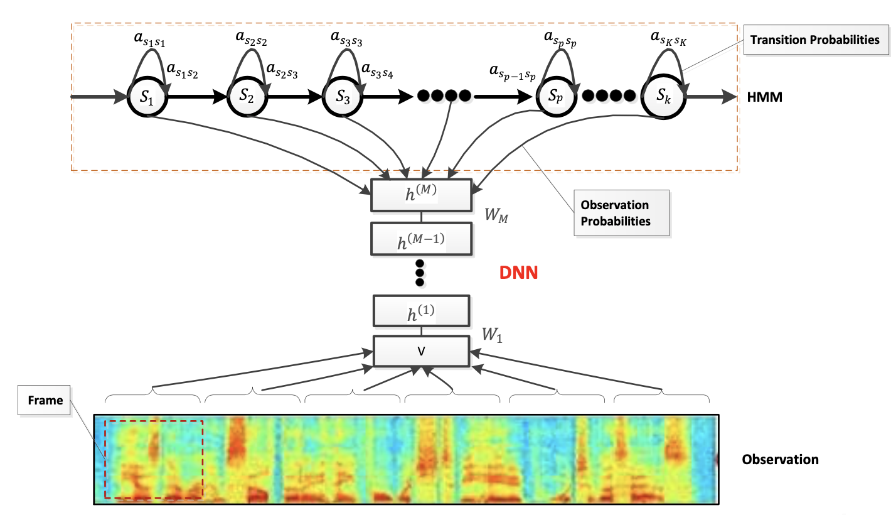

Speech语音

1. 语音技术概述
2. 语音数据集
3. 语音识别
4. 声纹识别
5. 语音合成

# 语音技术概述

语音指的是人们讲话时发出的话语，是组成语言的声音或者带有语言信息的声音，是一种人们进行信息交流产生的声音：语音(Speech) = 声音(Acoustic) + 语言(Language)。

# 常见语音数据集

### THCHS30

- 由清华大学语音与语言技术中心(CSLT)出版的开放式免费中文语音数据库
- 包含了1万余条语音文件，大约40小时的中文语音数据，内容以文 章诗句为主，全部为女声
- 数据库对学术用户完全免费
- https://arxiv.org/abs/1512.01882
- https://www.openslr.org/18/

### AISHELL

- 由北京希尔公司发布的一个免费中文语音数据集

- 包含约178小时的开源版数据

- 该数据集包含400个来自中国不同地区、具有不同的口音的人的语

  音

- 该数据免费供学术使用

- https://arxiv.org/abs/1709.05522

- https://www.openslr.org/33/

### ST-CMDS

- 由一个AI数据公司发布的免费中文语音数据集
- 包含10万余条语音文件，大约100余小时的语音数据
- 数据内容以平时的网上语音聊天和智能语音控制语句为主，855个不同说话者，同时有男声和女声
- https://www.openslr.org/38/

### Primewords Chinese Corpus Set 1

- 由上海普力信息技术有限公司发布的免费中文普通话语料库。
- 包含了大约100小时的中文语音数据，语料库由296名母语为中文的智能手机录制。
- 学术用途免费
- https://www.openslr.org/47/

### TIMIT

- 由德州仪器、麻省理工学院和SRIInternational合作构建的声学-音素连续语音语料库。
- TIMIT数据集的语音采样频率为16kHz，一共包含6300个句子
- 语音由来自美国八个主要方言地区的630个人每人说出给定的10个 句子，所有的句子都在音素级别(phone level)上进行了手动分割， 标记
- https://catalog.ldc.upenn.edu/LDC93S1

### TED-LIUM Corpus

- 包括TED演讲音频和对应讲稿。其中包括1495段演讲录音和对应的演讲稿，数据获取自TED网站
- https://www.openslr.org/51/

### VoxForge

- 该数据集是带口音的语音清洁数据集，对测试模型在不同重音或语调下的鲁棒性非常有用
- http://www.voxforge.org/

# 语音识别

语音识别(Speech Recognition，SR)是以语音信号为研究对象，让机器通过识别和理解的过程，将语音信号转为相应文字或命令的技术。目的是让机器“听懂”人说话，是人机交互的重要方式之一。

先展示语音识别的技术框架：

### 声学模型

声学模型(AcousticModel,AM)的任务是建模给定文本下产生语音波形的概率，将声学和发音学的知识进行整合，以特征提取模块提取的特征为输入， 生成声学模型得分。声学模型是语音识别系统的重要组成部分，它占据着语音识别大部分的计算开销，决定着语音识别系统的性能。

**GMM-HMM**

高斯混合模型(Gaussian mixture model，GMM)用于对语音信号的声学特征分布进行建模；隐马尔科夫模型(Hidden Markov model，HMM)则用于对语音信号的时序性进行建模。

维特比算法(Viterbi)：针对篱笆网络的有向图(Lattice)的最短路径问题而提出的动态规划算法。凡是使用隐含马 尔可夫模型描述的问题都可以用维特比算法来解码。

GMM-HMM语音识别分三步：

1. 把帧识别成状态(难点)，GMM 
2. 把状态组合成音素，HMM
3. 把音素组合成单词，HMM

**DNN-HMM**

GMM模拟任意函数的功能取决于混合高斯函数的个数，所以具有一定的局限性，属于浅层模型；深度神经网络可以模拟任意的函数，因而表达能力更强；随着深度学习的发展，DNN模型展现出了明显超越GMM 模型的性能，于是替代了GMM进行HMM状态建模。

**BLSTM-CTC**

然而在混合DNN/HMM系统的训练过程中，依然需要利用 GMM 来对训练数据进行强制对齐，以获得语音帧层面的 标注信息进一步训练DNN。这样显然不利于针对整句发音 进行全局优化，同时也相应地增加了识别系统的复杂度和 搭建门槛。

对于序列标记任务，Graves 等人提出了在循环神经网络训 练中引入联结时序分类(Connectionist Temporal Classification，CTC)目标函数，使得RNN可以自动地完成 序列输入自动对齐任务，进而提出了BLSTM-CTC模型。

**DFCNN-CTC**

深度全序列卷积神经网络(Deep Fully Convolutional Neural Network，DFCNN ):由科大讯飞2016年提出的一 种使用深度卷积神经网络来对语音时频图进行识别的方法。

连接时序分类(Connectionist temporal classification，CTC )：CTC不需要标签在时间上一一对齐就可以进行训练，在对输入数据的任一时刻做出的预测不是很关心，而关心的是整体上输出是否与标签一致，从而减少了标签预 划定的冗杂工作。在整个网络结构中把CTC作为损失函数。

DFCNN 比较灵活，可以方便地和其他建模方式融合，比如和连接时序分类模型(CTC)方案结合，以实现整个模型 的端到端声学模型训练。和目前(2016年)业界最好的语音识别框架BLSTM-CTC 系统相比， DFCNN 系统获得了额外15%的性能提升。

DFCNN 先对时域的语音信号进行傅里叶变换得到语音的语谱图， 直接将 一句语音转化成一张图像作为输入，输出单元则 直接与最终的识别结果(比如音节或者汉字)相对应。

### 语音识别主要应用

- 智能家居
  - 用语音可以控制电视机、VCD、空调、电扇、窗帘的操作
- 语音搜索
  - 搜索内容直接以语音的方式输入，响应速度更快，适用于音乐、电影、小说等内容搜索场景，让搜索内容输入更加便捷，高效
- 人机对话
  - 将语音识别为文字，毫秒级响应，可用于聊天机器人、故事机等近场语音识别环境，让人机对话更加流畅自然
- 语音输入
  - 通过语音识别将语音转换为文字实现输入，如语音输入法等

# 声纹识别

# 语音合成

