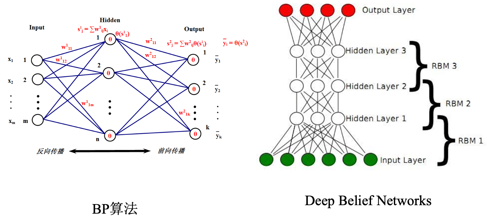

# 绪论与深度学习概述

1. 人工智能、机器学习与深度学习
2. 起源与发展
3. 重要的研究机构和著名科学家
4. 定义、理论和方法
5. 主要应用

## 人工智能、机器学习与深度学习

### 人工智能

人工智能是一门新兴学科，关于人工智能的定义，有很多人给出过，比如

- 约翰·麦卡锡(2007)：It is the science and engineering of making intelligent machines, especially intelligent computer programs. It is related to the similar task of using computers to understand human intelligence, but AI does not have to confine itself to methods that are biologically observable.
- $Andreas Kaplan$：A system’s ability to correctly interpret external data, to learn from such data, and to use those learnings to achieve specific goals and tasks through flexible adaptation.

- 全国信息安全标准化技术委员会：人工智能，是利用数字计算机或者数字计算机控制的机器模拟、延伸 和扩展人的智能，感知环境、获取知识并使用知识获得最佳结果的理 论、方法、技术及应用系统。

人工智能可以分成以下三类：

- 强人工智能：认为有可能制造出真正能推理和解决问题的智能机器，这样的机器被认为是有自主意识的
- 弱人工智能：认为不可能制造出能真正进行推理和解决问题的智能 机器，这些机器只不过看起来像是智能的，但是并不真正拥有智能， 也不会有自主意识
- 超级人工智能：机器的智能彻底超过了人类，“奇点”2050年到来？

**人工智能的三次浪潮**

### 机器学习

**机器学习定义**   让计算机具有像人一样的学习和思考能力的技术的总称。具体来说是从已知数据中获得规律，并利用规律对未知数据进行预测的技术

**机器学习分类**

- 有监督学习( $SupervisedLearning$ )：有老师(环境)的情况下， 学生(计算机)从老师(环境)那里获得对错指示、最终答案的学

  习方法。跟学师评

- 无监督学习( $UnsupervisedLearning$ )：没有老师(环境)的情

  况下，学生(计算机)自学的过程，一般使用一些既定标准进行评价。自学标评

- 强化学习( $ReinforcementLearning$ )：没有老师(环境)的情况 下，学生(计算机)对问题答案进行自我评价的方法。自学自评

## 起源与发展

- 第一阶段(1943 -1969)
  - 1943年： $Warren McCulloch$ 和 $Walter Pitts$ 提出了`MP`神经元模型
  - 1958年： $Frank Rosenblatt$ 提出了感知器( $Perceptron$ )
  - 1960年： $Bernard Widrow$ 和 $Ted Hoff$ 提出了`ADLINE`神经网络
  - 1969年： $Marvin Minsky$ 和 $Seymour Papert$ 指出感知器只能做简单的线性分类任务，无法解决`XOR`这种简单分类问题
- 第二阶段(1980 -1989)
  - 1982年： $John Hopfield$ 提出了`Hopfield`神经网络
  - 1986年： $David Rumelhart$ 、 $Geoffrey Hinton$ 和 $Ronald Williams$ 提出了误差反向传播算法(`Error Back Propagation`，`BP`)
  - 1989年： $YannLeCun$ 等人提出了卷积神经网络(`Convolutional Neural Networks`，`CNN`)

- 第三阶段(2006 - )

  - 2006年： $Hinton$ 和他的学生正式提出了深度学习的概念，通过无监督学习方法逐层训练算法，再使用有监督的反向传播算法进行调优

  - 2011年： $Frank Seide$ 在语音识别基准测试数据集上获得压倒性优势

  - 2012年： $AlexKrizhevsky$ 在`CNN`中引入`ReLU`激活函数，在图像识别基准测试中获得压倒性优势。

  - 2012年：吴恩达( $Andrew Ng$ )教授和谷歌首席架构师 $Jeff Dean$ 共同主导著名的 $GoogleBrain$ 项目，采用 $16$ 万个 $CPU$ 来构建一个深层 神经网络——`DNN`，将其应用于图像和语音的识别，大获成功

  - 2014年： $Facebook$ 的 $DeepFace$ 项目，在人脸识别方面的准确率已 经能够达到 $97%$ 以上，跟人类识别的准确率几乎没有差别

  - 2016年：谷歌 $DeepMind$ 开发的 $AlphaGo$ 以 $4:1$ 的比分战胜国际顶尖 围棋高手李世石，证明在围棋领域，基于深度学习技术的机器人已经超越了人类

## 重要的研究机构和著名科学家

### 深度学习研究机构

- **$Machine Learning at University of Toronto$** 

代表人物： $GeoffreyHinton$

- **Deepmind at Google**

- **$AI research at Facebook$**
- **清华大学AI研究院** 
- **中国科学院自动化所**
- **中国科学院数学与系统科学研究院**
- **$Tencent AI Lab$**
- **华为诺亚方舟实验室**
- **阿里达摩院**
- ...

### 深度学习知名科学家

- **$Geoffrey Hinton$**

深度学习之父；多伦多大学杰出教授； $Google$ 副总裁及首席科学顾问；英国皇家科学院院士，美国国家工 程院外籍院士，美国艺术与科学院 外籍院士。

在`BP`算法， $Boltzmannmachines$ ， $Time-delay neural nets$ ， $Variational learning and Deep learning$ 做出杰出文献。

- **$Yann LeCun$**

卷积神经网络之父；纽约大学杰出教授； $Facebook$ 人工智能实验室负责人；纽约大学数据科学实验室创始人。

在学习理论与学习算法、卷积神经 网络领域做出杰出文献。

- **$Yoshua Bengio$**

蒙特利尔大学全职教授；加拿大统计学习算法研究主席；加拿大皇家科学院院士； $CIFAR Senior Fellow$ ；创办了 $ICLR$ 国际会议。

在 $MachineLearning$ ， $Deeplearning$ 领域做出杰出文献。

- **吴恩达(Andrew Ng)**

斯坦福大学计算机科学系和电子工程系副教授；在线教育平台$Coursera$ 的联合创始人( $with Daphne Koller$ )；2014年5月16日，吴恩达加入百度，担任百度公司首席科学家；2017年10月，吴恩达出任 $Woebot$ 公司新任董事长。

## 深度学习的定义和主要应用

### 定义

**深度学习定义**：一般是指通过训练多层网络结构对未知数据进行分类或回归

**深度学习分类**：有监督学习方法——深度前馈网络、卷积神经网络、循环神经网络等；无监督学习方法——深度信念网、深度玻尔兹曼机，深度自编码器等。

### 主要应用

**图像处理领域主要应用**

- 图像分类(物体识别)：整幅图像的分类或识别
- 物体检测：检测图像中物体的位置进而识别物体
- 图像分割：对图像中的特定物体按边缘进行分割
- 图像回归：预测图像中物体组成部分的坐标

**语音识别领域主要应用**

- 语音识别：将语音识别为文字
- 声纹识别：识别是哪个人的声音
- 语音合成：根据文字合成特定人的语音

**自然语言处理领域主要应用**

- 语言模型：根据之前词预测下一个单词。
- 情感分析：分析文本体现的情感(正负向、正负中或多态度类型)。
- 神经机器翻译：基于统计语言模型的多语种互译。
- 神经自动摘要：根据文本自动生成摘要。
- 机器阅读理解：通过阅读文本回答问题、完成选择题或完型填空。
- 自然语言推理：根据一句话(前提)推理出另一句话(结论)。

**综合应用**

- 图像描述：根据图像给出图像的描述句子
- 可视问答：根据图像或视频回答问题
- 图像生成：根据文本描述生成图像
- 视频生成：根据故事自动生成视频