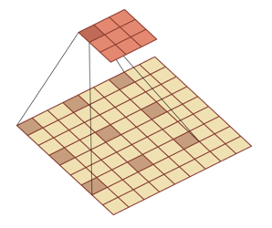
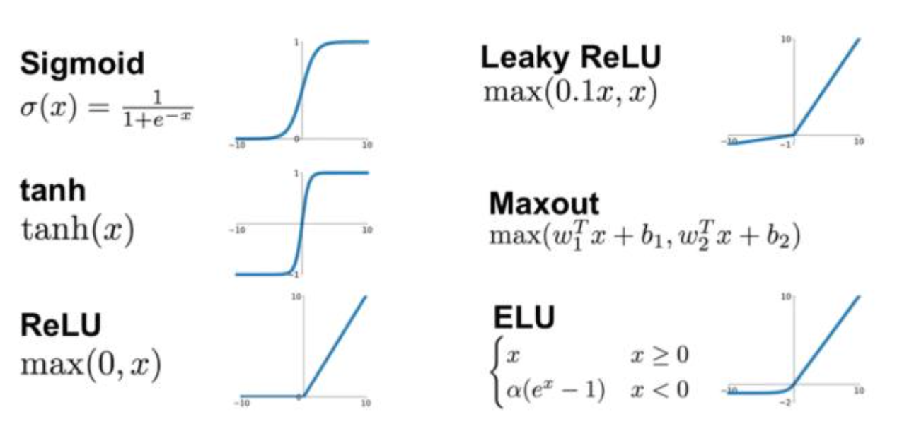

卷积神经网络CNN 

1. 卷积
2. CNN基本原理
3. 经典CNN
4. CNN主要应用

之前我们介绍了全连接神经网络，它的权重矩阵的参数非常多。

而且往往自然图像中的物体都具有局部不变性特征，即尺度缩放、平移、旋转等操作不影响其语义信息，但是全连接前馈网络很难提取这些局部不变特征，这就引出了我们将要介绍的卷积神经网络（Convolutional Neural Networks，CNN）。

卷积神经网络也是一种前馈神经网络，是受到生物学上感受野（感受野主要是指听觉系统、本体感觉系统和视觉系统中神经元的一些性质）的机制而提出的（在视觉神经系统中，一个神经元的感受野是指视网膜上的特定区域，只有这个区域内的刺激才能够激活该神经元）。

# 卷积

卷积：(*f***g*)(*n*)成为 $f$ 和 $g$ 的卷积，连续卷积和离散卷积可以表达为如下形式：
$$
(f * g)(n)=\int_{-\infty}^{\infty} f(\tau) g(n-\tau) d \tau
\\
n = \tau + (n - \tau)
\\
(f * g)(n) = \sum_{\tau = -\infty}^{\infty} f(\tau) g(n-\tau)
$$
卷积有很多应用，经常用于处理一个输入，通过系统产生一个适应需求的输出。

- 统计学中加权平均法
- 概率论中两个独立变量之和概率密度的计算  
- 信号处理中的线性系统
- 物理学的线性系统
- 图像处理中的应用(卷积神经网络)

卷积经常用在信号处理中，用于计算信号的延迟累积。

例如，假设一个信号发生器每个时刻 $t$ 产生一个信号 $x_t$ ，其信息的衰减率为 $w_k$ ，即在 $k−1$ 个时间步长后，信息为原来的 $w_k$ 倍，假设 $w_1 = 1,w_2 = 1/2,w_3 = 1/4$，则时刻 $t$ 收到的信号 $y_t$ 为当前时刻产生的信息和以前时刻延迟信息的叠加，即：
$$
\begin{aligned} y_{t} &=1 \times x_{t}+1 / 2 \times x_{t-1}+1 / 4 \times x_{t-2} \\ &=w_{1} \times x_{t}+w_{2} \times x_{t-1}+w_{3} \times x_{t-2} \\ &=\sum_{k=1}^{3} w_{k} \cdot x_{t-k+1} \end{aligned}
$$
其中 $w_k$ 就是滤波器，也就是常说的卷积核 convolution kernel。

给定一个输入信号序列 $x$ 和滤波器 $w$，卷积的输出为：
$$
y_t = \sum_{k = 1}^{K} w_k x_{t-k+1}
$$
不同的滤波器来提取信号序列中的不同特征：

下面引入滤波器的滑动步长*S*和零填充*P*：

卷积的结果按输出长度不同可以分为三类：

1. 窄卷积：步长 𝑇 = 1 ，两端不补零 𝑃 = 0 ，卷积后输出长度为 𝑀 − 𝐾 + 1
2. 宽卷积：步长 𝑇 = 1 ，两端补零 𝑃 = 𝐾 − 1 ，卷积后输出长度 𝑀 + 𝐾 − 1 
3. 等宽卷积：步长 𝑇 = 1 ，两端补零 𝑃 =(𝐾 − 1)/2 ，卷积后输出长度 𝑀 

在早期的文献中，卷积一般默认为窄卷积。而目前的文献中，卷积一般默认为等宽卷积。

在图像处理中，图像是以二维矩阵的形式输入到神经网络中，因此我们需要二维卷积。下面给出定义：一个输入信息 $X$ 和滤波器 $W$ 的二维卷积为 $Y = W * X$，即 $y_{ij} = \sum_{u =1}^U \sum_{v = 1}{V}w_{uv}x_{i-u+1,j-v+1}$ .可以参考下面的算例。

下图直接表示卷积层的映射关系

多个卷积核的情况：下图是表示步长2、filter 3*3 、filter个数6、零填充 1的情形。

几乎很多实际应用都可以对应到这个问题上，都是在做这样一件事

1）输入对应着rgb图片

2）一旦输入的特征图个数是多个，这个时候每一组filter就应该是多个，而这里有两组filter

3）输入是三个特征图，输出为两个特征图，那么我们同样看看每个特征图怎么计算的。

典型的卷积层为3维结构

### 其他卷积

**转置卷积/微步卷积**：低维特征映射到高维特征

**空洞卷积**：为了增加输出单元的感受野，通过给卷积核插入“空洞”来变相地增加其大小。

# 卷积神经网络基本原理

卷积神经网络的基本结构大致包括：卷积层、激活函数、池化层、全连接层、输出层等。

### 卷积层

二维卷积运算：给定二维的图像*I*作为输入，二维卷积核*K*，卷积运算可表示为 $S(i, j)=(I * K)(i, j)=\sum_{m} \sum_{n} I(i-m, j-n) K(m, n)$，卷积核需要进行上下翻转和左右反转
$$
\left.S(i, j)=\operatorname{sum}\left(\begin{array}{ccc}I(i-2, j-2) & I(i-2, j-1) & I(i-2, j) \\ I(i-1, j-2) & I(i-1, j-1) & I(i-1, j) \\ I(i, j-2) & I(i, j-1) & I(i, j)\end{array}\right] . *\left[\begin{array}{rll}K(2,2) & K(2,1) & K(2,0) \\ K(1,2) & K(1,1) & K(1,0) \\ K(0,2) & K(0,1) & K(0,0)\end{array}\right]\right)
$$
卷积实际上就是互相关

**卷积的步长(stride)**：卷积核移动的步长

**卷积的模式**：Full**,** Same和Valid

**数据填充**：如果我们有一个 𝑛×𝑛 的图像，使用𝑓×𝑓 的卷积核进行卷积操作，在进行卷积操作之前我们在图像周围填充 𝑝 层数据，输出的维度：

**感受野**：卷积神经网络每一层输出的特征图(featuremap)上的像素点在输 入图片上映射的区域大小，即特征图上的一个点对应输入图上的区 域。

那么如何计算感受野的大小，可以采用从后往前逐层的计算方法：

- 第 *i* 层的感受野大小和第 i - 1 层的卷积核大小和步长有关系，同时也与第 (i - 1)层感受野大小有关
- 假设最后一层(卷积层或池化层)输出特征图感受野的大小(相对于其直 接输入而言)等于卷积核的大小

**卷积层的深度(卷积核个数)**：一个卷积层通常包含多个尺寸一致的卷积核

### 激活函数

激活函数是用来加入非线性因素，提高网络表达能力，卷积神经网络中最常用的是ReLU，Sigmoid使用较少。

**1. ReLU函数**
$$
f(x)=\left\{\begin{array}{l}0, x<0 \\ x, x \geq 0\end{array}\right.
$$
**ReLU**函数的优点：

- 计算速度快，ReLU函数只有线性关系，比Sigmoid和Tanh要快很多
- 输入为正数的时候，不存在梯度消失问题

**ReLU**函数的缺点：

- 强制性把负值置为0，可能丢掉一些特征
- 当输入为负数时，权重无法更新，导致“神经元死亡”(学习率不 要太大)

**2. Parametric ReLU**
$$
f(x)=\left\{\begin{array}{l}\alpha x, x<0 \\ x, x \geq 0\end{array}\right.
$$

- 当 𝛼=0.01 时，称作Leaky ReLU
- 当 𝛼 从高斯分布中随机产生时，称为Randomized ReLU(RReLU)

**PReLU**函数的优点：

- 比sigmoid/tanh收敛快
- 解决了ReLU的“神经元死亡”问题

**PReLU**函数的缺点：需要再学习一个参数，工作量变大

**3. ELU函数**
$$
f(x)=\left\{\begin{array}{l}\alpha (e^x-1), x<0 \\ x, x \geq 0\end{array}\right.
$$
**ELU**函数的优点：

- 处理含有噪声的数据有优势
- 更容易收敛

**ELU**函数的缺点：计算量较大，收敛速度较慢

- CNN在卷积层尽量不要使用Sigmoid和Tanh，将导致梯度消失。
- 首先选用ReLU，使用较小的学习率，以免造成神经元死亡的情况。
- 如果ReLU失效，考虑使用Leaky ReLU、PReLU、ELU或者Maxout，此时一般情况都可以解决

**特征图**

- 浅层卷积层：提取的是图像基本特征，如边缘、方向和纹理等特征
- 深层卷积层：提取的是图像高阶特征，出现了高层语义模式，如“车轮”、“人脸”等特征

### 池化层

池化操作使用某位置相邻输出的总体统计特征作为该位置 的输出，常用最大池化**(max-pooling)**和均值池化**(average- pooling)**。

池化层不包含需要训练学习的参数，仅需指定池化操作的核大小、操作步幅以及池化类型。

池化的作用：

- 减少网络中的参数计算量，从而遏制过拟合
- 增强网络对输入图像中的小变形、扭曲、平移的鲁棒性(输入里的微 小扭曲不会改变池化输出——因为我们在局部邻域已经取了最大值/ 平均值)
- 帮助我们获得不因尺寸而改变的等效图片表征。这非常有用，因为 这样我们就可以探测到图片里的物体，不管它在哪个位置

### 全连接层

- 对卷积层和池化层输出的特征图(二维)进行降维
- 将学到的特征表示映射到样本标记空间的作用

### 输出层

对于分类问题：使用**Softmax**函数
$$
y_i = \frac{e^{z_i}}{\sum_{i = 1}^{n}e^{z_i}}
$$
对于回归问题：使用线性函数
$$
y_i = \sum_{m = 1}^{M}w_{im}x_m
$$

### 卷积神经网络的训练

Step 1：用随机数初始化所有的卷积核和参数/权重

Step 2：将训练图片作为输入，执行前向步骤(卷积， ReLU，池化以及全连接层的前向传播)并计算每个类别的对应输出概率。

Step 3：计算输出层的总误差

Step 4：反向传播算法计算误差相对于所有权重的梯度，并用梯度下降法更新所有的卷积核和参数/权重的值，以使输出误差最小化

注：卷积核个数、卷积核尺寸、网络架构这些参数，是在 Step 1 之前就已经固定的，且不会在训练过程中改变——只有卷 积核矩阵和神经元权重会更新。

和多层神经网络一样，卷积神经网络中的参数训练也是使用误差反向传播算法，关于池化层的训练，需要再提一下，是将池化层改为多层神经网络的形式

将卷积层也改为多层神经网络的形式

# 经典卷积神经网络

### 1. LeNet-5

LeNet-5由LeCun等人提出于1998年提出，主要进行手写数字识别和英文字母识别。经典的卷积神经网络，LeNet虽小，各模块齐全，是学习 CNN的基础。

参考：**http://yann.lecun.com/exdb/lenet/**

Y. LeCun, L. Bottou, Y. Bengio, and P. Haffner. Gradient-based learning applied to document recognition. Proceedings of the IEEE, November 1998.

**网络结构**

**输入层**：$32*32$ 的图片，也就是相当于1024个神经元

**C1层(卷积层)**：选择6个 $5*5$ 的卷积核，得到6个大小为32-5+1=28的特征图，也就是神经元的个数为 $6*28*28=4704$

**S2层(下采样层)**：每个下抽样节点的4个输入节点求和后取平均(平均池化)，均值 乘上一个权重参数加上一个偏置参数作为激活函数的输入，激活函数的输出即是下一层节点的值。池化核大小选择 $2*2$，得到6个 $14*14$ 大小特征图

**C3层(卷积层)**：用 $5*5$的卷积核对S2层输出的特征图进行卷积后，得到6张$10*10$ 新 图片，然后将这6张图片相加在一起，然后加一个偏置项b，然后用 激活函数进行映射，就可以得到1张 $10*10$ 的特征图。我们希望得到 16 张  $10*10$ 的 特 征 图 ， 因 此 我 们 就 需 要 参 数 个 数 为 $16*(6*(5*5))=16*6*(5*5)$ 个参数

**S4层(下采样层)**：对C3的16张 $10*10$ 特征图进行最大池化，池化核大小为$2*2$，得到16张大小为 $5*5$ 的特征图。神经元个数已经减少为:$16*5*5=400$

**C5层(卷积层)**：用 $5*5$ 的卷积核进行卷积，然后我们希望得到120个特征图，特征图 大小为5-5+1=1。神经元个数为120（这里实际上是全连接，但是原文还是称之为了卷积层）

**F6层(全连接层)**：有84个节点，该层的训练参数和连接数都$(120+1)* 84=10164$

**Output层**：共有10个节点，分别代表数字0到9，如果节点*i*的输出值为0，则网络识别的结果是数字*i*。采用的是径向基函数(RBF)的网络连接方式：
$$
y_i = \sum_j(x-j - w_{ij})^2
$$
**总结**：卷积核大小、卷积核个数(特征图需要多少个)、池化核大小(采样率多少)这些参数都是变化的，这就是所谓的CNN调参，需要学会根据需要进行不同的选择。

### 2. AlexNet

AlexNet由Hinton的学生Alex Krizhevsky于2012年提出，获得ImageNet LSVRC-2012(物体识别挑战赛)的冠军，1000个类别120万幅高清图像（Error: 26.2%(2011) →15.3%(2012)），通过AlexNet确定了CNN在计算机视觉领域的王者地位。

参考：A. Krizhevsky, I. Sutskever, and G. Hinton. Imagenet classification with deep convolutional neural networks. In NIPS, 2012.

- 首次成功应用ReLU作为CNN的激活函数
- 使用Dropout丢弃部分神元，避免了过拟合
- 使用重叠MaxPooling(让池化层的步长小于池化核的大小)， 一定程度上提升了特征的丰富性
- 使用CUDA加速训练过程
- 进行数据增强，原始图像大小为256×256的原始图像中重 复截取224×224大小的区域，大幅增加了数据量，大大减 轻了过拟合，提升了模型的泛化能力

**网络结构**

AlexNet可分为8层(池化层未单独算作一层)，包括5个卷 积层以及3个全连接层

**输入层**：AlexNet首先使用大小为224×224×3图像作为输入(后改为227×227×3)

**第一层(卷积层)**：包含96个大小为11×11的卷积核，卷积步长为4，因此第一层输出大小为55×55×96；然后构建一个核大小为3×3、步长为2的最大池化层进行数据降采样，进而输出大小为27×27×96

**第二层(卷积层)**：包含256个大小为5×5卷积核，卷积步长为1，同时利用padding保证 输出尺寸不变，因此该层输出大小为27×27×256；然后再次通过 核大小为3×3、步长为2的最大池化层进行数据降采样，进而输出大小为13×13×256

**第三层与第四层(卷积层)**：均为卷积核大小为3×3、步长为1的same卷积，共包含384个卷积核，因此两层的输出大小为13×13×384

**第五层(卷积层)**：同样为卷积核大小为3×3、步长为1的same卷积，但包含256个卷积 核，进而输出大小为13×13×256;在数据进入全连接层之前再次 通过一个核大小为3×3、步长为2的最大池化层进行数据降采样， 数据大小降为6×6×256，并将数据扁平化处理展开为9216个单元

**第六层、第七层和第八层(全连接层)**：全连接加上Softmax分类器输出1000类的分类结果，有将近6千万个参数

### 3. VGGNet 

VGGNet由牛津大学和DeepMind公司提出

- Visual Geometry Group:https://www.robots.ox.ac.uk/~vgg/ 
- DeepMind:https://deepmind.com/

参考：K. Simonyan and A. Zisserman. Very deep convolutional networks for large-scale image recognition. In ICLR, 2015.

- 比较常用的是VGG-16，结构规整，具有很强的拓展性
- 相较于AlexNet，VGG-16网络模型中的卷积层均使用 $3*3$ 的 卷积核，且均为步长为1的same卷积，池化层均使用 $2*2$ 的 池化核，步长为2

**网络结构**

- 两个卷积核大小为 $3*3$ 的卷积层串联后的感受野尺寸为 $5*5$， 相当于单个卷积核大小为 $5*5$ 的卷积层
- 两者参数数量比值为$(2*3*3)/(5*5)=72\%$ ，前者参数量更少
- 此外，两个的卷积层串联可使用两次ReLU激活函数，而一个卷积层只使用一次

### 4. Inception Net 

Inception Net 是Google公司2014年提出，获得ImageNet LSVRC-2014冠军。文章提出获得高质量模型最保险的做法就是增加模型的深度(层数)或者是其宽度(层核或者神经元数)，采用了22层网络。

**Inception四个版本**所对应的论文及ILSVRC中的Top-5错误率：

-  [v1] Going Deeper with Convolutions: 6.67%

-  [v2] Batch Normalization: Accelerating Deep Network Training by

  Reducing Internal Covariate Shift: 4.8%

-  [v3]RethinkingtheInceptionArchitectureforComputerVision:3.5%

-  [v4] Inception-v4, Inception-ResNet and the Impact of Residual Connections on Learning: 3.08%

**Inception Module**

- 深度：层数更深，采用了22层，在不同深度处增加了两个 loss来避免上述提到的梯度消失问题
- 宽度：Inception Module包含4个分支，在卷积核3x3、5x5 之前、max pooling之后分别加上了1x1的卷积核，起到了降低特征图厚度的作用
  - 1×1的卷积的作用：可以跨通道组织信息，来提高网络的表达能力；可以对输出通道进行升维和降维。

### 5. ResNet

ResNet(Residual Neural Network)，又叫做残差神经网 络，是由微软研究院的何凯明等人2015年提出，获得ImageNet ILSVRC 2015比赛冠军，获得CVPR2016最佳论文奖。

随着卷积网络层数的增加，误差的逆传播过程中存在的梯 度消失和梯度爆炸问题同样也会导致模型的训练难以进行，甚至会出现随着网络深度的加深，模型在训练集上的训练误差会出现先降低再升高的现象。残差网络的引入则有助于解决梯度消失和梯度爆炸问题。

**残差块**

ResNet的核心是叫做残差块(Residual block)的小单元， 残差块可以视作在标准神经网络基础上加入了跳跃连接(Skip connection)

- 原连接

$$
a_{l+1} = \sigma(W_{l+1}a_l+b_{l+1})
\\
a_{l+2} = \sigma(W_{l+2}a_{l+1}+b_{l+2})
$$

- 跳跃连接

$$
a_{l+1} = \sigma(W_{l+1}a_l+b_{l+1})
\\
a_{l+2} = \sigma(W_{l+2}a_{l+1}+b_{l+2}+a_l)
$$

**Skip connection的作用**

记 $u_{l+1} = W_{l+1}a_l+b_{l+1},u_{l+2} = W_{l+2}a_{l+1}+b_{l+2}+a_l = \hat{u}_{l+2} + a_l$

我们有：
$$
\begin{align}

\frac{\partial E}{\partial w_l} &= 
\frac{\partial E}{\partial a_{l+2}}
\frac{\partial a_{l+2}}{\partial u_{l+2}}
\frac{\partial u_{l+2}}{\partial w_l}
\\
&=
\frac{\partial E}{\partial a_{l+2}}
\frac{\partial a_{l+2}}{\partial u_{l+2}}
\frac{\partial \hat{u}_{l+2}}{\partial w_l}
+
\frac{\partial E}{\partial a_{l+2}}
\frac{\partial a_{l+2}}{\partial u_{l+2}}
\frac{\partial a_l}{\partial w_l}
\\
&=
\cdots + \frac{\partial E}{\partial a_{l+2}}
\frac{\partial a_{l+2}}{\partial u_{l+2}}
\frac{\partial a_l}{\partial u_l}
\frac{\partial u_{l}}{\partial w_l}
\end{align}
$$

### 6. Densenet

DenseNet中，两个层之间都有直接的连接，因此该网络的直接连接个数为L(L+1)/2。

对于每一层，使用前面所有层的特征映射作为输入，并且使用其自身的特征映射作为所有后续层的输入

参考：Huang, G., Liu, Z., Van Der Maaten, L., & Weinberger, K. Q. (2017). Densely connected convolutional networks. In *Proceedings of the IEEE conference on computer vision and pattern recognition* (pp. 4700- 4708).

**5层的稠密块示意图**

DenseNets可以自然地扩展到数百个层，而没有表现出优化困难。在实验中，DenseNets随着参数数量的增加，在精度上产生一致的提高，而没有任何性能下降或过拟合的迹象。

**优点**：

- 缓解了消失梯度问题
- 加强了特征传播，鼓励特征重用 
- 一定程度上减少了参数的数量

# 主要应用

**图像处理领域主要应用**

- 图像分类(物体识别)：整幅图像的分类或识别
- 物体检测：检测图像中物体的位置进而识别物体
- 图像分割：对图像中的特定物体按边缘进行分割
- 图像回归：预测图像中物体组成部分的坐标

**语音识别领域主要应用**

**自然语言处理领域主要应用**

情感分析：分析文本体现的情感(正负向、正负中或多态度类型) 

参考：(Yoon Kim)Convolutional Neural Networks for Sentence https://arxiv.org/abs/1408.5882

