循环神经网络RNN

1. 计算图
2. RNN
3. 长短时记忆网络
4. 其他RNN
5. RNN主要应用


# 计算图

计算图的引入是为了后面更方便的表示网络，计算图是描述计算结构的一种图，它的元素包括节点(node)和边(edge)，节点表示变量，可以是标量、矢量、张量等，而边表示的是某个操作，即函数。

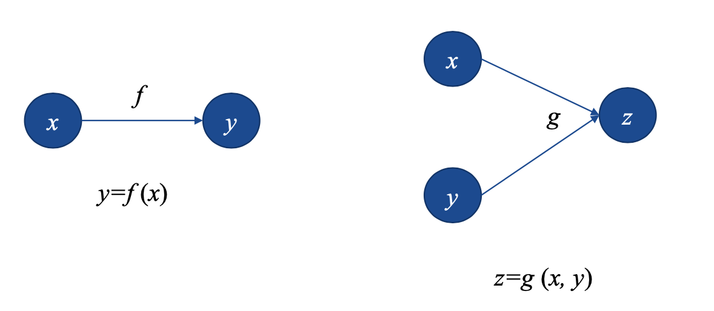

下面这个计算图表示复合函数

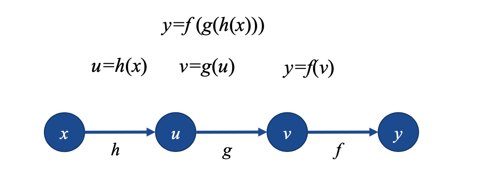

关于计算图的求导，我们可以用链式法则表示，有下面两种情况。

- 情况1

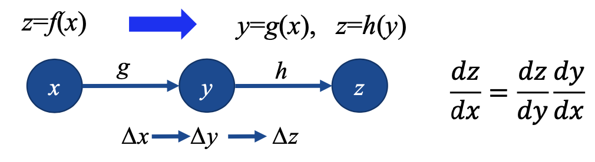

- 情况2

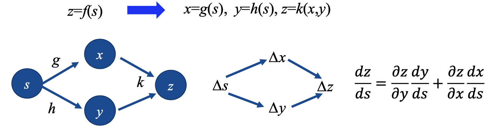

求导举例：

例1

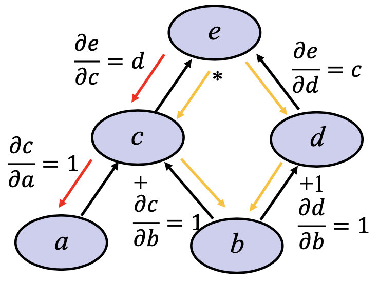

- a = 3, b = 1 可以得到 c = 4, d = 2, e = 6

- $\frac{\partial e}{\partial a} = \frac{\partial e}{\partial c}\frac{\partial c}{\partial a} = d = b + 1 = 2$
- $\frac{\partial e}{\partial b} = \frac{\partial e}{\partial c}\frac{\partial c}{\partial b}+\frac{\partial e}{\partial d}\frac{\partial d}{\partial b} = d + c=b+1+a+b = 5$

例2

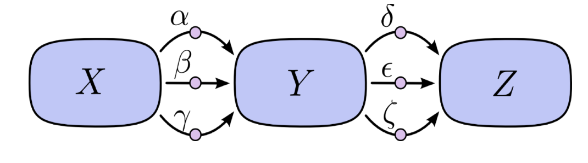

$\frac{\partial Z}{\partial X}=\alpha \delta+\alpha \epsilon+\alpha \zeta+\beta \delta+\beta \epsilon+\beta \zeta+\gamma \delta+\gamma \epsilon+\gamma \zeta = (\alpha +\beta+\gamma)(\delta+\epsilon+\zeta) $

计算图可以很好的表示导数的前向传递和后向传递的过程，比如上面例2，前向传递了$\frac{\partial }{\partial X}$ ，反向传递$\frac{\partial }{\partial Z}$ 。

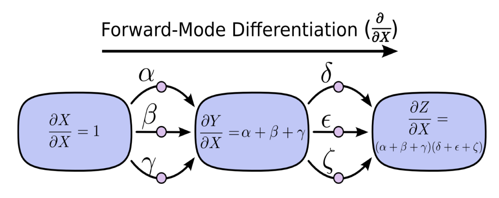

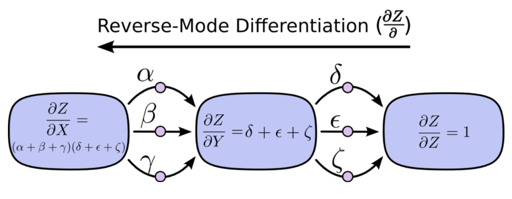

# 循环神经网络（Recurrent Neural Network）

上一章我们已经介绍了CNN，可能我们会想这里为什么还需要构建一种新的网络RNN呢？因为现实生活中存在很多序列化结构，我们需要建立一种更优秀的序列数据模型。

- 文本：字母和词汇的序列
- 语音：音节的序列
- 视频：图像帧的序列
- 时态数据：气象观测数据，股票交易数据、房价数据等

RNN的发展历程：

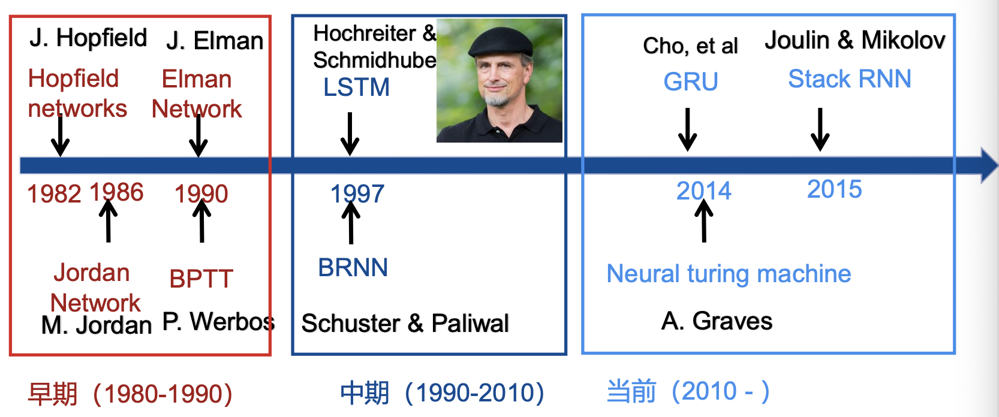

循环神经网络是一种人工神经网络，它的节点间的连接形成一个遵循时间序列的有向图，它的核心思想是，样本间存在顺序关系，每个样本和它之前的样本存在关联。通过神经网络在时序上的展开，我们能够找到样本之间的序列相关性。

下面给出RNN的一般结构：

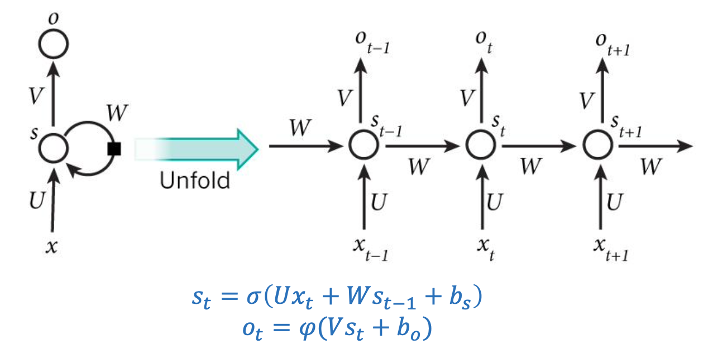

其中各个符号的表示：$x_t,s_t,o_t$分别表示的是$t$时刻的输入、记忆和输出，$U,V,W$是RNN的连接权重，$b_s,b_o$是RNN的偏置，$\sigma,\varphi$是激活函数，$\sigma$通常选tanh或sigmoid，$\varphi$通常选用softmax。

其中 softmax 函数，用于分类问题的概率计算。本质上是将一个K维的任意实数向量压缩 (映射)成另一个K维的实数向量，其中向量中的每个元素取值都介于(0，1)之间。

$$
\sigma(\vec{z})_{i}=\frac{e^{z_{i}}}{\sum_{j=1}^{K} e^{z_{j}}}
$$

### RNN案例

比如词性标注，

- 我/n,爱/v购物/n,
- 我/n在/pre华联/n购物/v

Word Embedding：自然语言处理(NLP)中的 一组语言建模和特征学习技术的统称，其中来自词汇表的单词或短语被映射到实数的向量。比如这里映射到三个向量然后输入：

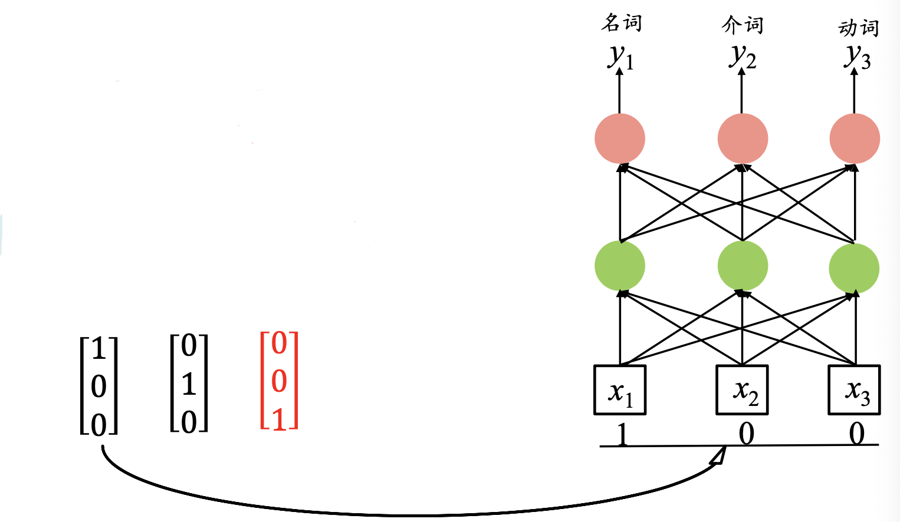

将神经元的输出存到memory中，memory中值会作为下一时刻的输入。在最开始时刻，给定 memory初始值，然后逐次更新memory中的值。

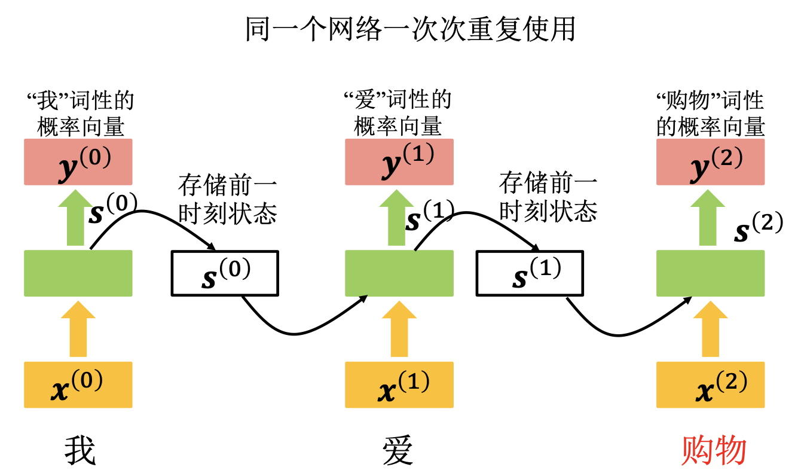

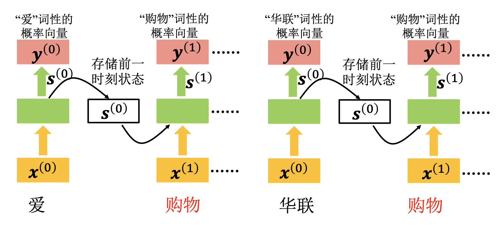

### RNN的一般结构

- Elman Network

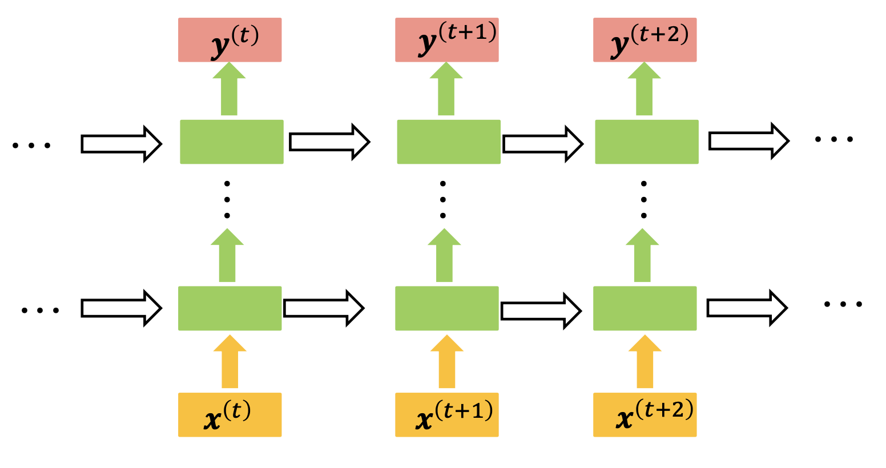

- Jordan Network


各种不同的RNN结构

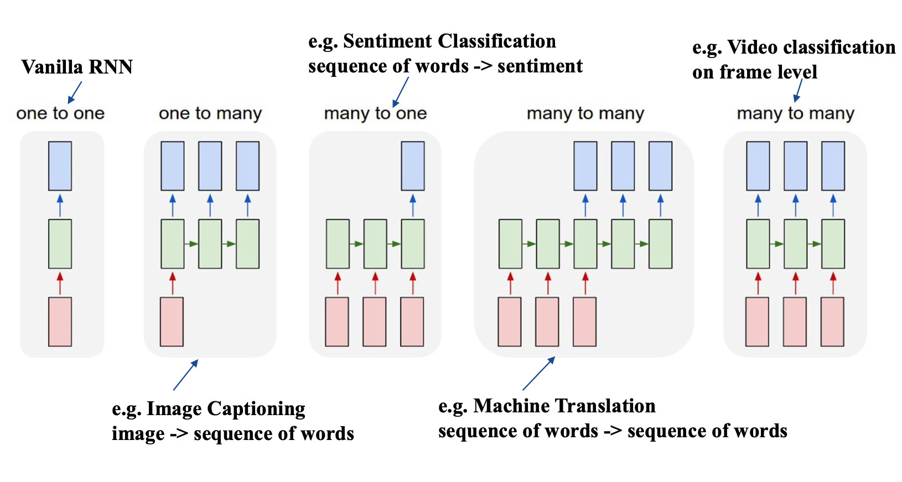

### RNN训练算法 - BPTT

我们先来回顾一下BP算法，就是定义损失函数 Loss 来表示输出 $\hat{y}$ 和真实标签 y 的误差，通过链式法则自顶向下求得 Loss 对网络权重的偏导。沿梯度的反方向更新权重的值， 直到 Loss 收敛。而这里的 BPTT 算法就是加上了时序演化，后面的两个字母 TT 就是 Through Time。

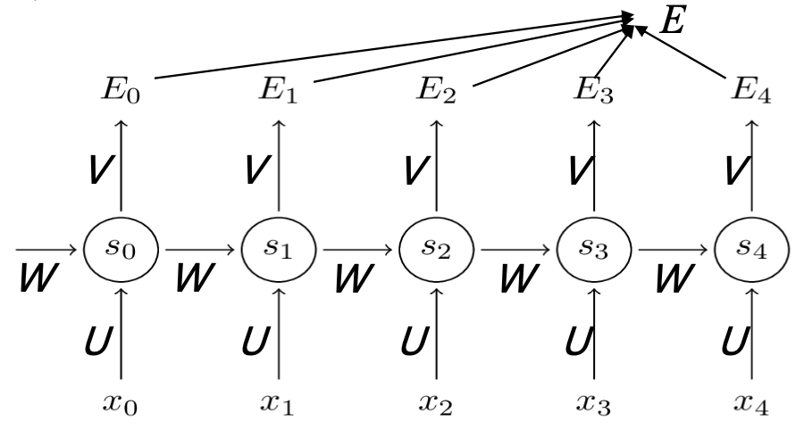

我们先定义输出函数：

$$
\begin{array}{l}s_{t}=\tanh \left(U x_{t}+W s_{t-1}\right) \\ \hat{y}_{t}=\operatorname{softmax}\left(V s_{t}\right)\end{array}
$$

再定义损失函数：

$$
\begin{aligned} E_{t}\left(y_{t}, \hat{y}_{t}\right) =-y_{t} \log \hat{y}_{t} \\ E(y, \hat{y}) =\sum_{t} E_{t}\left(y_{t}, \hat{y}_{t}\right) \\ =-\sum_{t} y_{t} \log \hat{y}_{t}\end{aligned}
$$

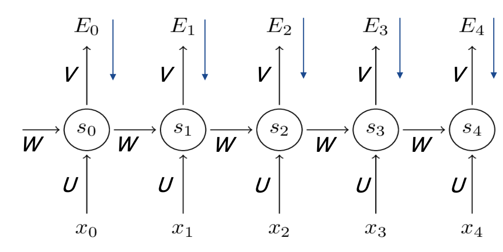

我们分别求损失函数 E 对 U、V、W的梯度：

$$
\begin{array}{l}\frac{\partial E}{\partial V}=\sum_{t} \frac{\partial E_{t}}{\partial V} \\ \frac{\partial E}{\partial W}=\sum_{t} \frac{\partial E_{t}}{\partial W} \\ \frac{\partial E}{\partial U}=\sum_{t} \frac{\partial E_{t}}{\partial U}\end{array}
$$

- 求 E 对 V 的梯度，先求 $E_3$ 对 V 的梯度

$$
\begin{aligned} \frac{\partial E_{3}}{\partial V} &=\frac{\partial E_{3}}{\partial \hat{y}_{3}} \frac{\partial \hat{y}_{3}}{\partial V} \\ &=\frac{\partial E_{3}}{\partial \hat{y}_{3}} \frac{\partial \hat{y}_{3}}{\partial z_{3}} \frac{\partial z_{3}}{\partial V} \end{aligned}
$$

其中 $z_3 = V s_3$，然后求和即可。

- 求 E 对 W 的梯度，先求 $E_3$ 对 W 的梯度

$$
\begin{array}{c}\frac{\partial E_{3}}{\partial W}=\frac{\partial E_{3}}{\partial \hat{y}_{3}} \frac{\partial \hat{y}_{3}}{\partial s_{3}} \frac{\partial s_{3}}{\partial W} \\ s_{3}=\tanh \left(U x_{3}+W s_{2}\right) \\ \frac{\partial E_{3}}{\partial W}=\sum_{k=0}^{3} \frac{\partial E_{3}}{\partial \hat{y}_{3}} \frac{\partial \hat{y}_{3}}{\partial s_{3}} \frac{\partial s_{3}}{\partial s_{k}} \frac{\partial s_{k}}{\partial W} \\ \frac{\partial E_{3}}{\partial W}=\sum_{k=0}^{3} \frac{\partial E_{3}}{\partial \hat{y}_{3}} \frac{\partial \hat{y}_{3}}{\partial s_{3}}\left(\prod_{j=k+1}^{3} \frac{\partial s_{j}}{\partial s_{j-1}}\right) \frac{\partial s_{k}}{\partial W}\end{array}
$$

其中:  $s_3$ 依赖于 $s_2$，而 $s_2$ 又依赖于 $s_1 $ 和 W ，依赖关系 一直传递到 t = 0 的时刻。因此，当我们计算对于 W 的偏导数时，不能把 $s_2$ 看作是常数项！

- 求 E 对 U 的梯度，先求 $E_3$ 对 U 的梯度

$$
\begin{array}{c}\frac{\partial E_{3}}{\partial U}=\frac{\partial E_{3}}{\partial \hat{y}_{3}} \frac{\partial \hat{y}_{3}}{\partial s_{3}} \frac{\partial s_{3}}{\partial U} \\ s_{3}=\tanh \left(U x_{3}+W s_{2}\right) \\ \frac{\partial E_{3}}{\partial U}=\sum_{k=0}^{3} \frac{\partial E_{3}}{\partial \hat{y}_{3}} \frac{\partial \hat{y}_{3}}{\partial s_{3}} \frac{\partial s_{3}}{\partial s_{k}} \frac{\partial s_{k}}{\partial U}\end{array}
$$

# 长短时记忆网络

在RNN中，存在一个很重要的问题，就是梯度消失问题，一开始我们不能有效的解决长时依赖问题，其中梯度消失的原因有两个：BPTT算法和激活函数Tanh

$$
\frac{\partial E_{3}}{\partial W}=\sum_{k=0}^{3} \frac{\partial E_{3}}{\partial \hat{y}_{3}} \frac{\partial \hat{y}_{3}}{\partial s_{3}}\left(\prod_{j=k+1}^{3} \frac{\partial s_{j}}{\partial s_{j-1}}\right) \frac{\partial s_{k}}{\partial W}
$$

有两种解决方案，分别是ReLU函数和门控RNN(LSTM).

### LSTM

LSTM，即长短时记忆网络，于1997年被Sepp Hochreiter 和Jürgen Schmidhuber提出来，LSTM是一种用于深度学习领域的人工循环神经网络（RNN）结构。一个LSTM单元由输入门、输出门和遗忘门组成，三个门控制信息进出单元。

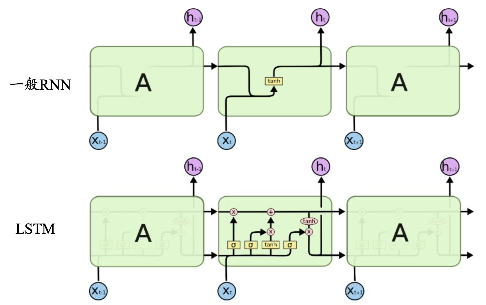

- LSTM依靠贯穿隐藏层的细胞状态实现隐藏单元之间的信息传递，其中只有少量的线性操作
- LSTM引入了“门”机制对细胞状态信息进行添加或删除，由此实现长程记忆
- “门”机制由一个Sigmoid激活函数层和一个向量点乘操作组成，Sigmoid层的输出控制了信息传递的比例

**遗忘门**：LSTM通过遗忘门(forget gate)实现对细胞状态信息遗忘程度的控制，输出当前状态的遗忘权重，取决于 $h_{t−1}$ 和 $x_t$.

$$
f_{t}=\sigma\left(W_{f} \cdot\left[h_{t-1}, x_{t}\right]+b_{f}\right)
$$

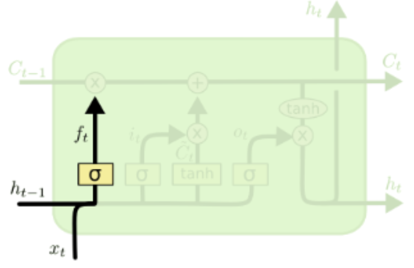

**输入门**：LSTM通过输入门(input gate)实现对细胞状态输入接收程度的控制，输出当前输入信息的接受权重，取决于 $h_{t−1}$ 和 $x_t$.

$$
\begin{array}{c}i_{t}=\sigma\left(W_{i} \cdot\left[h_{t-1}, x_{t}\right]+b_{i}\right) \\ \tilde{C}_{t}=\tanh \left(W_{C} \cdot\left[h_{t-1}, x_{t}\right]+b_{C}\right)\end{array}
$$

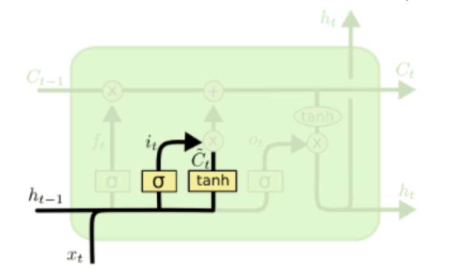

**输出门**：LSTM通过输出门(output gate)实现对细胞状态输出认可程度的控制，输出当前输出信息的认可权重，取决于 $h_{t−1}$ 和 $x_t$.

$$
o_{t}=\sigma\left(W_{o} \cdot\left[h_{t-1}, x_{t}\right]+b_{o}\right)
$$

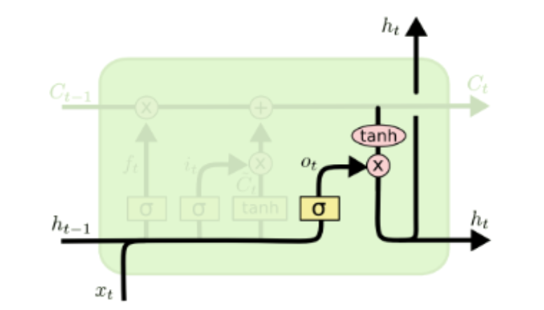

**状态更新**：“门”机制对细胞状态信息进行添加或删除，由此实现长程记忆。

$$
\begin{array}{c}C_{t}=f_{t} * C_{t-1}+i_{t} * \tilde{C}_{t} \\ h_{t}=o_{t} * \tanh \left(C_{t}\right)\end{array}
$$

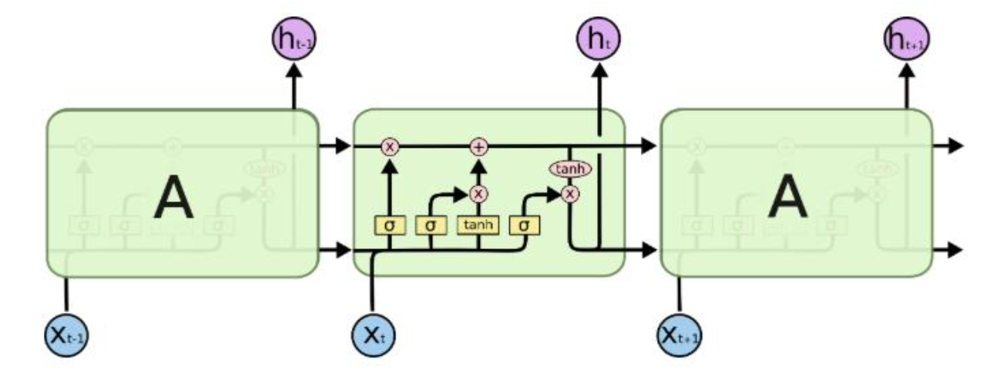

下面给出一个标准化的RNN例子

```python
#构造RNN网络，x的维度5，隐层的维度10,网络的层数2
rnn_ seq = nn.RNN(5， 10,2)
#构造一个输入序列，长为6，batch是3，特征是5
X =V(torch. randn(6， 3，5))
#out,ht = rnn_ seq(x， h0) # h0可以指定或者不指定
out,ht = rnn_ seq(x)
# q1:这里out、ht的size是多少呢? out:6*3*10， ht:2*3*10

#输入维度50，隐层100维，两层
Lstm_ seq = nn.LSTM(50， 100，num layers=2 )
#输入序列seq= 10，batch =3，输入维度=50
lstm input = torch. randn(10，3，50)
out, (h, c) = lstm_ seq(lstm_ _input) #使用默认的全0隐藏状态
```

# 其他经典的循环神经网络

### Gated Recurrent Unit(GRU)

Gated Recurrent Unit (GRU)，是在2014年提出的，可认为是LSTM 的变种，它的细胞状态与隐状态合并，在计算当前时刻新信息的方法和LSTM有 所不同；GRU只包含重置门和更新门；在音乐建模与语音信号建模领域与LSTM具有相似的性能，但是参数更少，只有两个门控。


### Peephole LSTM

让门层也接受细胞状态的输入，同时考虑隐层信息的输入。


### Bi-directional RNN(双向RNN) 

Bi-directional RNN(双向RNN)假设当前t的输出不仅仅和之前的序列有关，并且还与之后的序列有关，例如：完形填空，它由两个RNNs上下叠加在一起组成，输出由这两个RNNs的隐藏层的状态决定。

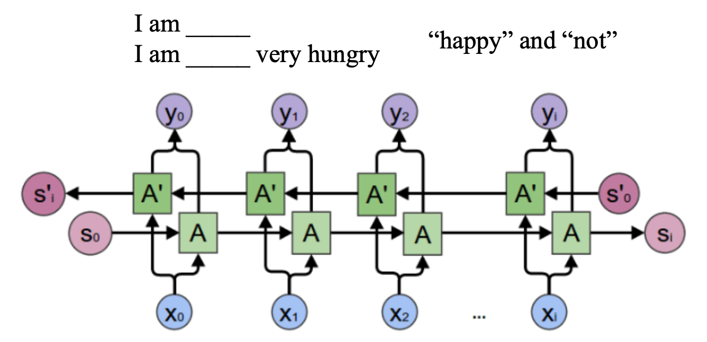

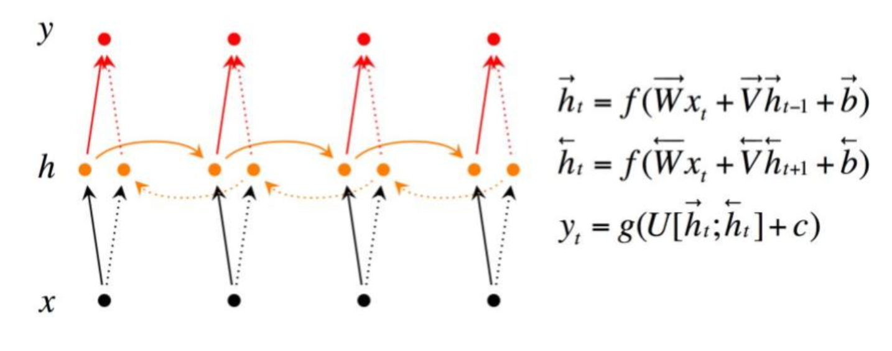

### Continuous time RNN(CTRNN)

CTRNN利用常微分方程系统对输入脉冲序列神经元的影响 进行建模。CTRNN被应用到进化机器人中，用于解决视觉、协作和最 小认知行为等问题。

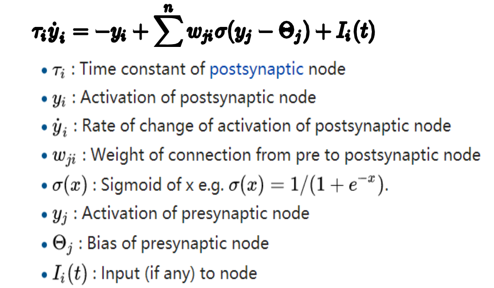

# 循环神经网络的主要应用

### 语言模型

根据之前和当前词预测下一个单词或者字母

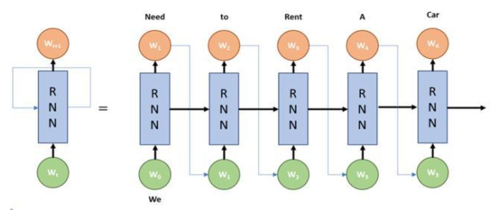

问答系统

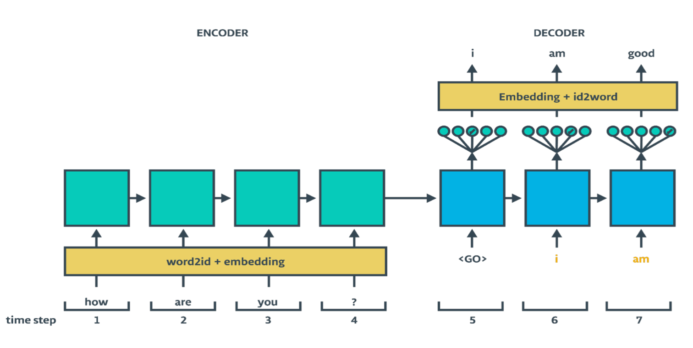

### 自动作曲

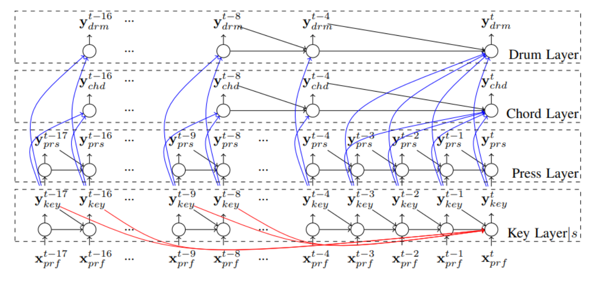

参考：Hang Chu, Raquel Urtasun, Sanja Fidler. Song From PI: A Musically Plausible Network for Pop Music Generation. CoRR abs/1611.03477 (2016)

Music AI Lab: **https://musicai.citi.sinica.edu.tw/**


### 机器翻译

将一种语言自动翻译成另一种语言

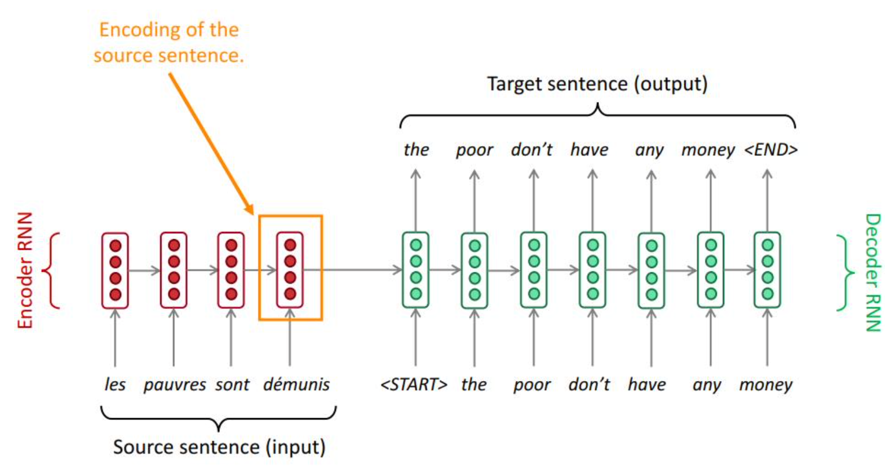

### 自动写作

根据现有资料自动写作，当前主要包括新闻写作和诗歌创作。主要是基于RNN&LSTM的文本生成技术来实现，需要训练大量同 类文本，结合模板技术。

目前主要产品有：腾讯Dreamwriter写稿机器人、今日头条xiaomingbot、第一财经DT稿王(背后是阿里巴巴) 、百度Writing-bots...

### 图像描述

根据图像形成语言描述

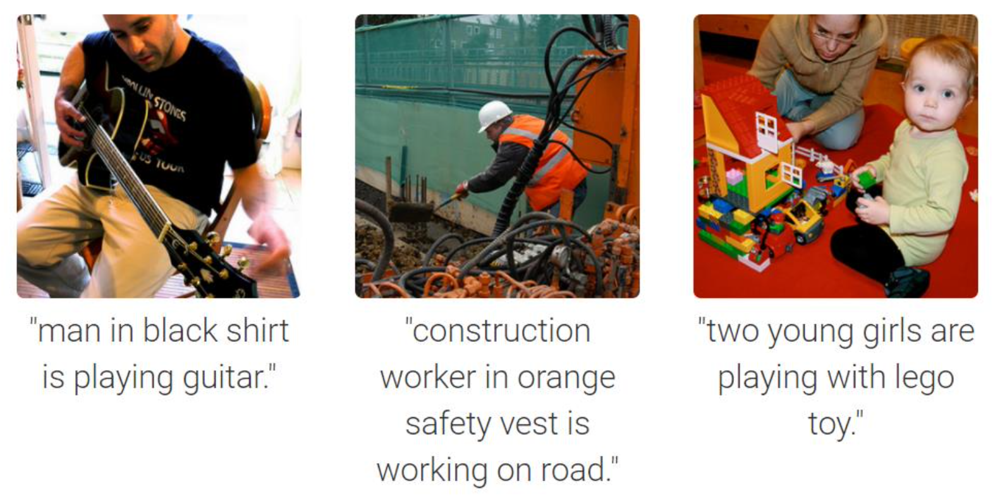

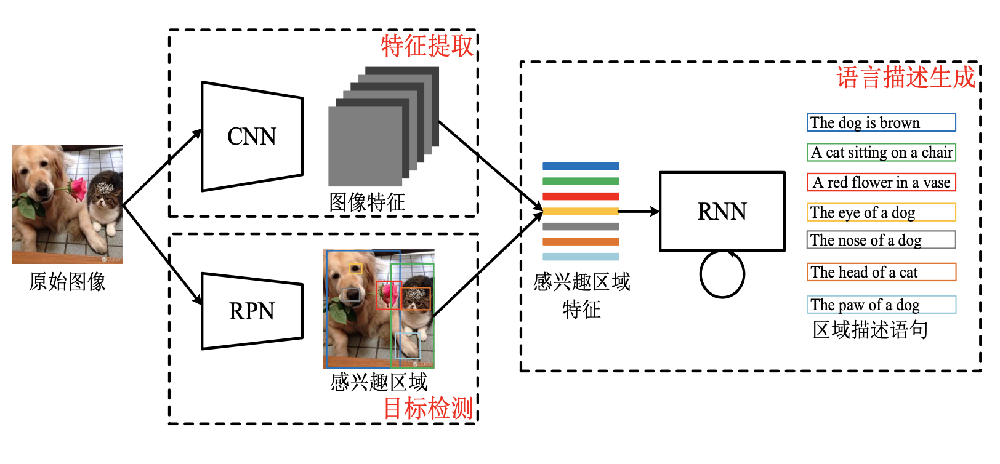
