# R-CNN系列

- Region-CNN的缩写，主要用于目标检测。
- 来自 2014 年 CVPR 论文“Rich feature hierarchies for accurate object  detection and semantic segmentation”
- 在 Pascal VOC 2012 的数据集上，能够将目标检测的验证指标 mAP 提升到 53.3%，这相对于之前最好的结果提升了整整 30%
- 采用在ImageNet上已经训练好的模型，然后在PASCAL VOC数据集上进行 fine-tune

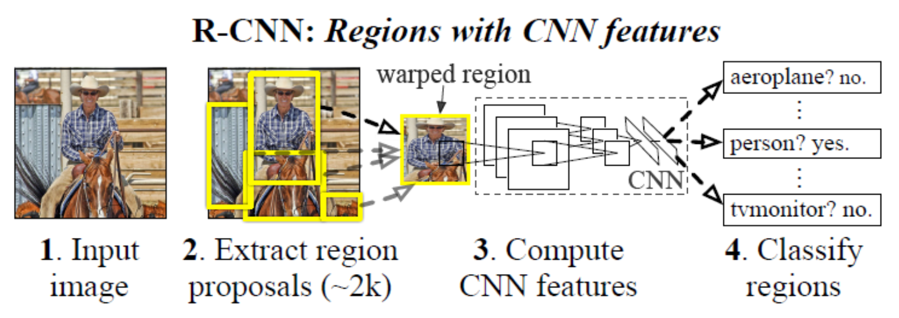

参考：Ross B. Girshick, Jeff Donahue, Trevor Darrell, Jitendra Malik. Rich Feature Hierarchies for Accurate Object Detection and Semantic Segmentation. CVPR 2014: 580-587

### 实现过程

- 区域划分:给定一张输入图片，从图片中提取2000个类别独立的候选区域，R-CNN 采用的是 Selective Search 算法

- 特征提取：对于每个区域利用CNN抽取一个固定长度的特征向量， R-CNN 使用的是 Alexnet

- 目标分类：再对每个区域利用SVM进行目标分类

- 边框回归：BoundingboxRegression(Bbox回归)进行边框坐标偏移

  优化和调整

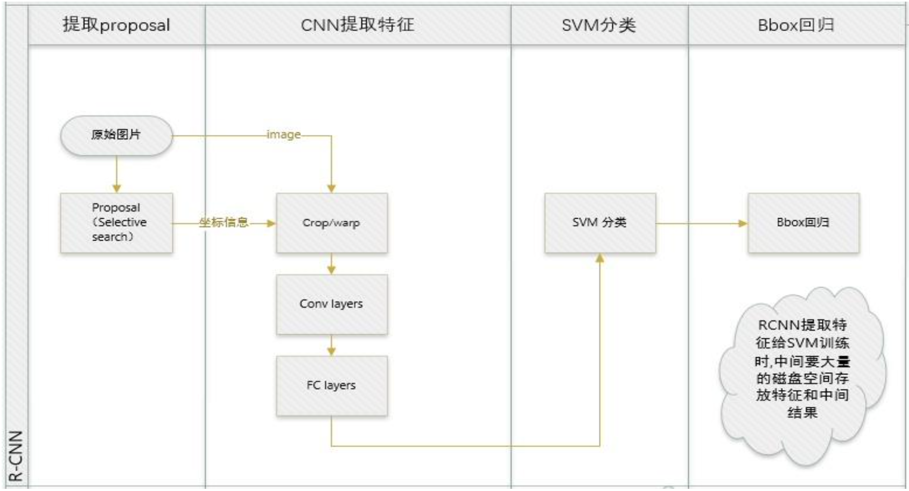

- Crop就是从一个大图扣出网络输入大小的patch，比如227×227
- Warp把一个边界框bounding box的内容resize成227×227

### Selective Search 算法

核心思想：图像中物体可能存在的区域应该有某些相似性或者连续性的，选择搜索基于上面这一想法采用子区域合并的方法提取 bounding boxes候选边界框。

- 首先，通过图像分割算法将输入图像分割成许多小的子区域
- 其次，根据这些子区域之间的相似性(主要考虑颜色、纹理、尺寸和 空间交叠4个相似) 进行区域迭代合并。每次迭代过程中对这些合并 的子区域做bounding boxes(外切矩形)，这些子区域的外切矩形就是 通常所说的候选框

**算法步骤**：

1. 生成区域集R，参见论文《Efficient Graph-Based Image Segmentation》
2. 计算区域集R里每个相邻区域的相似度$S=\{s1,s2,...\}$
3. 找出相似度最高的两个区域，将其合并为新集，添加进R
4. 从S中移除所有与step2中有关的子集
5. 计算新集与所有子集的相似度
6. 跳至step2，直至S为空

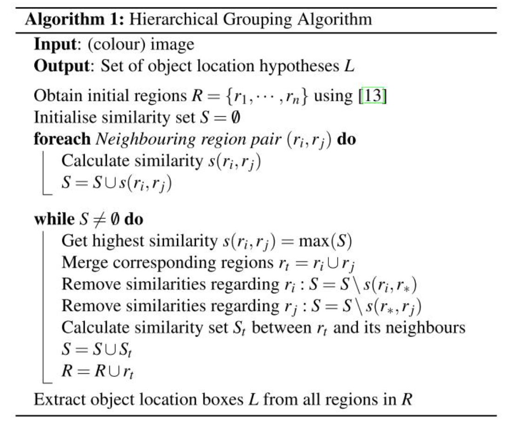

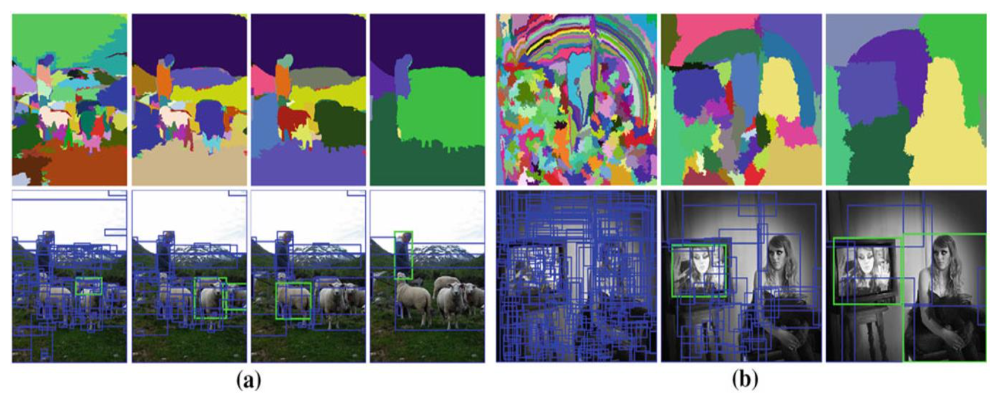

### Bbox回归

核心思想：通过平移和缩放方法对物体边框进行调整和修正。

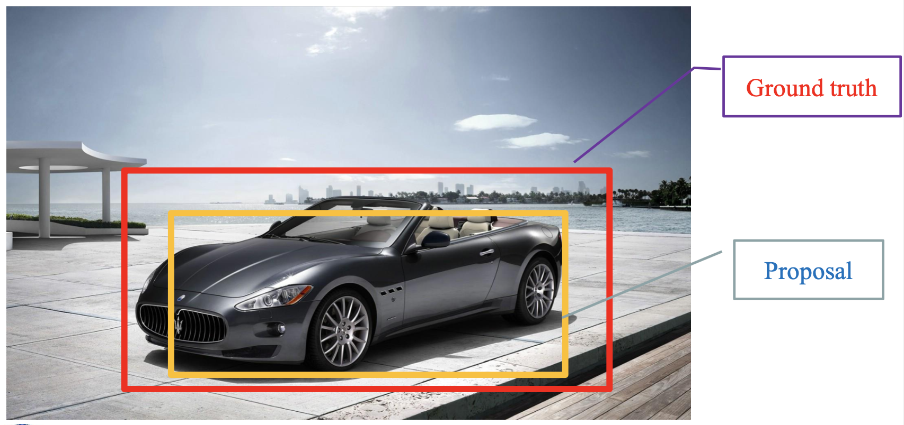

- bounding box的表示为$(x,y,w,h)$，即窗口的中心点坐标和宽高
- Bbox回归就是找到函数 $f$，将$(P_x,P_y, P_w,P_h)$映射为更接近 $(G_x,G_y, G_w,G_h)$ 的 $(\hat{G}_x,\hat{G}_y, \hat{G}_w,\hat{G}_h)$

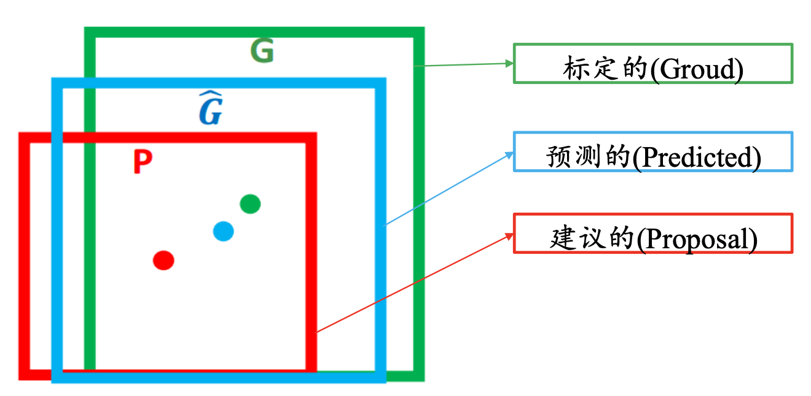

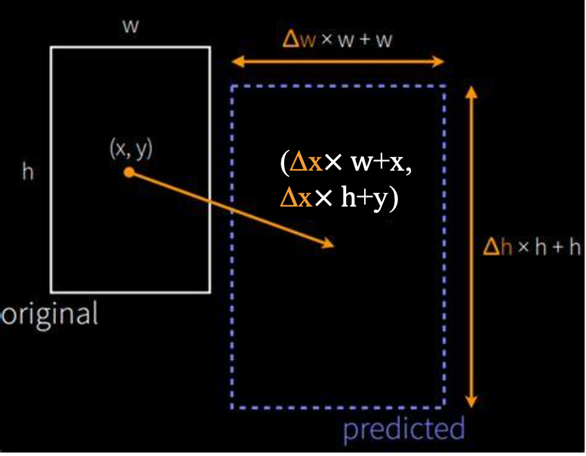

$$
\begin{align}
\hat{G}_x &= P_wd_x(P) + P_x
\\
\hat{G}_y &= P_hd_y(P) + P_y
\\
\hat{G}_w &= P_w \exp(d_w(P))
\\
\hat{G}_h &= P_h \exp(d_h(P))
\end{align}
$$

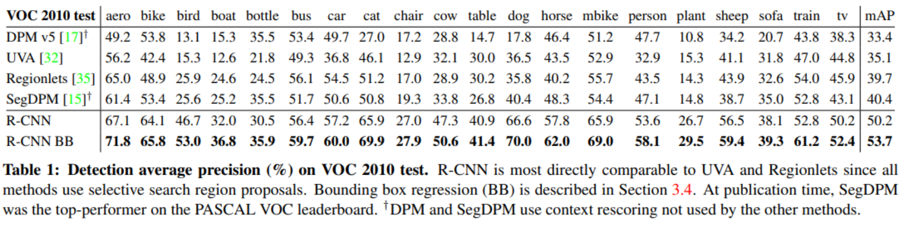

mAP：mean Average Precision，是多标签图像分类任务中的评价指标。AP衡量的是学出来的模型在给定类别上的好坏，而mAP衡量的是学出的模型在所有类别上的好坏。

### SPPnet

SPPnet (Spatial Pyramid Pooling)：空间金字塔网络，R-CNN主要问题：每个Proposal独立提取CNN features，分步训练。

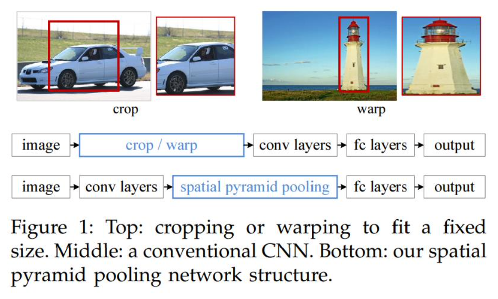

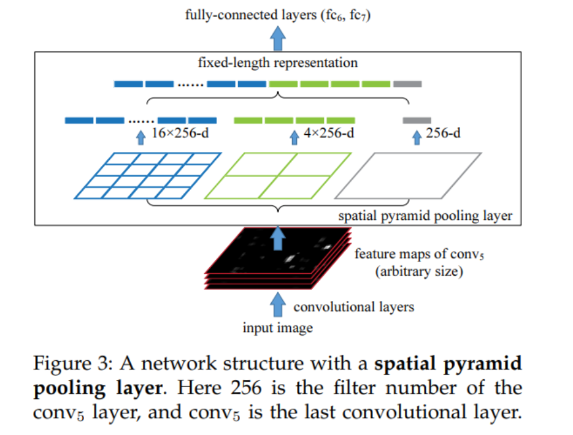

参考：Kaiming He, Xiangyu Zhang, Shaoqing Ren, Jian Sun. Spatial Pyramid Pooling in Deep Convolutional Networks for Visual Recognition. IEEE Trans. Pattern Anal. Mach. Intell. 37(9): 1904-1916 (2015)

### Fast R-CNN

- R-CNN和SPPnet问题：训练步骤过多，需要训练SVM分类器，需要 额外的回归器, 特征也是保存在磁盘上。
- 联合学习(jointtraining)：把SVM、Bbox回归和CNN阶段一起训 练，最后一层的Softmax换成两个：一个是对区域的分类Softmax， 另一个是对Bounding box的微调。训练时所有的特征不再存到硬盘上，提升了速度。
- ROI Pooling层：实现了单尺度的区域特征图的Pooling。

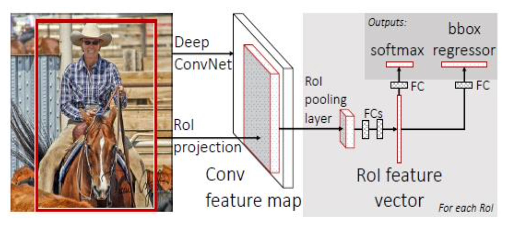

**ROI Pooling层**：将每个候选区域均匀分成M×N块，对每块进行max pooling，将特征图上大小不一的候选区域转变为大小统一的数据，送入下一层。

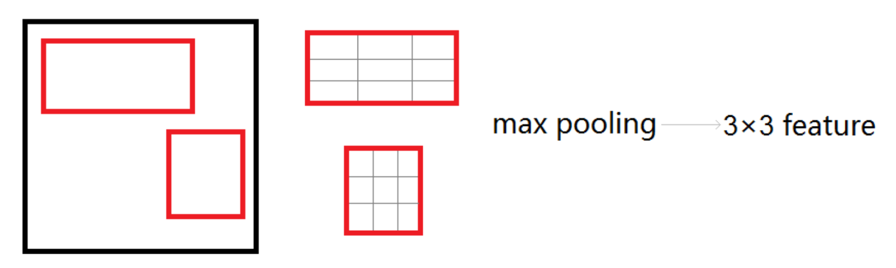

**性能对比**

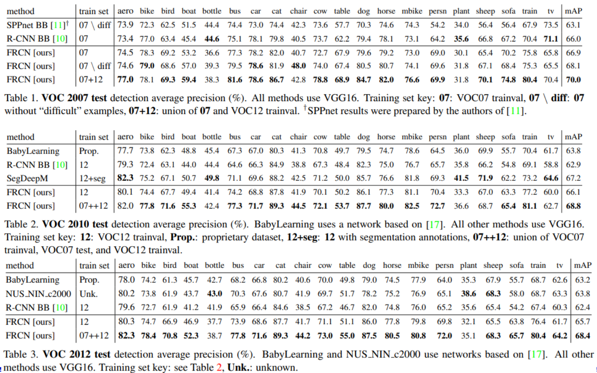

**效率对比**

- Fast R-CNN trains the very deep VGG16 network 9× faster than R- CNN, is 213× faster at test-time, and achieves a higher mAP on PASCAL VOC 2012.
- Compared to SPPnet, Fast R-CNN trains VGG16 3×faster, tests 10× faster, and is more accurate.

**RPN(Region Proposal Network)**：使用全卷积神经网络来生成区域建议(Region proposal)，替代之前的Selective search。

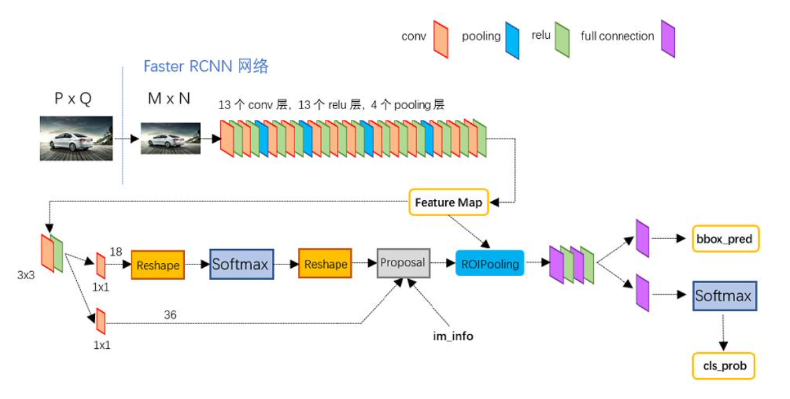

参考：Shaoqing Ren, Kaiming He, Ross B. Girshick, Jian Sun. Faster R-CNN: Towards Real-Time Object Detection with Region Proposal Networks. IEEE Trans. Pattern Anal. Mach. Intell. 39(6): 1137-1149 (2017)

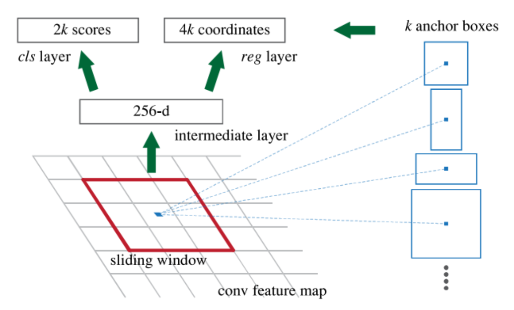

**Faster R-CNN训练方式**

- Alternating training

- Approximate joint training

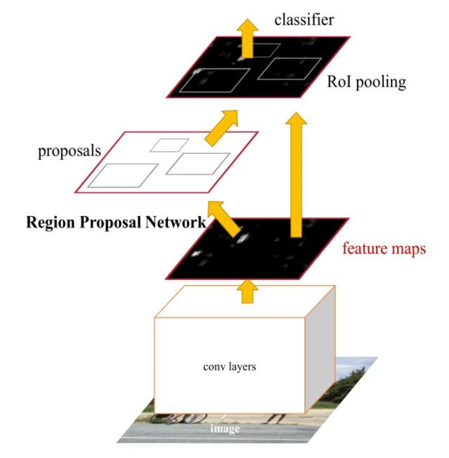

# YOLO系列

- 与R-CNN系列最大的区别是用一个卷积神经网络结构就可以从输入 图像直接预测bounding box和类别概率，实现了End2End训练
- 速度非常快，实时性好
- 可以学到物体的全局信息，背景误检率比R-CNN降低一半，泛化能力强
- 准确率还不如R-CNN高，小物体检测效果较差

参考：Joseph Redmon, Santosh Kumar Divvala, Ross B. Girshick, Ali Farhadi. You Only Look Once: Unified, Real-Time Object Detection. CVPR 2016: 779-788

### 目标检测和识别

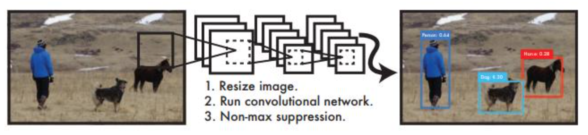

**The YOLO Detection System.** Processing images with YOLO is simple and straightforward. Our system (1) resizes the input image to 448 ×448, (2) runs a single convolutional network on the image, and (3) thresholds the resulting detections by the model’s confidence.

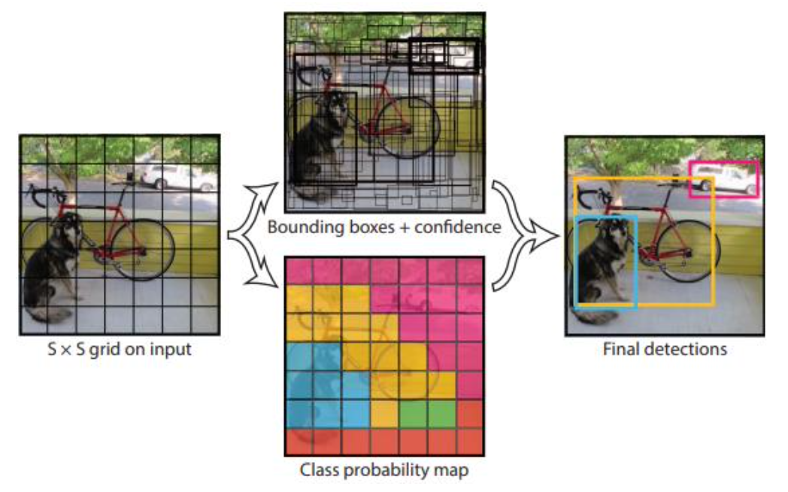

**The Model.** Our system models detection as a regression problem. It divides the image into an S×S grid and for each grid cell predicts B bounding boxes, confidence for those boxes, and C class probabilities. These predictions are encoded as an S×S×(B∗5+ C) tensor.

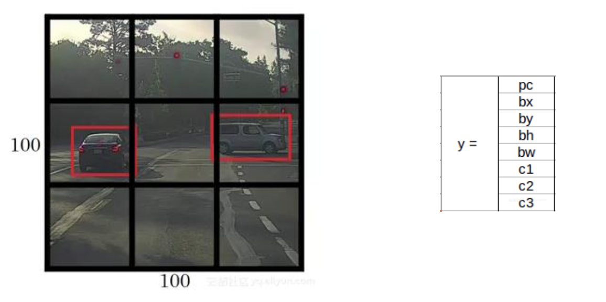

**网络结构**：24个卷积层和2个全连接层

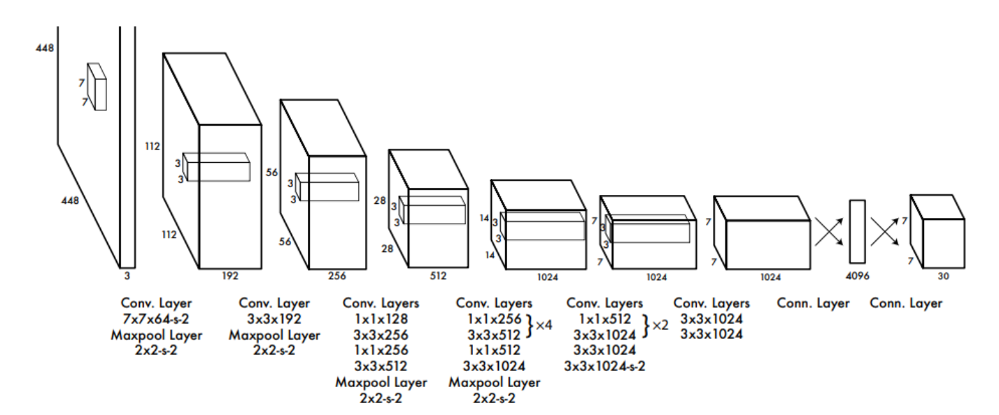

**The Architecture.** Our detection network has 24 convolutional layers followed by 2 fully connected layers. Alternating 1×1 convolutional layers reduce the features space from preceding layers. We pretrain the convolutional layers on the ImageNet classification task at half the resolution (224 ×224 input image) and then double the resolution for detection.

### YOLO2和YOLO9000

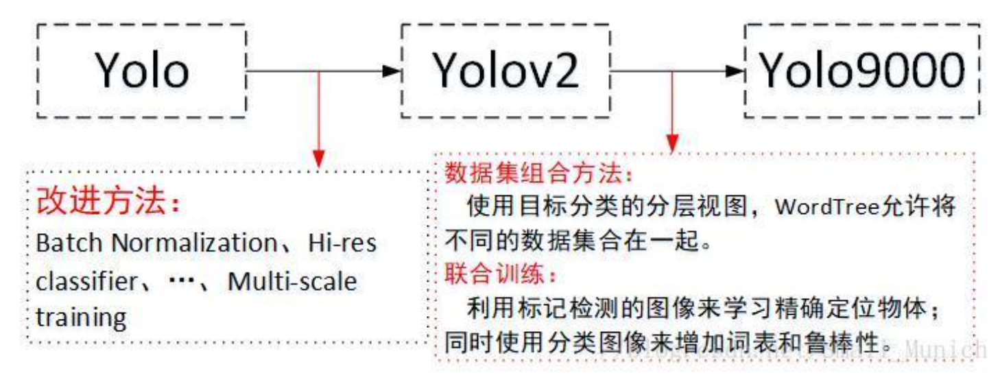

参考：Joseph Redmon, Ali Farhadi. YOLO9000: Better, Faster, Stronger. CVPR 2017: 6517-6525

**性能分析**

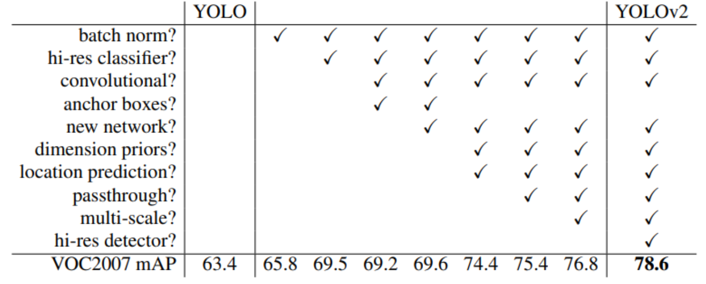
