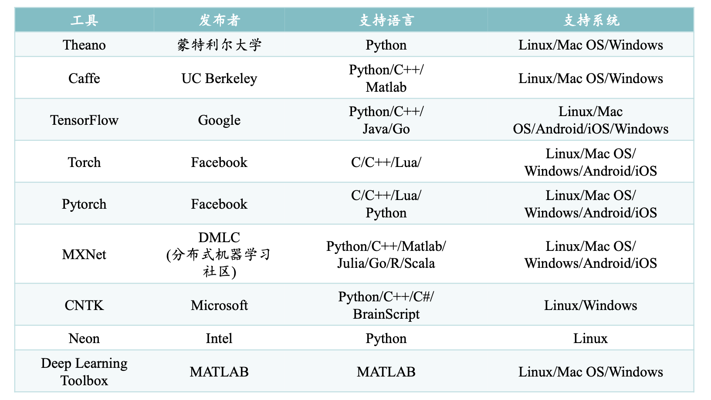
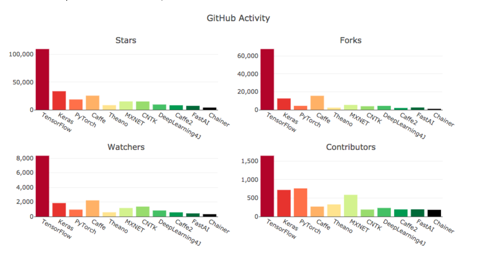
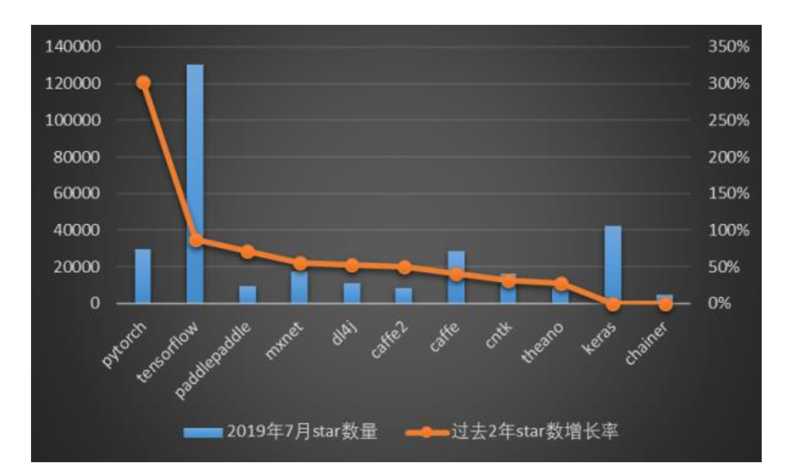
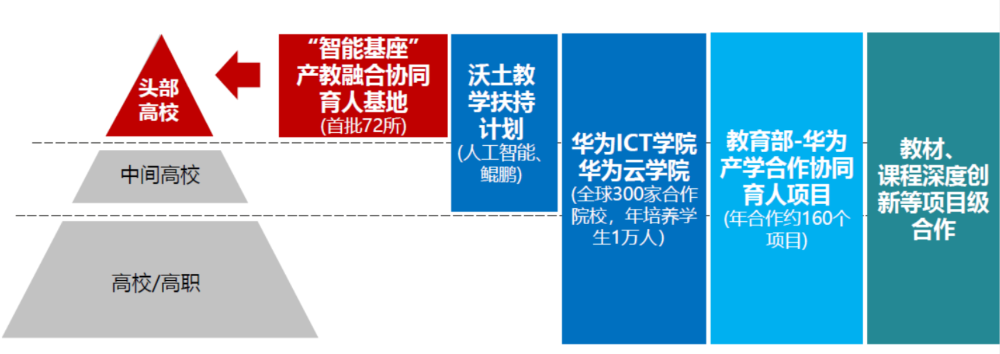

# 深度学习平台概况

这一章为大家介绍五种非常有用的深度学习框架，并介绍他们各自的优缺点。

很多人不喜欢造轮子的过程，喜欢实用主义，将轮子拼接起来

但是当需要为现实世界的数据集构建深度学习模型时，这还是一个不错的主意吗？如果你需要几天或几周的时间来建立起模型，这是完全不可能的。

值得庆幸的是，我们现在已经有了易于使用的开源深度学习框架，旨在简化复杂和大规模深度学习模型的实现。使用这些神奇的框架，我们可以实现诸如卷积神经网络这样复杂的模型。

> A deep learning framework is an interface, library or a tool which allows us to build deep learning models more easily and quickly , without getting into the details of underlying algorithms . They provide a clear and concise way for defining models using a collection of pre-built and optimized components.

什么是深度学习框架：深度学习框架是一种界面、库或工具，它使我们在无需深入了解底层算法的细节的情况下，能够更容易、更快速地构建深度学习模型。深度学习框架利用预先构建和优化好的组件集合定义模型，为模型的实现提供了一种清晰而简洁的方法。

利用恰当的框架来快速构建模型，而无需编写数百行代码，一个良好的深度学习框架具备以下关键特征：

- 优化的性能
- 易于理解和编码
- 良好的社区支持
- 并行化的进程，以减少计算
- 自动计算梯度

这五点也是我用来挑选顶级深度学习框架的标准。

深度学习框架对照

2018年GitHub统计

2019年GitHub统计

# Tensorflow

TensorFlow是由谷歌大脑团队的研究人员和工程师开发的，它是深度学习领域中最常用的软件库（尽管其他软件正在迅速崛起）。

> The two things I really like about TensorFlow - it's completely open source  and has excellent community support. TensorFlow has pre-written codes for most of the complex deep learning models you'll come across, such as RNN and CNN.

TensorFlow有两大特点：它完全是开源的，并且有出色的社区支持。TensorFlow为大多数复杂的深度学习模型预先编写好了代码，比如循环神经网络和卷积神经网络。

TensorFlow如此流行的最大原因之一是支持多种语言来创建深度学习模型，比如Python、C和R，并且有不错的文档和指南。

TensorFlow有许多组件，其中最为突出的是：

- **Tensorboard：**帮助使用数据流图进行有效的数据可视化
- **TensorFlow：**用于快速部署新算法/试验

TensorFlow的灵活架构使我们能够在一个或多个CPU（以及GPU）上部署深度学习模型。下面是一些典型的TensorFlow用例：

- 基于文本的应用：语言检测、文本摘要
- 图像识别：图像字幕、人脸识别、目标检测
- 声音识别
- 时间序列分析
- 视频分析
- ...

# PyTorch

在我所研究过的框架中，PyTorch最富灵活性。

PyTorch是Torch深度学习框架的一个接口，可用于建立深度神经网络和执行张量计算。Torch是一个基于Lua的框架，而PyTorch则运行在Python上。

PyTorch是一个Python包，它提供张量计算。张量是多维数组，就像numpy的ndarray一样，它也可以在GPU上运行。PyTorch使用动态计算图，PyTorch的Autograd软件包从张量生成计算图，并自动计算梯度。与特定功能的预定义的图表不同，PyTorch提供了一个框架，用于在运行时构建计算图形，甚至在运行时也可以对这些图形进行更改。当不知道创建神经网络需要多少内存的情况下，这个功能便很有价值。

可以使用PyTorch处理各种来自深度学习的挑战，包括：

- 影像（检测、分类等）
- 文本(NLP)
- 增强学习

# Keras

如果你习惯使用python，那么可以立即上手到Keras。这是一个非常适合你的深度学习之旅的完美的框架。

Keras用Python编写，可以在TensorFlow（以及CNTK和Theano）之上运行。TensorFlow的接口具备挑战性，因为它是一个低级库，新用户可能会很难理解某些实现。而Keras是一个高层的API，它为快速实验而开发。因此，如果希望获得快速结果，Keras会自动处理核心任务并生成输出。Keras支持卷积神经网络和递归神经网络，可以在CPU和GPU上无缝运行。

深度学习的初学者经常会抱怨：无法正确理解复杂的模型。如果你是这样的用户，Keras便是你的正确选择！它的目标是最小化用户操作，并使其模型真正容易理解。

可以将Keras中的模型大致分为两类：

**1. 序列化**
模型的层是按顺序定义的。这意味着当我们训练深度学习模型时，这些层次是按顺序实现的。下面是一个顺序模型的示例：
from keras.models import Sequential from keras.layers import Dense model = Sequential() # we can add multiple layers to the model using .add() model.add(Dense(units=64, activation='relu', input_dim=100)) model.add(Dense(units=10, activation='softmax'))
**2. Keras 函数API**
用于定义复杂模型，例如多输出模型或具有共享层的模型。请查看下面的代码来理解这一点：
from keras.layers import Input, Dense from keras.models import Model inputs = Input(shape=(100,)) # specify the input shape x = Dense(64, activation='relu')(inputs) predictions = Dense(10, activation='softmax')(x) model = Model(inputs=inputs, outputs=predictions)

# PaddlePaddle

**PaddlePaddle**是百度提供的开源深度学习框架，致力于为开发者和企业提供最好的深度学习研发体验，框架本身具有易学、易用、安全、高效四大特性，是最适合中国开发者和企业的深度学习工具。

- 网址:http://www.paddlepaddle.org/zh

#### 功能特点

 •教程文档友好，提供jupyter文档

**开源**

 •开源，代码在github上公开
 • 社区活跃，合作伙伴支持，有很多的贡献者 

**速度快、方便** 

 • 底层C++编写，运行速度快，占用内存少
 • 接口Python，使用方便，开发便捷 

**分布式系统** 

 • 底层硬件同时支持CPU和GPU
 • 分布式系统，支持单机运行和云上运行 

**部署方便** 

 • 支持docker部署和原生包部署
 • 支持多操作系统windows、 macOS、 Linux

#### 优势

提供搭建私有云的全套解决方案

- 帮助用户保护数据
- 充分支持分布式系统
- 模型并行和数据并行

灵活易用且性能高

- 支持多种机器学习和优化算法，可定 制
- 全面支持多机、多GPU环境，优化的 通信实现使高吞吐与高性能成为可能

# MindSpore

教育部**-**华为“智能基座” 产教融合协同育人基地

**MindSpore**(**AI**框架):全场景**AI**框架(类似TensorFlow、Pytorch)

- https://www.mindspore.cn/
- MindSpore提供了Python编程范式
- MindSpore提供了动态图和静态图统一的编码方式
- 能够用串行算法代码，自动实现分布式并行训练
- 具备训练过程静态执行和动态调试能力，开发者通过变更一行代码 即可切换模式，快速在线定位问题
- 最佳匹配昇腾处理器，最大程度地发挥硬件能力，帮助开发者缩短 训练时间，提升推理性能
- 支持云、边缘和手机上的快速部署，实现更好的资源利用和隐私保 护