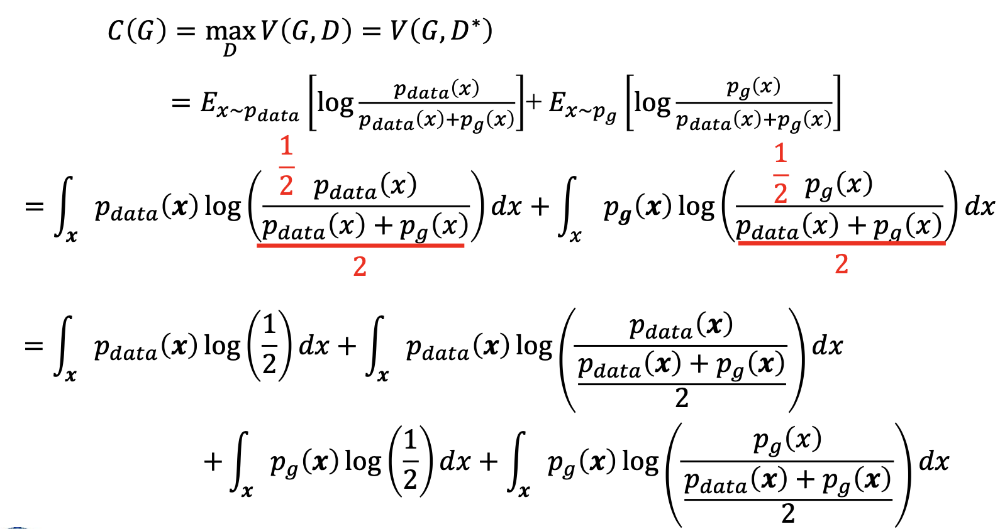

生成对抗网络 Generative Adversarial Networks

# GAN产生背景

机器学习方法有两种，**生成方法**和**判别方法**。

- 生成方法，所学到到模型称为生成式模型
  - 生成方法通过观测数据学习样本与标签的联合概率分布P(X,Y)，训练好的模型，即生成模型，能够生成符合样本分布的新数据；
  - 生成式模型在无监督深度学习方面占据主要位置，可以用于在没有目标类标签信息的情况下捕捉观测到或可见数据的高阶相关性 – 判别方法，所学到的模型称为判别式模型。

- 判别方法由数据直接学习决策函数f(X)或者条件概率分布P(Y|X)作为预测的模型，即判别模型
  - 判别模型经常用在有监督学习方面；
  - 判别方法关心的是对给定的输入X，应该预测什么样的输出Y。

有监督学习经常比无监督学习获得更好的模型，但是有监督学习需 要大量的标注数据，从长远看无监督学习更有发展前景。但是支持无监督学习的生成式模型会遇到下面两大困难：

- 首先是人们需要大量的先验知识去对真实世界进行建模，而建模的好坏直接影响着我们的生成模型的表现；
- 真实世界的数据往往很复杂，人们要用来拟合模型的计算量往往非常庞大，甚至难以承受。

# GAN的概况

**GAN的提出**

2014年，生成对抗网络(Generative Adversarial Networks， GAN)由当时还在蒙特利尔读博士的Ian Goodfellow(导师Bengio)提出。

- 2016年，GAN热潮席卷AI领域顶级会议，从ICLR到NIPS，大量高质量论文被发表和探讨
- 2017年入选MIT评论35岁以下创新人物

**GAN的基本原理**

GAN起源于博弈论中的二人零和博弈(获胜1，失败-1)

- 由两个互为敌手的模型组成
  - 生成模型(假币制造者团队) 
  - 判别模型(警察团队)
- 竞争使得两个团队不断改进他们的方法直到无法区分假币与真币

参考：Ian J. Goodfellow, Jean Pouget-Abadie, Mehdi Mirza, Bing Xu, David Warde-Farley, Sherjil Ozair, Aaron C. Courville, Yoshua Bengio. Generative Adversarial Nets. NIPS 2014: 2672-2680

**GAN的评价**

Yann LeCun评价GAN：

- 我们一直在错过一个关键因素就是无监督/预测学习，这是指：机器给真实环境建模、预测可能的未来、并通过观察和演示来理解世界是如何运行的能力。
- GAN为创建无监督学习提供了强有力的算法框架，有望帮助我们为AI加入常识，我们认为，沿着这条路走下去，有不小的成功的机会能开发出更智慧的AI。

**The GAN Zoo**

- https://github.com/hindupuravinash/the-gan-zoo
- ABC-GAN, AC-GAN...
- BAGAN, BCGAN...
- C-GAN, CA-GAN...

# GAN模型

###  生成模型中的问题

**自编码器**

**概率模型**

- 按照某种概率分布生成数据，得到最能覆盖训练样本的概率分布
- 需要确定样本的概率模型，即显式地定义概率密度函数

对于GAN模型，我们就是改进这些问题，做到估计样本概率分布却不需要显示定义概率分布

### GAN模型示例

**生成模型**

- 捕捉样本数据的分布，用服从某一分布(均匀分布，高斯分布)的 噪声z生成一个类似真实训练数据的样本，追求效果是越像真实的 数据越好
- $p_{data} (x)$ 表示真实数据的x分布
- $p_z (z)$ 表示输入噪声变量z的分布
- $p_g$ 表示在数据x上学习得到的生成样本的分布
- $𝐺(z;\theta_g)$ 表示生成模型(多层感知器)

**判别模型**

- 一个二分类器，估计一个样本来自训练数据(而非生成数据)的概率，如果样本来自真实的训练数据，输出大概率，否则，输出小概率。
- $D(x;\theta_d)$ 表示判别模型(多层感知器)
- $D(x)$ 表示x来自真实数据而非生成数据的概率

用网络代替概率模型$P(x;\theta),P_{data}(x)$

### GAN目标函数和损失函数

$$
\min _{G} \max _{D} V(G, D)=E_{x \sim p_{\text {data }}(x)}[\log D(x)]+E_{z \sim p_{z}(z)}[\log (1-D(G(z)))]
$$

- 训练GAN的时候，判别模型希望目标函数最大化，也就是使判别模 型判断真实样本为“真”，判断生成样本为“假”的概率最大化， 要尽量最大化自己的判别准确率
- 判别模型也可以写成损失函数的形式：

$$
L(G, D)=-E_{x \sim p_{\text {data }}(x)}[\log D(x)]-E_{z \sim p_{z}(z)}[\log (1-D(G(z)))]
$$

- 与之相反，生成模型希望该目标函数最小化，也就是降低 判别模型对数据来源判断正确的概率，要最小化判别模型 的判别准确率

### GAN模型训练

- GAN在训练的过程中固定一方，更新另一方的网络权重
- 交替迭代，在这个过程中，双方都极力优化自己的网络， 从而形成竞争对抗，直到双方达到一个动态的平衡(纳什均衡)
- 此时生成模型的数据分布无限接近训练数据的分布(造出 了和真实数据一模一样的样本)，判别模型再也判别不出 来真实数据和生成数据，准确率为50%。

固定**G**，训练**D**时，最优的判别器为：

$$
D_{G}^{*}=\frac{p_{\text {data }}(\boldsymbol{x})}{p_{\text {data }}(\boldsymbol{x})+p_{g}(\boldsymbol{x})}
$$

证明：

全局最优的生成函数值**-log4**

### 优势和不足

**优势**

- 任何一个可微分函数都可以参数化D和G(如深度神经网络)
- 支持无监督方法实现数据生成，减少了数据标注工作
- 生成模型G的参数更新不是来自于数据样本本身(不是对数据的似然性进行优化)，而是来自于判别模型D的一个反传梯度

**不足**

- 无需预先建模，数据生成的自由度太大
- 得到的是概率分布，但是没有表达式，可解释性差
- D与G训练无法同步，训练难度大，会产生梯度消失问题

# GAN的优化和改进

### 限定条件优化

- CGAN:ConditionalGenerativeAdversarialNets
- Generative Adversarial Text to Image Synthesis
- InfoGAN: Interpretable Representation Learning by Information Maximizing Generative Adversarial Nets
- Improved Techniques for Training GANs
- GP-GAN: Towards Realistic High-Resolution Image Blending

### 迭代式生成优化

- –  LAPGAN:Deep Generative Image Models using a Laplacian Pyramid of Adversarial Networks
- –  StackGAN: Text to Photo-realistic Image Synthesis with Stacked Generative Adversarial Networks
- –  PPGN: “Plug & Play Generative Networks: Conditional Iterative Generation of Images in Latent Space

### 结构优化

- DCGAN:Unsupervised Representation Learning with Deep

  Convolutional Generative Adversarial Networks

- Pix2Pix: Image-to-Image Translation with Conditional Adversarial Networks

# GAN的主要应用

### 图像转换

https://affinelayer.com/pixsrv/

### 图像迁移

https://junyanz.github.io/CycleGAN/

### 图像生成

 https://arxiv.org/abs/1606.03498

### 图像合成

https://arxiv.org/abs/1704.04086

### 图像预测

https://arxiv.org/abs/1702.01983

### 图像修复

https://arxiv.org/abs/1604.07379

